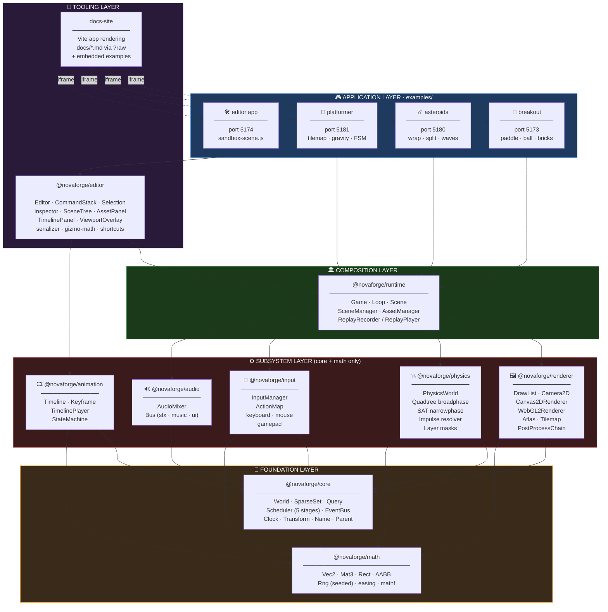
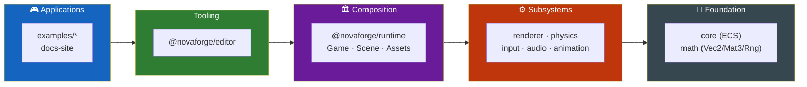
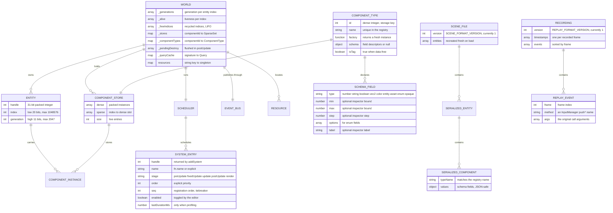
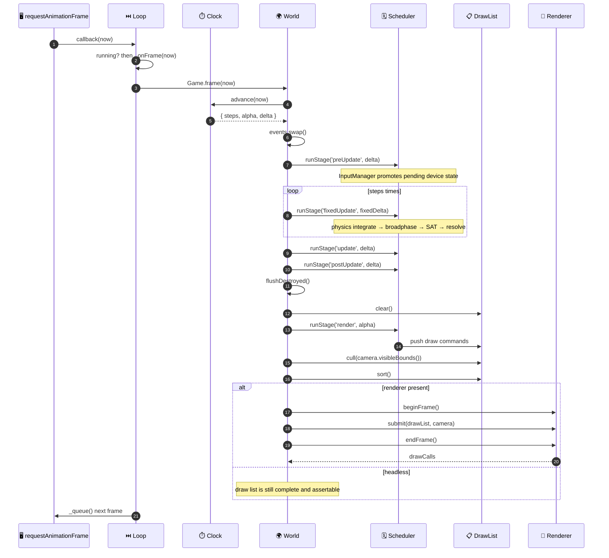
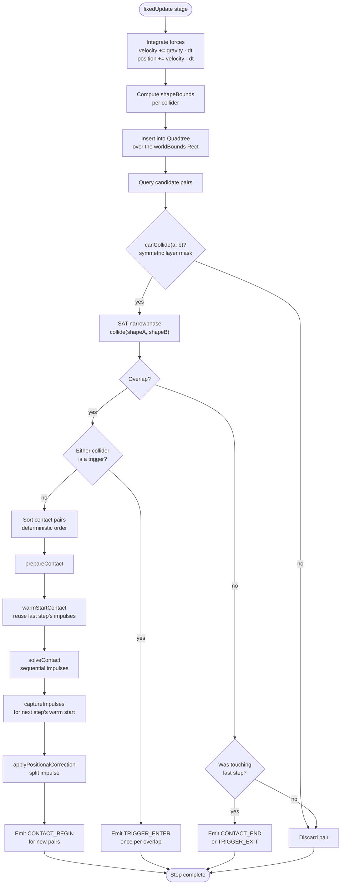
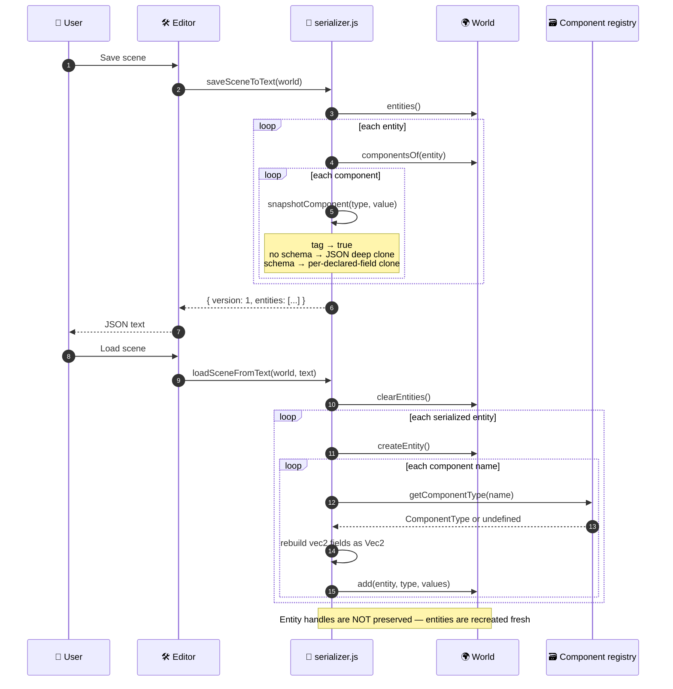
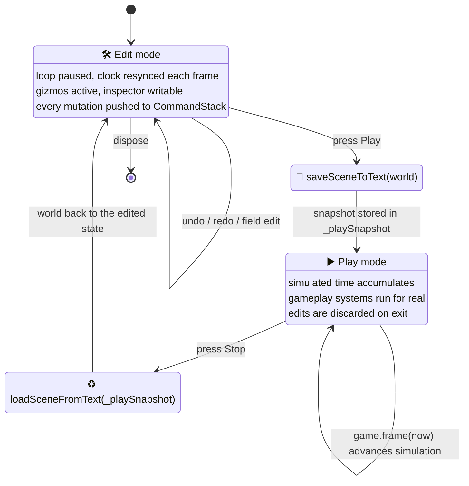
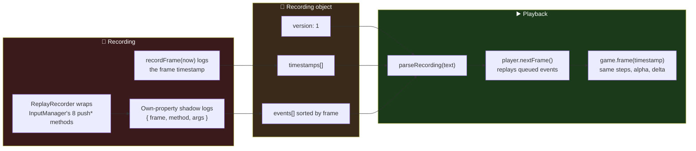
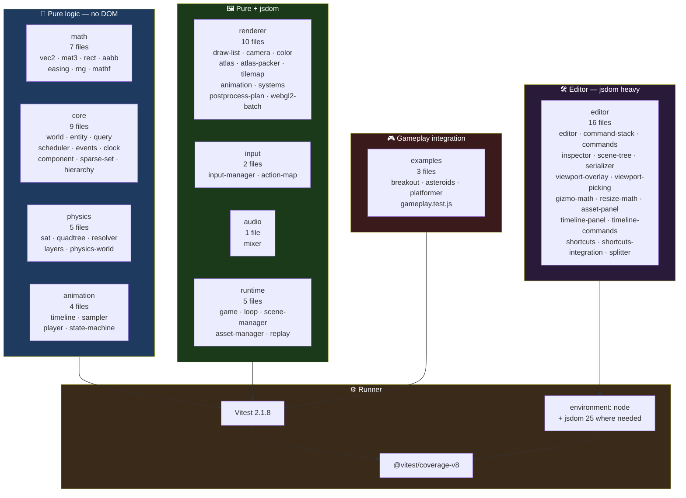

<div align="center">

**🌐 Choose Language / Selecione o Idioma / Elija el Idioma**

[](README.md)&nbsp;&nbsp;&nbsp;[](README_PT.md)&nbsp;&nbsp;&nbsp;[](README_ES.md)

</div>

---

<div align="center">

```
███╗   ██╗ ██████╗ ██╗   ██╗ █████╗ ███████╗ ██████╗ ██████╗  ██████╗ ███████╗
████╗  ██║██╔═══██╗██║   ██║██╔══██╗██╔════╝██╔═══██╗██╔══██╗██╔════╝ ██╔════╝
██╔██╗ ██║██║   ██║██║   ██║███████║█████╗  ██║   ██║██████╔╝██║  ███╗█████╗
██║╚██╗██║██║   ██║╚██╗ ██╔╝██╔══██║██╔══╝  ██║   ██║██╔══██╗██║   ██║██╔══╝
██║ ╚████║╚██████╔╝ ╚████╔╝ ██║  ██║██║     ╚██████╔╝██║  ██║╚██████╔╝███████╗
╚═╝  ╚═══╝ ╚═════╝   ╚═══╝  ╚═╝  ╚═╝╚═╝      ╚═════╝ ╚═╝  ╚═╝ ╚═════╝ ╚══════╝
                 A 2D game engine and visual editor in plain JavaScript
```

---

[](https://developer.mozilla.org/docs/Web/JavaScript)
[](https://nodejs.org/)
[](https://vitest.dev/)
[](https://vite.dev/)
[](https://www.typescriptlang.org/)
[](https://eslint.org/)
[](https://developer.mozilla.org/docs/Web/API/WebGL2RenderingContext)
[](LICENSE)

<br/>

> **An archetype-free ECS, two interchangeable renderer backends, a SAT physics solver and a browser-based scene editor**
> built from scratch as nine npm workspaces of standard ESM, with no build step inside the engine itself.

<br/>


%20Cases-1100-FF6B35?style=flat-square)


</div>

---

## 📑 Table of Contents

<details>
<summary>▶️ <strong>Click to expand / collapse this section</strong></summary>

<table>
<tr>
<td valign="top" width="50%">

**🏗️ System**
- [Overview](#-overview)
- [System Architecture](#️-system-architecture)
- [Technology Stack](#️-technology-stack)
- [Design Patterns](#-design-patterns-applied)
- [Project Structure](#-project-structure)

**📦 Modules**
- [@novaforge/math](#-novaforgemath--2d-math-primitives)
- [@novaforge/core](#-novaforgecore--the-ecs-runtime)
- [@novaforge/renderer](#-novaforgerenderer--draw-list-and-backends)
- [@novaforge/physics](#-novaforgephysics--collision-and-response)
- [@novaforge/input](#-novaforgeinput--devices-and-action-maps)
- [@novaforge/audio](#-novaforgeaudio--web-audio-mixer)
- [@novaforge/animation](#-novaforgeanimation--keyframes-and-state-machines)
- [@novaforge/runtime](#-novaforgeruntime--game-composition)
- [@novaforge/editor](#-novaforgeeditor--the-visual-editor)
- [Example Applications](#-example-applications)
- [Tooling Scripts](#-tooling-scripts)

</td>
<td valign="top" width="50%">

**💼 Business**
- [Business Rules](#-business-rules)
- [Functional Requirements](#-functional-requirements)
- [Non-Functional Requirements](#-non-functional-requirements)

**📐 Design**
- [Data Model](#️-data-model)
- [System Flows](#-system-flows)
- [Frame Pipeline](#frame-pipeline)
- [Physics Step](#physics-step)
- [Editor Mode Machine](#editor-mode-machine)

**🔐 Security & Ops**
- [Security](#-security)
- [Installation & Execution](#-installation--execution)
- [Automated Tests](#-automated-tests)
- [Metrics & Monitoring](#-metrics--monitoring)
- [Known Limitations](#️-known-limitations)

</td>
</tr>
</table>

---

</details>

## 🌟 Overview

<details>
<summary>▶️ <strong>Click to expand / collapse this section</strong></summary>

**NovaForge** is a 2D game engine and an accompanying visual editor, written from scratch in plain JavaScript. There is no Phaser, no PixiJS, no TypeScript compiler in the pipeline and no bundler inside the engine: every package under `packages/` is standard ECMAScript module source that a browser or Node can load directly. Type safety is obtained through JSDoc annotations checked by `tsc -p jsconfig.json --noEmit`, which is why `jsconfig.json` sets `"checkJs": true` and `"strict": true` yet the repository contains zero `.ts` files.

The repository is an npm workspace monorepo declared in `package.json` with three workspace globs: `packages/*`, `examples/*` and `docs-site`. Nine of those workspaces are the engine itself, arranged in a strict dependency order so that `@novaforge/math` depends on nothing, `@novaforge/core` depends only on math, the four sibling subsystems (renderer, physics, input, audio) plus animation depend only on core and math, `@novaforge/runtime` is the single package allowed to know about all of them, and `@novaforge/editor` sits on top of runtime.

The second half of the project is the toolchain. `@novaforge/editor` is a browser-based scene editor with a scene tree that supports reparenting, a schema-driven inspector generated from each component's declared field types, translate/rotate/scale gizmos with snapping, an undo/redo command stack, JSON scene save and load, an asset panel and a keyframe timeline panel. It does not simulate a copy of the game: it wraps a real `Game` instance and drives that instance's own `frame()` function, so edit mode and play mode operate on the identical world.

### 🎯 System Objectives

| Objective | Description |
|-----------|-------------|
| 🧩 **Archetype-free ECS** | Sparse-set component storage with packed 31-bit entity handles carrying a generation counter, so stale handles are detectable |
| 🎨 **Backend independence** | Systems never call a drawing API; they append to a `DrawList` that both `Canvas2DRenderer` and `WebGL2Renderer` consume identically |
| ⏱️ **Deterministic simulation** | A fixed-timestep `Clock` with a spiral-of-death guard, plus an order-independent physics solver, so the same inputs replay to the same result |
| 🧪 **Headless testability** | `@novaforge/core`, `math`, `physics` and `animation` have no DOM dependency at all; a whole game can be ticked and asserted in Node |
| 🛠️ **A real editor** | Scene tree, inspector, gizmos, undo/redo, save/load, asset hot-reload and an animation timeline, driving the shipping runtime |
| 📼 **Deterministic replay** | `ReplayRecorder` shadows `InputManager`'s eight `push*` methods to log every raw device event alongside frame timestamps |
| 📦 **Tree-shakeable output** | `build:packages` emits a minified `dist/index.js` per package, and `verify:treeshaking` proves with a real bundler run that unused siblings are eliminated |
| 🚀 **Zero engine build step** | Every example aliases `@novaforge/*` straight to `packages/*/src/index.js`, so editing engine source hot-reloads a running game |
| 🎮 **Complete sample games** | Breakout, Asteroids and a tilemap platformer, each with its own gameplay test suite, not just a moving sprite |

---

</details>

## 🏗️ System Architecture

<details>
<summary>▶️ <strong>Click to expand / collapse this section</strong></summary>

### Module Diagram



### Architecture Layers



> [!NOTE]
> The dependency direction is enforced socially and by each package's `dependencies` block, not by a lint rule. `@novaforge/math` declares no dependencies at all; `@novaforge/core` declares only math; `@novaforge/runtime` declares six; `@novaforge/editor` declares eight.

---

</details>

## 🛠️ Technology Stack

<details>
<summary>▶️ <strong>Click to expand / collapse this section</strong></summary>

<table>
<thead>
<tr>
<th>Layer</th>
<th>Technology</th>
<th>Version</th>
<th>Purpose</th>
</tr>
</thead>
<tbody>
<tr>
<td rowspan="2">🧠 <strong>Language</strong></td>
<td>JavaScript (ESM)</td>
<td>ES2022</td>
<td>Every source file is a native module; <code>"type": "module"</code> in every manifest</td>
</tr>
<tr>
<td>JSDoc + TypeScript checker</td>
<td>typescript 5.7.2</td>
<td><code>tsc -p jsconfig.json --noEmit</code> with <code>checkJs</code> and <code>strict</code> enabled, zero <code>.ts</code> files</td>
</tr>
<tr>
<td rowspan="2">🏗️ <strong>Runtime</strong></td>
<td>Node.js</td>
<td>&ge; 20 (<code>engines</code>)</td>
<td>Test host, benchmark host, build scripts; CI matrix runs 20 and 22</td>
</tr>
<tr>
<td>Browser (DOM, Canvas2D, WebGL2, Web Audio, Gamepad)</td>
<td>evergreen</td>
<td>The only environment the renderer, input and audio packages actually need</td>
</tr>
<tr>
<td rowspan="3">🖼️ <strong>Rendering</strong></td>
<td>Canvas2D</td>
<td>—</td>
<td><code>Canvas2DRenderer</code>: one <code>drawImage</code> or path per draw command, no batching by design</td>
</tr>
<tr>
<td>WebGL2</td>
<td>—</td>
<td><code>WebGL2Renderer</code> + <code>webgl2-batch.js</code>: batched sprite quads, render targets, post-processing</td>
</tr>
<tr>
<td>Draw list indirection</td>
<td>—</td>
<td><code>DrawList</code> with <code>cull()</code> and <code>sort()</code>, the sole contract between simulation and screen</td>
</tr>
<tr>
<td rowspan="2">🧪 <strong>Testing</strong></td>
<td>Vitest</td>
<td>^2.1.8</td>
<td>62 test files matched by <code>packages/*/src/**/__tests__/**/*.test.js</code> and the examples equivalent</td>
</tr>
<tr>
<td>@vitest/coverage-v8 · jsdom</td>
<td>^2.1.8 · ^25.0.1</td>
<td>V8 coverage over <code>packages/*/src/**/*.js</code>; jsdom for the DOM-touching editor suites</td>
</tr>
<tr>
<td rowspan="2">📦 <strong>Build &amp; bundling</strong></td>
<td>Vite</td>
<td>^6.0.7</td>
<td>Dev server per example, library builds in <code>scripts/build-packages.mjs</code></td>
</tr>
<tr>
<td>npm workspaces</td>
<td>—</td>
<td><code>packages/*</code>, <code>examples/*</code>, <code>docs-site</code>; a single lockfile at the root</td>
</tr>
<tr>
<td>🔍 <strong>Quality</strong></td>
<td>ESLint (flat config)</td>
<td>^9.17.0</td>
<td><code>eqeqeq</code>, <code>no-var</code>, <code>prefer-const</code>, <code>no-undef</code>, <code>no-unused-vars</code> with <code>^_</code> escapes</td>
</tr>
<tr>
<td rowspan="2">📊 <strong>Benchmarks</strong></td>
<td>Node <code>--expose-gc</code></td>
<td>—</td>
<td><code>benchmarks/run.js</code>: ECS query, entity churn and physics-step throughput</td>
</tr>
<tr>
<td>Playwright</td>
<td>^1.62.1</td>
<td><code>benchmarks/run-browser.mjs</code> captures real Canvas2D-vs-WebGL2 frame times in headless Chrome</td>
</tr>
<tr>
<td>📚 <strong>Docs</strong></td>
<td>marked</td>
<td>^18.0.9</td>
<td><code>docs-site</code> renders markdown imported with Vite's <code>?raw</code> suffix</td>
</tr>
<tr>
<td>🤖 <strong>CI</strong></td>
<td>GitHub Actions</td>
<td><code>.github/workflows/ci.yml</code></td>
<td>Three jobs: <em>check</em> (lint + typecheck + test on Node 20/22), <em>coverage</em>, <em>example builds</em></td>
</tr>
<tr>
<td>📄 <strong>License</strong></td>
<td>MIT</td>
<td>—</td>
<td>Declared in the root manifest and in every package manifest</td>
</tr>
</tbody>
</table>

---

</details>

## 🎨 Design Patterns Applied

<details>
<summary>▶️ <strong>Click to expand / collapse this section</strong></summary>

| Pattern | Where | Rationale |
|---------|-------|-----------|
| 🧩 **Entity-Component-System** | `packages/core/src/world.js` | Data lives in `SparseSet` stores keyed by dense component id; behaviour lives in stage-registered systems |
| 🗂️ **Sparse Set** | `packages/core/src/sparse-set.js` | O(1) add, remove and lookup with a packed dense array, chosen over archetypes because games churn components every frame |
| 🎫 **Handle with generation counter** | `packages/core/src/entity.js` | 20 index bits + 11 generation bits packed into one 31-bit integer, so a recycled index cannot resurrect a stale reference |
| 🧾 **Command / Memento** | `packages/editor/src/command-stack.js`, `commands.js` | Every editor mutation is a `{ do, undo }` pair; `snapshotComponent` in `serializer.js` provides the memento |
| 🔌 **Strategy (renderer backend)** | `packages/renderer/src/renderer.js` | `Renderer` is an abstract base that throws on unimplemented methods; `Canvas2DRenderer` and `WebGL2Renderer` are interchangeable at runtime |
| 📮 **Publish / Subscribe** | `packages/core/src/events.js` | A double-buffered `EventBus` swapped once per frame in `Game.frame`, so a listener never sees an event mid-write |
| 🧰 **Service Locator** | `World.resources` map | `DRAW_LIST_RESOURCE`, `ASSETS_RESOURCE`, `AUDIO_RESOURCE`, `INPUT_RESOURCE`, `PHYSICS_RESOURCE` keep `core` from importing downward |
| 🧱 **Composition Root** | `packages/runtime/src/game.js` | The only file where every package meets; a game wanting a different composition assembles the pieces itself |
| 🔁 **Object Pool / Free List** | `World._freeIndices` | Destroyed entity indices are recycled LIFO to keep the dense arrays compact |
| 🎭 **Decorator (method shadowing)** | `packages/runtime/src/replay.js` | `ReplayRecorder` installs own-properties over `InputManager`'s eight `push*` methods to log events without changing the class |
| 🏷️ **Schema-driven UI** | `packages/core/src/component.js` + `packages/editor/src/inspector.js` | Each component declares field types (`number`, `vec2`, `color`, `enum`, `opaque`), and the inspector generates its widgets from that |
| 🧵 **Template Method (Scene)** | `packages/runtime/src/scene.js` | `onEnter` / `onExit` / `onPause` / `onResume` hooks the `SceneManager` calls at fixed points in the stack lifecycle |

---

</details>

## 📁 Project Structure

<details>
<summary>▶️ <strong>Click to expand / collapse this section</strong></summary>

```
novaforge/
│
├── 📄 package.json                    # Root workspace manifest, 14 npm scripts, MIT
├── 📄 package-lock.json               # Single lockfile for the whole monorepo
├── 📄 vitest.config.js                # Test globs, @novaforge/* → src aliases, v8 coverage
├── 📄 eslint.config.js                # Flat config: ES2022, browser globals, 5 rules
├── 📄 jsconfig.json                   # strict + checkJs type checking of plain .js
├── 📄 .editorconfig                   # Shared whitespace conventions
├── 📄 LICENSE                         # MIT
│
├── 📂 .github/workflows/
│   └── 📄 ci.yml                      # check (Node 20/22) · coverage · example builds
│
├── 📂 packages/                       # ★ The engine — 9 npm workspaces
│   ├── 📂 math/src/                   # Vec2, Mat3, Rect, AABB, Rng, easing, mathf
│   ├── 📂 core/src/                   # World, SparseSet, Query, Scheduler, EventBus, Clock
│   │   ├── 📄 world.js                #   517 lines: entities, stores, queries, resources
│   │   ├── 📄 entity.js               #   Packed handle: 20 index bits + 11 generation bits
│   │   ├── 📄 sparse-set.js           #   The storage primitive behind every component
│   │   ├── 📄 query.js                #   Iteration over the rarest required component
│   │   ├── 📄 scheduler.js            #   5 stages, explicit `order`, optional profiling
│   │   ├── 📄 events.js               #   Double-buffered channels, swapped per frame
│   │   ├── 📄 clock.js                #   Fixed timestep + spiral-of-death clamp
│   │   ├── 📄 component.js            #   defineComponent / defineTag + field schema
│   │   ├── 📄 hierarchy.js            #   Parent component, reparenting, descendants
│   │   ├── 📄 transform.js            #   The shared Transform component
│   │   └── 📄 name.js                 #   The Name component the editor tree displays
│   ├── 📂 renderer/src/               # 18 modules: draw list, camera, both backends
│   │   ├── 📄 draw-list.js            #   DrawKind commands, cull(), sort()
│   │   ├── 📄 renderer.js             #   Abstract backend interface
│   │   ├── 📄 canvas2d-renderer.js    #   Backend #1, one command per draw call
│   │   ├── 📄 webgl2-renderer.js      #   Backend #2
│   │   ├── 📄 webgl2-batch.js         #   Quad batching for the WebGL2 path
│   │   ├── 📄 atlas.js / atlas-packer.js  # TextureAtlas, AtlasRegistry, rect packing
│   │   ├── 📄 tilemap.js              #   Tilemap component + render system
│   │   ├── 📄 postprocess*.js         #   PostProcessChain and its pure plan calculator
│   │   └── 📄 render-target.js        #   Offscreen targets for the chain
│   ├── 📂 physics/src/                # Quadtree, SAT, warm-started impulse resolver
│   ├── 📂 input/src/                  # InputManager, ActionMap, mouse, systems
│   ├── 📂 audio/src/                  # AudioMixer, Bus
│   ├── 📂 animation/src/              # Timeline, sampler, player, state machine
│   ├── 📂 runtime/src/                # Game, Loop, Scene, SceneManager, AssetManager, replay
│   └── 📂 editor/src/                 # 17 modules + style.css — the visual editor
│       ├── 📄 editor.js               #   Wraps a real Game, owns edit/play mode
│       ├── 📄 command-stack.js        #   Undo/redo
│       ├── 📄 serializer.js           #   Scene JSON, format version 1
│       ├── 📄 inspector.js            #   Widgets generated from component schemas
│       ├── 📄 scene-tree.js           #   Hierarchy view with drag-reparenting
│       ├── 📄 gizmo-math.js           #   Pure handle geometry and snapping
│       ├── 📄 viewport-picking.js     #   Pure hit testing
│       └── 📄 timeline-panel.js       #   Keyframe editing surface
│
├── 📂 examples/                       # 4 runnable Vite apps
│   ├── 📂 breakout/                   # port 5173 — paddle, ball, bricks, HUD
│   ├── 📂 asteroids/                  # port 5180 — screen wrap, splitting, waves
│   ├── 📂 platformer/                 # port 5181 — tilemap, coins, hazards, camera
│   └── 📂 editor/                     # port 5174 — the editor over sandbox-scene.js
│
├── 📂 docs-site/                      # port 5176 — renders docs/*.md, embeds the examples
│   ├── 📄 index.html
│   └── 📂 src/                        # main.js, docs.js, style.css
│
├── 📂 docs/                           # ⚠️ Present but currently empty (see Known Limitations)
│   └── 📂 adr/
│
├── 📂 benchmarks/
│   ├── 📄 run.js                      # Node ECS/physics throughput, needs --expose-gc
│   ├── 📄 run-browser.mjs             # Playwright-driven Canvas2D vs WebGL2 capture
│   ├── 📄 browser-results.json        # Captured 2026-08-06, HeadlessChrome 151
│   └── 📂 browser/                    # The page the browser benchmark drives
│
├── 📂 scripts/
│   ├── 📄 build-packages.mjs          # Minified dist/index.js per package
│   ├── 📄 verify-treeshaking.mjs      # Real bundler run proving dead-code elimination
│   ├── 📄 build-docs-site.mjs         # Builds examples, nests them under docs-site/dist
│   └── 📄 verify-docs-site.mjs        # Playwright smoke test, reads canvas pixels
│
├── 📄 README.md                       # 🇺🇸 English (primary)
├── 📄 README_PT.md                    # 🇧🇷 Português
└── 📄 README_ES.md                    # 🇪🇸 Español
```

---

</details>

## 📦 System Modules

<details>
<summary>▶️ <strong>Click to expand / collapse this section</strong></summary>

### 🔢 @novaforge/math — 2D Math Primitives

Plain data with no engine dependencies. This is what lets every simulation package stay testable in Node with no DOM present. Eight source modules, seven test files.

| Export | Kind | Notes |
|--------|------|-------|
| `Vec2` | class | 2D vector; has a `toJSON`, which is what makes scene serialisation possible |
| `Mat3` | class | 3x3 affine matrix used for camera and transform composition |
| `Rect` | class | Axis-aligned rectangle; the physics broadphase region and camera bounds |
| `AABB` | class | Axis-aligned bounding box used by the quadtree and culling |
| `Rng` | class | Seeded pseudo-random generator, a precondition of deterministic replay |
| `easing` | namespace | `export * as easing` from `easing.js`, consumed by the animation sampler |
| `clamp` `clamp01` `lerp` `inverseLerp` `remap` | functions | Scalar helpers from `mathf.js` |
| `approximately` `sign` `wrap` `wrapAngle` | functions | Comparison and angle helpers |
| `moveTowards` `smoothDamp` | functions | Frame-rate-aware value tracking |
| `nearestPowerOfTwo` `isPowerOfTwo` | functions | Texture sizing helpers |
| `EPSILON` `DEG_TO_RAD` `RAD_TO_DEG` `TAU` | constants | Shared numeric constants |

---

### 🧩 @novaforge/core — The ECS Runtime

The heart of the engine, and deliberately free of any DOM dependency: `new World()` works in Node, which is what makes the entire headless test suite possible. Twelve source modules, nine test files, 1,846 lines.

| Concern | API | Behaviour |
|---------|-----|-----------|
| Entity lifecycle | `createEntity()` `spawn(...)` `destroy()` `destroyImmediate()` `flushDestroyed()` | `destroy` marks dead immediately but defers storage cleanup to `postUpdate`, so systems iterating mid-frame are never pulled out from under |
| Handle validity | `isAlive()` `generationOf()` `describeEntity()` | Generation increments on reclaim and wraps at `MAX_GENERATION` (2047) |
| Components | `add()` `remove()` `get()` `getOrThrow()` `getOrAdd()` `has()` `componentsOf()` | `add` overwrites an existing component on purpose, making re-add a reset-to-defaults idiom |
| Queries | `query(required, { without })` | Results are cached by a `id,id\|id` signature string, since systems build queries every frame |
| Resources | `setResource()` `getResource()` `requireResource()` | `requireResource` throws by design: a missing resource means a plugin failed to install |
| Systems | `addSystem(stage, fn, { order, name })` `removeSystem()` `runStage()` | Explicit `order` numbers, ties broken by registration sequence |
| Lifecycle | `clearEntities()` `reset()` `stats()` | `clearEntities` keeps systems and resources; `reset` clears everything |

**Entity handle layout** (`entity.js`)

| Field | Bits | Mask constant | Meaning |
|-------|------|---------------|---------|
| index | 20 | `ENTITY_INDEX_MASK` | Storage slot; up to `MAX_ENTITIES` = 1,048,576 live entities |
| generation | 11 | `ENTITY_GENERATION_MASK` | Recycle counter; starts at 1 so no live handle is ever `0` |
| — | 31 total | `NULL_ENTITY = 0` | Staying inside signed 32-bit keeps `\|` and `>>>` on the fast integer path |

**Scheduler stages**, in the order `Game.frame` runs them:

| # | Stage | Runs | Typical occupants |
|---|-------|------|-------------------|
| 1 | `preUpdate` | once per frame | `InputManager.update()` promoting pending device state |
| 2 | `fixedUpdate` | 0..N times per frame | Physics integration and gameplay that must be deterministic |
| 3 | `update` | once per frame | Variable-rate gameplay, camera follow, HUD state |
| 4 | `postUpdate` | once per frame | Cleanup; deferred destroys are flushed right after |
| 5 | `render` | once per frame | Systems that append to the `DrawList`, receiving `alpha` as `dt` |

---

### 🖼️ @novaforge/renderer — Draw List and Backends

Everything between the simulation and the screen. The simulation never calls a drawing API: render systems append commands to a `DrawList`, and a backend consumes it. That indirection is why culling and sort order are unit-testable in Node with no canvas involved. Eighteen source modules, ten test files, 3,460 lines, the largest package in the repository.

| Area | Exports | Purpose |
|------|---------|---------|
| Draw list | `DrawList`, `DrawKind` | The single contract between systems and backends; supports `cull(bounds)` and `sort()` |
| Backends | `Renderer`, `Canvas2DRenderer`, `WebGL2Renderer` | `Renderer` is abstract and throws on any unimplemented method, so a half-built backend fails at construction |
| Batching | `webgl2-batch.js` | Quad batching that reduces 8,000 sprites to 8 draw calls in the captured benchmark |
| Camera | `Camera2D` | Viewport size, `visibleBounds()` used for culling, world/screen projection |
| Components | `Transform`, `Sprite`, `ShapeRect`, `ShapeCircle`, `TextLabel` | The renderable component set |
| Systems | `spriteRenderSystem`, `shapeRenderSystem`, `textRenderSystem`, `syncPreviousTransform`, `installRenderSystems` | Registered under the `render` stage; `DRAW_LIST_RESOURCE` is their handle to the list |
| Textures | `TextureCache`, `TextureAtlas`, `AtlasRegistry` | Loading and atlas region lookup |
| Packing | `packRects`, `packingEfficiency`, `packTextures` | Pure atlas packing, independently tested |
| Sprite animation | `defineClip`, `play`, `Animator`, `animationSystem`, `installAnimationSystem` | Frame-based sprite animation over atlas regions |
| Tilemaps | `Tilemap`, `setTile`, `getTile`, `worldToTile`, `resizeTilemap`, `inTilemapBounds`, `tilemapRenderSystem` | Grid level geometry, used by the platformer example |
| Post-processing | `RenderTarget`, `PostProcessChain`, `POSTPROCESS_EFFECTS`, `computePostProcessPlan`, `fullscreenQuadVertices` | Offscreen targets plus a pure plan calculator that is testable without a GL context |
| Color | `rgb`, `rgba`, `fromHexString`, `toCssColor`, `channels`, `lerpColor`, `WHITE`, `BLACK`, `MAGENTA` | Packed 0xRRGGBB helpers |

---

### 💥 @novaforge/physics — Collision and Response

A four-stage pipeline: integrate, broadphase (quadtree), narrowphase (SAT), resolve (sequential impulses). Nine source modules, five test files, 1,880 lines.

| Stage | Module | Detail |
|-------|--------|--------|
| Shapes | `shapes.js` | `circle`, `box`, `polygon`, plus `shapeBounds`, `shapeArea`, `momentOfInertia` |
| Filtering | `layers.js` | `Layers`, `canCollide`, `layerFromNames`, `describeMask`; filtering is symmetric on purpose |
| Broadphase | `quadtree.js` | Spatial subdivision over a `Rect` region, default `(-10000, -10000, 20000, 20000)` from `Game` |
| Narrowphase | `sat.js` | `collide`, `collideCircles`, `collidePolygons`, `collideCirclePolygon` |
| Resolution | `resolver.js` | `prepareContact`, `warmStartContact`, `solveContact`, `captureImpulses`, `resolveContact`, `applyPositionalCorrection` |
| World | `physics-world.js` | Owns the quadtree and cross-step contact bookkeeping |
| Components | `components.js` | `RigidBody`, `Collider`, `BodyType`, `setMass`, `makeStatic` |
| Wiring | `systems.js` | `installPhysicsSystems`, `PHYSICS_RESOURCE` |

**Contact events** published on the world `EventBus`:

| Constant | Channel | Payload | Fires |
|----------|---------|---------|-------|
| `CONTACT_BEGIN` | `physics:contactBegin` | `{ a, b, normal, penetration }` | First frame two colliders touch |
| `CONTACT_END` | `physics:contactEnd` | `{ a, b }` | First frame they stop touching |
| `TRIGGER_ENTER` | `physics:triggerEnter` | `{ trigger, other }` | Once per overlap, not once per frame |
| `TRIGGER_EXIT` | `physics:triggerExit` | `{ trigger, other }` | First frame the overlap ends |

---

### 🎹 @novaforge/input — Devices and Action Maps

Gameplay reads **actions**, not keys: `input.pressed('jump')` survives rebinding, gamepad support and a second local player, while `input.pressed('Space')` does not. Five source modules, two test files.

| Export | Role |
|--------|------|
| `InputManager` | Owns pending and current device state; `attach(canvas)` installs DOM listeners, `detach()` removes them |
| `INPUT_RESOURCE` | The world resource key under which the manager is registered |
| `ActionMap` | Named actions bound to device inputs |
| `MouseButton` | Button constant enum |
| `installInputSystems` | Registers the `preUpdate` system that promotes pending state into the readable snapshot |

**Raw event surface** — the eight `push*` methods every DOM listener funnels through, and exactly what `ReplayRecorder` records:

| Method | Origin |
|--------|--------|
| `pushKeyDown` / `pushKeyUp` | `keydown` / `keyup` |
| `pushMouseDown` / `pushMouseUp` | `mousedown` / `mouseup` |
| `pushMouseMove` | `mousemove` |
| `pushWheel` | `wheel` |
| `pushMouseLeave` | `mouseleave` |
| `pushGamepadState` | Gamepad API polling |

---

### 🔊 @novaforge/audio — Web Audio Mixer

Sounds are addressed by id and routed through named buses, each with its own volume, all feeding a master. Three source modules, one test file.

| Export | Role |
|--------|------|
| `AudioMixer` | Owns the `AudioContext`, tracks `voiceCount`, exposes `dispose()` |
| `Bus` | A named volume group; the conventional set is `sfx`, `music`, `ui` |
| `AUDIO_RESOURCE` | The world resource key registered by `Game` |

> [!NOTE]
> Bus structure is present from the start deliberately. Retrofitting separate music and effects sliders later means touching every `play()` call in a codebase.

---

### 🎞️ @novaforge/animation — Keyframes and State Machines

Keyframe tracks over *arbitrary* component fields, a timeline player and a state machine. It depends only on core and math, sitting parallel to renderer and physics, because it animates any schema-declared field of any component rather than rendering-specific ones. Five source modules, four test files.

| Module | Exports | Purpose |
|--------|---------|---------|
| `timeline.js` | `defineTrack`, `defineTimeline` | Declarative keyframe tracks; also the `Keyframe`, `KeyframeTrack`, `Timeline` typedefs re-exported from the barrel |
| `sampler.js` | `sampleTrack`, `interpolateValue` | Pure evaluation of a track at a time, easing applied |
| `player.js` | `TimelinePlayer`, `play`, `timelineSystem`, `installTimelineSystem` | Advances players each frame and writes sampled values back onto components |
| `state-machine.js` | `defineState`, `defineStateMachine`, `AnimationController`, `enterStateMachine`, `setParameter`, `stateMachineSystem`, `installStateMachineSystem` | Parameter-driven transitions; the platformer example uses it for idle/run/jump |

---

### 🏛️ @novaforge/runtime — Game Composition

The only package allowed to know about all the others. Everything below it stays independently testable precisely because the wiring lives here and nowhere else. Seven source modules, five test files.

| Export | Responsibility |
|--------|----------------|
| `Game` | Constructs `World`, `Clock`, `DrawList`, `Camera2D`, `TextureCache`, `AudioMixer`, `AssetManager`, `SceneManager`, `Loop`, installs input, render and (optionally) physics systems |
| `Loop` | Turns wall-clock time into `onFrame` invocations; `schedule`/`cancel` are injectable so tests step it by hand |
| `Scene` | `onEnter` / `onExit` / `onPause` / `onResume` hooks |
| `SceneManager` | A scene **stack**: `change`, plus push/pop for overlays such as the examples' pause scenes |
| `AssetManager` | Reference-counted textures and sounds; `ASSETS_RESOURCE` |
| `ReplayRecorder` / `ReplayPlayer` | Record and replay raw input plus frame timestamps; `parseRecording`, `REPLAY_FORMAT_VERSION` |

**`Game` constructor options**

| Option | Default | Effect |
|--------|---------|--------|
| `canvas` | `undefined` | Omit for a headless game: `renderer` stays `null`, every stage still runs and the draw list still fills |
| `gravity` | passed through | Forwarded to `installPhysicsSystems` |
| `fixedDelta` | `1/60` | Seconds per simulation step |
| `backgroundColor` | backend default | Packed `0xRRGGBB` |
| `worldBounds` | `Rect(-10000, -10000, 20000, 20000)` | The physics broadphase region |
| `assetBaseUrl` | `undefined` | Prefix for asset loads |
| `physics` | `true` | Set `false` to skip installing physics entirely |

---

### 🛠️ @novaforge/editor — The Visual Editor

Seventeen source modules plus `style.css`, sixteen test files, 2,542 lines. `Editor` wraps a real `Game` rather than replacing it: play mode resumes the very loop edit mode keeps paused, so what you see in the editor and what ships are the same thing by construction.

| Subsystem | Modules | Notes |
|-----------|---------|-------|
| Shell | `editor.js` | Owns `mode` (`'edit'` \| `'play'`), the play snapshot, and is the *sole* driver of `game.frame()` |
| History | `command-stack.js`, `commands.js`, `timeline-commands.js` | `setFieldCommand`, `addComponentCommand`, `removeComponentCommand`, `createEntityCommand`, `deleteEntityCommand`, `renameEntityCommand`, `setParentCommand`, `setKeyframeCommand`, `removeKeyframeCommand` |
| Selection | `selection.js` | The current entity set the inspector and gizmos operate on |
| Panels | `inspector.js`, `scene-tree.js`, `asset-panel.js`, `timeline-panel.js` | The inspector is generated from component schemas, never hand-written per component |
| Viewport | `viewport-overlay.js`, `viewport-picking.js`, `gizmo-math.js`, `resize-math.js` | `pickEntity` and all gizmo geometry are pure functions, tested with no DOM |
| Persistence | `serializer.js` | `serializeScene` / `deserializeScene`, `saveSceneToText` / `loadSceneFromText`, `SCENE_FORMAT_VERSION = 1` |
| Ergonomics | `shortcuts.js`, `splitter.js` | `comboFromEvent`, `DEFAULT_BINDINGS`, `installDefaultShortcuts`, and a draggable panel splitter |

**Gizmo math constants**

| Export | Purpose |
|--------|---------|
| `ROTATE_HANDLE_DISTANCE` / `SCALE_HANDLE_DISTANCE` | Handle offsets from the selection centre |
| `rotateHandlePosition` / `scaleHandlePosition` | Handle placement given a transform |
| `angleFromCenter` / `scaleFromDrag` | Drag-to-value conversion |
| `snapValue` / `snapPoint` / `snapAngle` | Grid and angle snapping |

---

### 🎮 Example Applications

Four Vite apps, each an npm workspace with its own `package.json`, `vite.config.js` and pinned dev-server port. Three of them ship a gameplay test suite under `src/__tests__/gameplay.test.js`.

| App | Port | Workspace name | Demonstrates |
|-----|------|----------------|--------------|
| 🧱 **breakout** | 5173 | `@novaforge/example-breakout` | `paddle.js`, `ball.js`, `bricks.js`, `hud.js` systems; a pause scene pushed on the stack |
| ☄️ **asteroids** | 5180 | `@novaforge/example-asteroids` | `ship.js`, `asteroids.js`, `wrap.js`, `hud.js`; screen wrapping and asteroid splitting |
| 🏃 **platformer** | 5181 | `@novaforge/example-platformer` | `player.js`, `camera.js`, `coins.js`, `hazards.js`, `goal.js`, `animation.js` over a `level.js` tilemap |
| 🛠️ **editor** | 5174 | `@novaforge/example-editor` | The editor driving `sandbox-scene.js`, with a live backend-switch toolbar |

Each example follows the same internal layout: `components.js`, `config.js`, `factories.js`, `main.js`, `scenes/play-scene.js`, `scenes/pause-scene.js` and a `systems/` folder. Only the platformer adds `level.js` and `player-animation.js`.

---

### 🧰 Tooling Scripts

| Script | Command | What it does |
|--------|---------|--------------|
| `scripts/build-packages.mjs` | `npm run build:packages` | Vite library build producing a minified `dist/index.js` per package; cross-package imports stay external rather than being inlined |
| `scripts/verify-treeshaking.mjs` | `npm run verify:treeshaking` | Bundles a tiny app importing one symbol from `@novaforge/core`, twice (from source and from `dist/`), and fails if forbidden tokens such as `WebGL2Renderer` appear |
| `scripts/build-docs-site.mjs` | `npm run docs:build` | Builds all four examples, then nests their output inside `docs-site/dist` so the Play tab can iframe them relatively |
| `scripts/verify-docs-site.mjs` | (invoked manually) | Playwright smoke test on port 5177: navigation renders, markdown converts, and the embedded example's canvas has non-blank pixels |
| `benchmarks/run.js` | `npm run bench` | Node throughput bench with `--expose-gc`, forcing a collection between sections |
| `benchmarks/run-browser.mjs` | `npm run bench:browser` | Playwright capture of Canvas2D vs WebGL2 at 500 / 2,000 / 8,000 sprites |

---

</details>

## 💼 Business Rules

<details>
<summary>▶️ <strong>Click to expand / collapse this section</strong></summary>

### 🧩 Entity and Component Rules

| # | Rule | Enforcement |
|---|------|-------------|
| BR-01 | An entity handle is a single 31-bit integer, never an object | `makeEntity` in `entity.js` packs index and generation |
| BR-02 | Generations start at 1, so no live handle equals `NULL_ENTITY` | `World.createEntity` sets `_generations[index] = 1` for fresh indices |
| BR-03 | Destroying an already-dead entity is a no-op, not an error | `World.destroy` returns `false` when `isAlive` is false |
| BR-04 | Component storage is not reclaimed until `flushDestroyed()` runs | `_pendingDestroy` queue, flushed by `Game.frame` after `postUpdate` |
| BR-05 | Adding a component that already exists overwrites it | `World.add` always calls `type.factory()` then `store.set` |
| BR-06 | Adding a component to a dead entity throws | `World.add` raises `Error` rather than silently no-op'ing |
| BR-07 | Duplicate component names are rejected at definition time | `defineComponent` throws when the registry already holds the name |
| BR-08 | A component factory must return a fresh object per call | Documented contract; a shared literal would give every entity the same instance |
| BR-09 | Component instances are plain data with no methods or closures | Required for `JSON.stringify` scene saves and the editor's play snapshot |

### ⏱️ Simulation Rules

| # | Rule | Enforcement |
|---|------|-------------|
| BR-10 | A frame delta larger than `maxFrameTime` is clamped, never accumulated | `Clock.maxFrameTime`, default 0.25 s, the spiral-of-death guard |
| BR-11 | `fixedUpdate` runs zero or more times per frame, `update` exactly once | The `for (let i = 0; i < steps; …)` loop in `Game.frame` |
| BR-12 | Events are swapped before any stage reads them | `world.events.swap()` is the first statement in `Game.frame` |
| BR-13 | The draw list is cleared and rebuilt from scratch each frame | `this.drawList.clear()` immediately before the `render` stage |
| BR-14 | Culling happens before sorting, both before submission | `drawList.cull(camera.visibleBounds())` then `drawList.sort()` |
| BR-15 | Registering a system on an unknown stage throws | `Scheduler.add` validates against `STAGES` |
| BR-16 | System order ties are broken by registration sequence, never arbitrarily | The `seq` field on each `SystemEntry` |

### 💥 Physics and Editor Rules

| # | Rule | Enforcement |
|---|------|-------------|
| BR-17 | Collision filtering is symmetric; a one-sided mask cannot let objects pass through | `canCollide` in `layers.js` |
| BR-18 | Contact resolution is deterministic; pairs are sorted before solving | Documented invariant P2 in `physics/src/index.js` |
| BR-19 | Trigger events fire once per overlap, not once per frame | `TRIGGER_ENTER` / `TRIGGER_EXIT` bookkeeping in `PhysicsWorld` |
| BR-20 | Entering play mode snapshots the scene; leaving it restores the snapshot | `Editor._playSnapshot`, written and read through the serialiser |
| BR-21 | The editor is the sole driver of the frame loop it owns | `Editor.frame()` calls `game.frame(now)` directly, never `game.loop.start()` |
| BR-22 | Entity identity is not preserved across a scene save/load round trip | Documented in `serializer.js`; entities are recreated fresh, as `Scene.onEnter` already does |
| BR-23 | A component with no declared schema is serialised opaquely, unchanged | `snapshotComponent` falls back to a JSON deep clone |

---

</details>

## ✅ Functional Requirements

<details>
<summary>▶️ <strong>Click to expand / collapse this section</strong></summary>

| ID | Requirement | Priority | Status |
|----|-------------|----------|--------|
| **RF-01** | The engine shall create, destroy and recycle entities with stale-handle detection | 🔴 High | ✅ Implemented |
| **RF-02** | The engine shall store components in sparse sets keyed by a dense integer id | 🔴 High | ✅ Implemented |
| **RF-03** | The engine shall support queries with required and excluded component sets | 🔴 High | ✅ Implemented |
| **RF-04** | The engine shall cache queries by component signature across frames | 🟡 Medium | ✅ Implemented |
| **RF-05** | The engine shall run systems in five ordered stages with explicit priorities | 🔴 High | ✅ Implemented |
| **RF-06** | The engine shall provide a double-buffered event bus swapped once per frame | 🔴 High | ✅ Implemented |
| **RF-07** | The engine shall advance simulation on a fixed timestep with an interpolation alpha | 🔴 High | ✅ Implemented |
| **RF-08** | The engine shall render through a draw list consumable by any backend | 🔴 High | ✅ Implemented |
| **RF-09** | The engine shall ship a Canvas2D backend | 🔴 High | ✅ Implemented |
| **RF-10** | The engine shall ship a WebGL2 backend with sprite batching | 🔴 High | ✅ Implemented |
| **RF-11** | The engine shall support render targets and a post-processing chain | 🟡 Medium | ✅ Implemented |
| **RF-12** | The engine shall pack and address texture atlases | 🟡 Medium | ✅ Implemented |
| **RF-13** | The engine shall render tilemaps as a first-class component | 🟡 Medium | ✅ Implemented |
| **RF-14** | The engine shall detect collisions using a quadtree broadphase and SAT narrowphase | 🔴 High | ✅ Implemented |
| **RF-15** | The engine shall resolve contacts with warm-started sequential impulses | 🔴 High | ✅ Implemented |
| **RF-16** | The engine shall publish begin/end contact and trigger events | 🔴 High | ✅ Implemented |
| **RF-17** | The engine shall map raw device input to named actions | 🔴 High | ✅ Implemented |
| **RF-18** | The engine shall sample keyboard, mouse and gamepad state | 🟡 Medium | ✅ Implemented |
| **RF-19** | The engine shall mix audio through named buses feeding a master | 🟡 Medium | ✅ Implemented |
| **RF-20** | The engine shall animate arbitrary component fields from keyframe tracks | 🟡 Medium | ✅ Implemented |
| **RF-21** | The engine shall drive animation states from a parameter-driven state machine | 🟡 Medium | ✅ Implemented |
| **RF-22** | The runtime shall manage a scene stack supporting overlay scenes | 🔴 High | ✅ Implemented |
| **RF-23** | The runtime shall reference-count loaded textures and sounds | 🟡 Medium | ✅ Implemented |
| **RF-24** | The runtime shall record and replay a session deterministically | 🟢 Low | ✅ Implemented |
| **RF-25** | The runtime shall run headless with no canvas and still fill the draw list | 🔴 High | ✅ Implemented |
| **RF-26** | The editor shall display and reparent a scene hierarchy | 🔴 High | ✅ Implemented |
| **RF-27** | The editor shall generate inspector widgets from component field schemas | 🔴 High | ✅ Implemented |
| **RF-28** | The editor shall provide translate, rotate and scale gizmos with snapping | 🔴 High | ✅ Implemented |
| **RF-29** | The editor shall support undo and redo for every mutation | 🔴 High | ✅ Implemented |
| **RF-30** | The editor shall save and load scenes as versioned JSON | 🔴 High | ✅ Implemented |
| **RF-31** | The editor shall toggle between edit and play mode without losing the edited scene | 🔴 High | ✅ Implemented |
| **RF-32** | The editor shall edit keyframes through a timeline panel | 🟡 Medium | ✅ Implemented |
| **RF-33** | The toolchain shall emit a tree-shakeable minified build per package | 🟢 Low | ✅ Implemented |
| **RF-34** | The toolchain shall verify tree-shaking with a real bundler run | 🟢 Low | ✅ Implemented |
| **RF-35** | The docs site shall render project markdown and embed the running examples | 🟢 Low | ⚠️ Partial — the site code exists, `docs/*.md` does not |

---

</details>

## ⚡ Non-Functional Requirements

<details>
<summary>▶️ <strong>Click to expand / collapse this section</strong></summary>

| ID | Category | Requirement | Target |
|----|----------|-------------|--------|
| **RNF-01** | ⚡ Performance | WebGL2 draw calls for a large sprite scene | 8 calls for 8,000 sprites (captured 2026-08-06) |
| **RNF-02** | ⚡ Performance | WebGL2 speed-up over Canvas2D at 2,000 sprites | ~8.7x in headless Chrome, software rendering |
| **RNF-03** | ⚡ Performance | Query iteration cost | Proportional to the rarest required component's store size |
| **RNF-04** | ⚡ Performance | Broadphase cost | Sub-quadratic via quadtree subdivision instead of all-pairs testing |
| **RNF-05** | 🎯 Determinism | Same inputs plus same timestamps reproduce the same session | Guaranteed by fixed step, sorted contacts and seeded `Rng` |
| **RNF-06** | 🎯 Determinism | A long frame must not lock the page | Delta clamped to `maxFrameTime` = 0.25 s |
| **RNF-07** | 🧪 Testability | Simulation packages must run with no DOM | `math`, `core`, `physics`, `animation` import nothing browser-specific |
| **RNF-08** | 🧪 Testability | Test suite size | 62 files, 303 `describe` blocks, roughly 1,100 `it()` cases |
| **RNF-09** | 🧱 Maintainability | Type coverage without a compile step | `tsc --noEmit` in `strict` + `checkJs` mode over every `.js` |
| **RNF-10** | 🧱 Maintainability | Lint gate | ESLint flat config with `eqeqeq`, `no-var`, `prefer-const`, `no-undef` as errors |
| **RNF-11** | 📦 Footprint | Consumers must not pay for unused packages | `verify:treeshaking` fails the build if a sibling's tokens leak in |
| **RNF-12** | 📦 Portability | Node support range | `engines.node >= 20`; CI matrix covers 20 and 22 |
| **RNF-13** | 🔌 Extensibility | Adding a renderer backend must not touch a single system | Enforced by the `Renderer` abstract interface and `DrawList` contract |
| **RNF-14** | 🔌 Extensibility | Plugins register and tear down cleanly | `Game.use(plugin)` collects optional teardown functions |
| **RNF-15** | 🚀 Developer loop | Editing engine source must hot-reload a running example | Every example aliases `@novaforge/*` to `packages/*/src/index.js` |
| **RNF-16** | 🔐 Security | No runtime network access in the engine | No `fetch` outside asset loading; no telemetry, no analytics |
| **RNF-17** | 📜 Licensing | Permissive, uniform licence | MIT in the root manifest and all nine package manifests |
| **RNF-18** | 🤖 Automation | Every push and pull request is verified | Three CI jobs: check, coverage, example builds |

---

</details>

## 🗄️ Data Model

<details>
<summary>▶️ <strong>Click to expand / collapse this section</strong></summary>

> [!IMPORTANT]
> NovaForge has **no database and no server**. What plays the role of a persistence layer here is threefold: the in-memory ECS world, the versioned JSON scene format written by `@novaforge/editor`'s serialiser, and the versioned replay recording written by `@novaforge/runtime`. The diagram below models those structures.

### Entity-Relationship Diagram



### Scene File Format (`serializer.js`)

| Key | Type | Meaning |
|-----|------|---------|
| `version` | integer | `SCENE_FORMAT_VERSION`, currently `1`; bumped on a breaking change |
| `entities` | array | One object per entity, in world index order |
| `entities[].components` | object | Map of registered component name to its serialised values |
| Tag components | `true` | A data-free component serialises to the literal `true` |
| Schema-less components | opaque object | Deep-cloned through `JSON.parse(JSON.stringify(...))` |
| `vec2` fields | `{ x, y }` | Reconstructed into a real `Vec2` on load, driven by the schema |

### World Resource Keys

| Constant | Declared in | Value held |
|----------|-------------|------------|
| `DRAW_LIST_RESOURCE` | `renderer/src/systems.js` | The frame's `DrawList` |
| `ASSETS_RESOURCE` | `runtime/src/asset-manager.js` | The `AssetManager` |
| `AUDIO_RESOURCE` | `audio/src/mixer.js` | The `AudioMixer` |
| `INPUT_RESOURCE` | `input/src/input-manager.js` | The `InputManager` |
| `PHYSICS_RESOURCE` | `physics/src/systems.js` | The `PhysicsWorld` |
| `ATLAS_REGISTRY_RESOURCE` | `renderer/src/animation.js` | The `AtlasRegistry`, created by `Editor` if absent |
| `SPRITE_COMPONENT_RESOURCE` | `renderer/src/animation.js` | The sprite component type used by the animation system |
| `'camera'` | `runtime/src/game.js` | The active `Camera2D` |
| `'textures'` | `runtime/src/game.js` | The `TextureCache` |

---

</details>

## 🔄 System Flows

<details>
<summary>▶️ <strong>Click to expand / collapse this section</strong></summary>

### Frame Pipeline



### Physics Step



### Scene Save and Load Round Trip



### Editor Mode Machine



### Deterministic Replay



---

</details>

## 🔐 Security

<details>
<summary>▶️ <strong>Click to expand / collapse this section</strong></summary>

### Implemented Controls

| Control | Implementation | Effect |
|---------|---------------|--------|
| 🚫 **No telemetry, no analytics** | The dependency set is Vite, Vitest, ESLint, TypeScript, jsdom, marked and Playwright, all dev-only | Nothing in a shipped game phones home |
| 📦 **Zero runtime dependencies** | Every engine package's `dependencies` block contains only sibling `@novaforge/*` packages | The published supply chain is the repository itself |
| 🔒 **Deterministic dependency resolution** | A single `package-lock.json` at the workspace root | Reproducible installs across machines and CI |
| 🧱 **Fail-loud abstract interface** | `Renderer` throws `TypeError` on direct construction and `Error` on unimplemented methods | A partially implemented backend cannot silently draw nothing |
| 🧨 **Fail-loud resource lookup** | `World.requireResource` throws with the missing key name | A plugin that failed to install is reported at the point of use |
| ✅ **Input validation on registration** | `Scheduler.add` validates the stage and asserts the system is a function | A typo cannot register a system that silently never runs |
| 🧬 **Duplicate-name rejection** | `defineComponent` throws on a name already in the registry | Scene serialisation can never become ambiguous |
| 🔍 **Static analysis in CI** | `npm run lint` and `npm run typecheck` gate every push and pull request | Type errors and undefined identifiers cannot merge |
| 🧾 **Versioned data formats** | `SCENE_FORMAT_VERSION` and `REPLAY_FORMAT_VERSION`, both currently `1` | A future breaking change is detectable rather than silently misparsed |
| 🧊 **Frozen dependency direction** | `math` declares no dependencies; `core` declares only `math` | Cycles that would make partial loading unsafe are structurally impossible |

### Known Security Limitations

> [!WARNING]
> NovaForge is a client-side game engine with no server component and no authentication surface. The items below are real gaps that matter the moment a scene file, a replay or an asset comes from somewhere untrusted.

| Limitation | Risk | Mitigation path |
|------------|------|-----------------|
| 📄 **Scene JSON is parsed without validation** | `loadSceneFromText` trusts the shape of the incoming object; a hostile or corrupt file can produce garbage components or throw deep inside the loader | Validate against a schema derived from the component registry before applying, and reject unknown `version` values |
| 🎞️ **Replay recordings are trusted input** | `ReplayPlayer` invokes `InputManager` methods named by the recording's `method` field | Whitelist the eight `RECORDED_METHODS` names at load time rather than dispatching whatever string arrives |
| 🖼️ **Assets are loaded by URL with no integrity check** | `AssetManager` fetches whatever `assetBaseUrl` resolves to | Add Subresource Integrity hashes or serve assets same-origin only |
| 🧮 **No resource ceiling on entity creation** | A scene file describing millions of entities will exhaust memory before hitting `MAX_ENTITIES` | Impose a configurable entity budget in the deserialiser |
| 🕳️ **`opaque` schema fields round-trip arbitrary JSON** | A deeply nested opaque field can be used as a payload carrier or a memory amplifier | Bound depth and size in `snapshotComponent` |
| 🌐 **The editor renders entity and component names into the DOM** | A scene file with hostile names is a stored-XSS vector if the panels ever interpolate HTML rather than setting text | Audit `scene-tree.js` and `inspector.js` to guarantee `textContent`-only writes, and add a test for it |
| 🔓 **No Content Security Policy in the example pages** | Each `examples/*/index.html` ships without a CSP meta tag | Add a restrictive `default-src 'self'` policy to the example and docs-site shells |
| 🧰 **No supply-chain scanning in CI** | The workflow runs lint, typecheck, tests and builds, but no `npm audit` or SCA step | Add an audit job, or Dependabot, to the existing three-job workflow |

---

</details>

## 🚀 Installation & Execution

<details>
<summary>▶️ <strong>Click to expand / collapse this section</strong></summary>

### Prerequisites

```bash
# Node.js 20 or newer — declared in package.json "engines"
node --version      # expect v20.x or v22.x

# npm with workspace support (bundled with Node 20+)
npm --version

# Optional: a Chromium download for Playwright, used only by the
# browser benchmark and the docs-site verifier.
npx playwright install chromium
```

### Build

```bash
# Install every workspace from the single root lockfile
npm install

# Full verification gate: lint, then typecheck, then the whole test suite
npm run check

# Individual gates
npm run lint            # ESLint flat config across the monorepo
npm run lint:fix        # ...with autofix
npm run typecheck       # tsc -p jsconfig.json --noEmit (strict, checkJs)
npm test                # vitest run

# Produce the publishable, minified dist/index.js for each engine package
npm run build:packages

# Prove a consumer's bundler eliminates unused packages
npm run verify:treeshaking
```

### Execution

```bash
# Breakout — the default dev target
npm run dev                                            # http://localhost:5173

# The other example apps
npm run dev --workspace @novaforge/example-editor      # http://localhost:5174
npm run dev --workspace @novaforge/example-asteroids   # http://localhost:5180
npm run dev --workspace @novaforge/example-platformer  # http://localhost:5181

# Throughput numbers
npm run bench                                          # Node, ECS + physics
npm run bench:browser                                  # Playwright, Canvas2D vs WebGL2
```

A minimal game, end to end:

```js
import { Game, Scene } from '@novaforge/runtime';
import { Transform, Sprite } from '@novaforge/renderer';
import { Vec2 } from '@novaforge/math';

class Playground extends Scene {
  onEnter(world) {
    const player = world.createEntity();
    world.add(player, Transform, { position: new Vec2(400, 300) });
    world.add(player, Sprite, { texture: 'player', width: 32, height: 32 });

    world.addSystem('update', function move(w, dt) {
      for (const [, transform] of w.query([Transform])) {
        transform.position.x += 60 * dt;
      }
    });
  }
}

const game = new Game({ canvas: document.querySelector('canvas') });
game.scenes.register('playground', Playground);
await game.start('playground');
```

### npm Scripts

| Script | Command | Purpose |
|--------|---------|---------|
| `test` | `vitest run` | Single-pass run of all 62 test files |
| `test:watch` | `vitest` | Watch mode |
| `test:coverage` | `vitest run --coverage` | V8 coverage over `packages/*/src/**/*.js` |
| `lint` | `eslint .` | Flat-config lint |
| `lint:fix` | `eslint . --fix` | Lint with autofix |
| `typecheck` | `tsc -p jsconfig.json --noEmit` | JSDoc type checking |
| `check` | lint && typecheck && test | The full local gate |
| `dev` | `npm run dev --workspace @novaforge/example-breakout` | Default dev server |
| `bench` | `node --expose-gc benchmarks/run.js` | ECS and physics throughput |
| `bench:browser` | `node benchmarks/run-browser.mjs` | Real backend comparison |
| `build:packages` | `node scripts/build-packages.mjs` | Per-package `dist/` |
| `verify:treeshaking` | `node scripts/verify-treeshaking.mjs` | Dead-code-elimination proof |
| `docs:dev` | `npm run dev --workspace docs-site` | Docs site dev server |
| `docs:build` | `node scripts/build-docs-site.mjs` | Examples + docs site build |

### Build Configuration

| Setting | Value | Declared in |
|---------|-------|-------------|
| Workspaces | `packages/*`, `examples/*`, `docs-site` | `package.json` |
| Module system | `"type": "module"` everywhere | every `package.json` |
| Node floor | `>=20` | `package.json` `engines` |
| Type target | `ES2022`, `moduleResolution: Bundler` | `jsconfig.json` |
| Type strictness | `strict: true`, `checkJs: true`, `noEmit: true` | `jsconfig.json` |
| Test include | `packages/*/src/**/__tests__/**/*.test.js`, `examples/*/src/**/__tests__/**/*.test.js` | `vitest.config.js` |
| Test environment | `node` (jsdom pulled in per-suite where needed) | `vitest.config.js` |
| Coverage provider | `v8`, excluding `**/__tests__/**` and `**/index.js` | `vitest.config.js` |
| Lint ignores | `**/node_modules/**`, `**/dist/**`, `**/coverage/**` | `eslint.config.js` |
| Dev-server ports | 5173 breakout · 5174 editor · 5176 docs · 5180 asteroids · 5181 platformer | each `vite.config.js` |

---

</details>

## 🧪 Automated Tests

<details>
<summary>▶️ <strong>Click to expand / collapse this section</strong></summary>

### Test Architecture



### Test Suites

| Package | Test files | Test LOC | Notable coverage |
|---------|-----------|----------|------------------|
| `math` | 7 | 902 | `vec2`, `mat3`, `rect`, `aabb`, `easing`, `rng`, `mathf` |
| `core` | 9 | 1,736 | `world`, `entity`, `query`, `scheduler`, `events`, `clock`, `component`, `sparse-set`, `hierarchy` |
| `renderer` | 10 | 1,750 | `draw-list`, `camera`, `color`, `atlas`, `atlas-packer`, `tilemap`, `animation`, `systems`, `postprocess-plan`, `webgl2-batch` |
| `physics` | 5 | 1,325 | `sat`, `quadtree`, `resolver`, `layers`, `physics-world` |
| `input` | 2 | 403 | `input-manager`, `action-map` |
| `audio` | 1 | 156 | `mixer` |
| `animation` | 4 | 517 | `timeline`, `sampler`, `player`, `state-machine` |
| `runtime` | 5 | 1,029 | `game`, `loop`, `scene-manager`, `asset-manager`, `replay` |
| `editor` | 16 | 2,768 | The full panel set, both gizmo math modules, the serialiser and a shortcuts integration suite |
| `examples` | 3 | — | `breakout`, `asteroids` and `platformer` gameplay suites |
| **Total** | **62** | **~10,600** | 303 `describe` blocks, roughly 1,100 `it()` cases |

### Running the Tests

```bash
# Everything, once
npm test

# Watch a single package while working on it
npx vitest packages/physics

# A single file
npx vitest packages/core/src/__tests__/world.test.js

# Coverage report (V8), written to coverage/
npm run test:coverage

# What CI runs, in order
npm run lint && npm run typecheck && npm run test
```

### Manual Acceptance Checklist

| # | Scenario | Expected result |
|---|----------|-----------------|
| 1 | `npm install` from a clean clone | All workspaces link, no peer warnings that fail the install |
| 2 | `npm run check` | Lint clean, `tsc` reports no errors, all 62 suites pass |
| 3 | `npm run dev` | Breakout loads at 5173, paddle responds to input, bricks break |
| 4 | Breakout: lose all lives | The pause/game-over scene is pushed onto the stack |
| 5 | `npm run dev --workspace @novaforge/example-asteroids` | Ship wraps at screen edges, large asteroids split into smaller ones |
| 6 | `npm run dev --workspace @novaforge/example-platformer` | Gravity applies, tilemap collision holds, coins are collected, camera follows |
| 7 | `npm run dev --workspace @novaforge/example-editor` | Scene tree lists sandbox entities, inspector shows schema-driven fields |
| 8 | Editor: drag a gizmo handle | Transform updates live in both the viewport and the inspector |
| 9 | Editor: press Ctrl+Z after an edit | The command stack reverts exactly that one change |
| 10 | Editor: reparent a node in the tree | The child's world position follows its new parent |
| 11 | Editor: Play then Stop | Simulation runs, then the pre-play scene is restored exactly |
| 12 | Editor: save then load a scene | Every component round-trips, `vec2` fields come back as real `Vec2` instances |
| 13 | Editor: switch renderer backend in the toolbar | The same scene renders through `WebGL2Renderer` with no visual regression |
| 14 | `npm run bench` | Prints per-call microsecond figures for the ECS and physics sections |
| 15 | `npm run bench:browser` | Rewrites `benchmarks/browser-results.json` with fresh captured numbers |
| 16 | `npm run build:packages && npm run verify:treeshaking` | Nine `dist/index.js` files produced, verification reports no leaked tokens |

---

</details>

## 📊 Metrics & Monitoring

<details>
<summary>▶️ <strong>Click to expand / collapse this section</strong></summary>

### Codebase Metrics

| Metric | Value |
|--------|-------|
| Engine packages | 9 |
| Example applications | 4 |
| Total tracked files (excluding `node_modules`) | 274 |
| Engine source modules (excluding tests) | 84 |
| Engine source lines | 14,026 |
| Test files | 62 |
| Test lines | ~10,586 |
| `describe` blocks | 303 |
| `it()` cases | ~1,100 |
| Example source lines | 4,946 |
| Largest package by source lines | `renderer` (3,460 across 18 modules) |
| Largest single module | `core/src/world.js` (517 lines) |
| Runtime dependencies of the engine | 0 external, sibling packages only |
| Dev dependencies at the root | 8 |
| npm scripts at the root | 14 |
| CI jobs | 3 (`check` on Node 20 and 22, `coverage`, `example`) |

### Runtime Signals

| Signal | Source | Where to observe |
|--------|--------|------------------|
| Frames per second | `Clock.fps`, exponentially smoothed | `Game.debugInfo().fps` |
| Frame index | `Clock.frame` | `Game.debugInfo().frame` |
| Fixed steps run this frame | `Game.stats.fixedSteps` | `Game.debugInfo().fixedSteps` |
| Interpolation alpha | `Game.stats.alpha` | `Game.debugInfo().alpha` |
| Live entity count | `World.entityCount` | `Game.debugInfo().entities` and `World.stats()` |
| Entities awaiting reclaim | `World.pendingDestroyCount` | `World.stats().pendingDestroy` |
| Component stores in use | `World.stats().componentTypes` | `World.stats()` |
| Stored component instances | `World.stats().storedComponents` | `World.stats()` |
| Cached queries | `World.stats().cachedQueries` | `World.stats()` |
| Draw commands submitted | `DrawList.length` | `Game.debugInfo().drawCommands` |
| Commands culled this frame | `DrawList.culled` | `Game.debugInfo().culled` |
| Backend draw calls | `Renderer.drawCalls` | `Game.debugInfo().drawCalls` |
| Active audio voices | `AudioMixer.voiceCount` | `Game.debugInfo().voices` |
| Scene stack | `SceneManager.stackNames()` | `Game.debugInfo().scenes` |
| Systems per stage | `Scheduler.systemsIn(stage).length` | `Game.debugInfo().systems` |
| Per-system duration | `SystemEntry.lastDurationMs` | Only when `scheduler.profiling === true` |
| Physics counters | `PhysicsWorld.stats` | `Game.debugInfo().physics`, `null` when physics is disabled |

### Diagnostic Commands

```bash
# Which packages have the most source, and how much test code backs them
find packages -name '*.js' -not -path '*__tests__*' | xargs wc -l | tail -1
find packages -path '*__tests__*' -name '*.test.js' | wc -l

# Run one package's suite with verbose reporting
npx vitest run packages/core --reporter=verbose

# Coverage for a single package
npx vitest run packages/physics --coverage

# Type-check only, with the exact CI settings
npx tsc -p jsconfig.json --noEmit

# Print the engine's throughput numbers
node --expose-gc benchmarks/run.js

# Re-capture real backend numbers into benchmarks/browser-results.json
node benchmarks/run-browser.mjs

# Inspect the captured benchmark without rerunning it
cat benchmarks/browser-results.json
```

### Captured Benchmark Results

Recorded on 2026-08-06 in HeadlessChrome 151 with 20 warm-up frames and 120 measured frames, taken from `benchmarks/browser-results.json`.

| Sprites | Canvas2D FPS | Canvas2D draw calls | WebGL2 FPS | WebGL2 draw calls | Speed-up |
|---------|--------------|---------------------|------------|-------------------|----------|
| 500 | 128.9 | 500 | 1081.1 | 8 | 8.39x |
| 2,000 | 74.6 | 2,000 | 651.1 | 8 | 8.72x |
| 8,000 | 33.9 | 8,000 | 164.1 | 8 | 4.84x |

> [!NOTE]
> These were captured in a headless browser without GPU acceleration, so they measure the batching win rather than raw GPU throughput. The draw-call column is the number that is hardware-independent, and it is where the architectural difference actually shows.

### Status and Error Contract

| Situation | Mechanism | Message shape |
|-----------|-----------|---------------|
| Entity index space exhausted | `RangeError` from `World.createEntity` | `World: entity limit of 1048576 reached` |
| Component added to a dead entity | `Error` from `World.add` | `World.add: <entity> is not alive (component "Name")` |
| Required component missing | `Error` from `World.getOrThrow` | `World.getOrThrow: <entity> has no "Name"` |
| Resource never registered | `Error` from `World.requireResource` | `World.requireResource: no resource registered under "key"` |
| Unknown scheduler stage | `Error` from `Scheduler.add` | `Scheduler.add: unknown stage "x". Valid stages: …` |
| System is not a function | `TypeError` from `Scheduler.add` | `Scheduler.add: system must be a function` |
| Duplicate component name | `Error` from `defineComponent` | `defineComponent: "Name" is already defined` |
| Component factory missing | `TypeError` from `defineComponent` | `defineComponent: "Name" needs a factory function` |
| Abstract renderer constructed | `TypeError` from `Renderer` | `Renderer is abstract; construct a backend such as Canvas2DRenderer` |
| Backend method not implemented | `Error` from `Renderer` | `<Backend> must implement submit()` |
| Canvas2D context unavailable | `Error` from `Canvas2DRenderer` | `Canvas2DRenderer: could not acquire a 2d context` |
| Missing entity in a query | Silent skip | Dead indices are filtered by `isAliveIndex` during iteration |

---

</details>

## ⚠️ Known Limitations

<details>
<summary>▶️ <strong>Click to expand / collapse this section</strong></summary>

> [!IMPORTANT]
> NovaForge is a portfolio-scale engine written to explore engine architecture, not a production alternative to Phaser or Godot. Everything listed below is a real, observable gap in the repository as it stands, not a hypothetical.

| Category | Issue | Status |
|----------|-------|--------|
| 📚 **Missing documentation source** | `docs/` and `docs/adr/` exist but are empty. `docs-site/src/docs.js` imports twelve markdown files from them with Vite's `?raw` suffix, so `npm run docs:dev` and `npm run docs:build` cannot currently resolve their imports | ⚠️ Open — restore or write `SPEC.md`, `ARCHITECTURE.md`, `ROADMAP.md`, `BENCHMARKS.md` and ADRs 0001 through 0008 |
| 🔗 **Dangling README links** | Source comments and the previous README referenced `docs/SPEC.md`, `docs/ROADMAP.md`, `docs/BENCHMARKS.md` and eight ADRs by path; those targets are absent | ⚠️ Open — same fix as above |
| 🖥️ **Benchmarks are software-rendered** | The captured Canvas2D-vs-WebGL2 numbers come from a headless browser with no GPU, so absolute FPS understates real hardware | ➕ Intentional — the honest caveat is stated with the numbers; draw-call counts remain hardware-independent |
| 🧵 **Single-threaded only** | No Web Worker offloading for physics or asset decoding | ➕ Intentional — worker boundaries would compromise the "plain ESM, no build step" property |
| 🗺️ **No spatial hashing alternative** | The broadphase is quadtree-only; a uniform grid is faster for evenly distributed same-size bodies | ⚠️ Open — the `Quadtree` interface is narrow enough to make a second implementation additive |
| 🎨 **Canvas2D backend does not batch** | One `drawImage` or path per draw command, by design | ➕ Intentional — batching is the WebGL2 backend's job, and keeping Canvas2D dumb is what keeps the comparison honest |
| 📐 **No 3D and no skeletal animation** | The engine is strictly 2D; animation is keyframe and sprite-frame based | ➕ Intentional — declared scope |
| 🧷 **Scene format has no migration path** | `SCENE_FORMAT_VERSION` is checked but there is no upgrade routine for older versions | ⚠️ Open — add a migration table keyed by version before bumping to 2 |
| 🆔 **Entity identity is lost across save/load** | References between entities stored in `entity`-typed fields are not remapped on deserialisation | ⚠️ Open — assign stable ids at save time and remap on load |
| 🌐 **No networking layer** | There is no client/server, no state sync and no lag compensation | ➕ Intentional — out of declared scope |
| 📱 **No touch or pointer input** | `InputManager` covers keyboard, mouse and gamepad; the eight `push*` methods contain no touch entry | ⚠️ Open — add `pushPointer*` methods and extend `ActionMap` bindings |
| ♿ **The editor has no accessibility pass** | Panels are mouse- and keyboard-shortcut-driven with no announced roles or focus management audit | ⚠️ Open — the shortcut layer in `shortcuts.js` is the natural place to start |

> [!TIP]
> The single highest-value fix is **restoring the `docs/` markdown sources**. It is the one gap that currently breaks a shipped npm script (`docs:dev` / `docs:build`), invalidates a whole workspace (`docs-site`), and makes eight referenced architecture decisions unreadable. Every other item on this list is a scoped feature; this one is a broken build target.

</details>

---

<div align="center">

---

### ⚙️ NovaForge

*Nine packages, one frame contract, no build step*

[](https://developer.mozilla.org/docs/Web/JavaScript)
[](https://www.typescriptlang.org/docs/handbook/jsdoc-supported-types.html)
[](https://vitest.dev/)
[](https://developer.mozilla.org/docs/Web/API/WebGL2RenderingContext)
[]()
[](LICENSE)

<br/>

```
"An engine is not the sprite you can move.
 It is the seam you can replace without moving the sprite."
```

</div>
