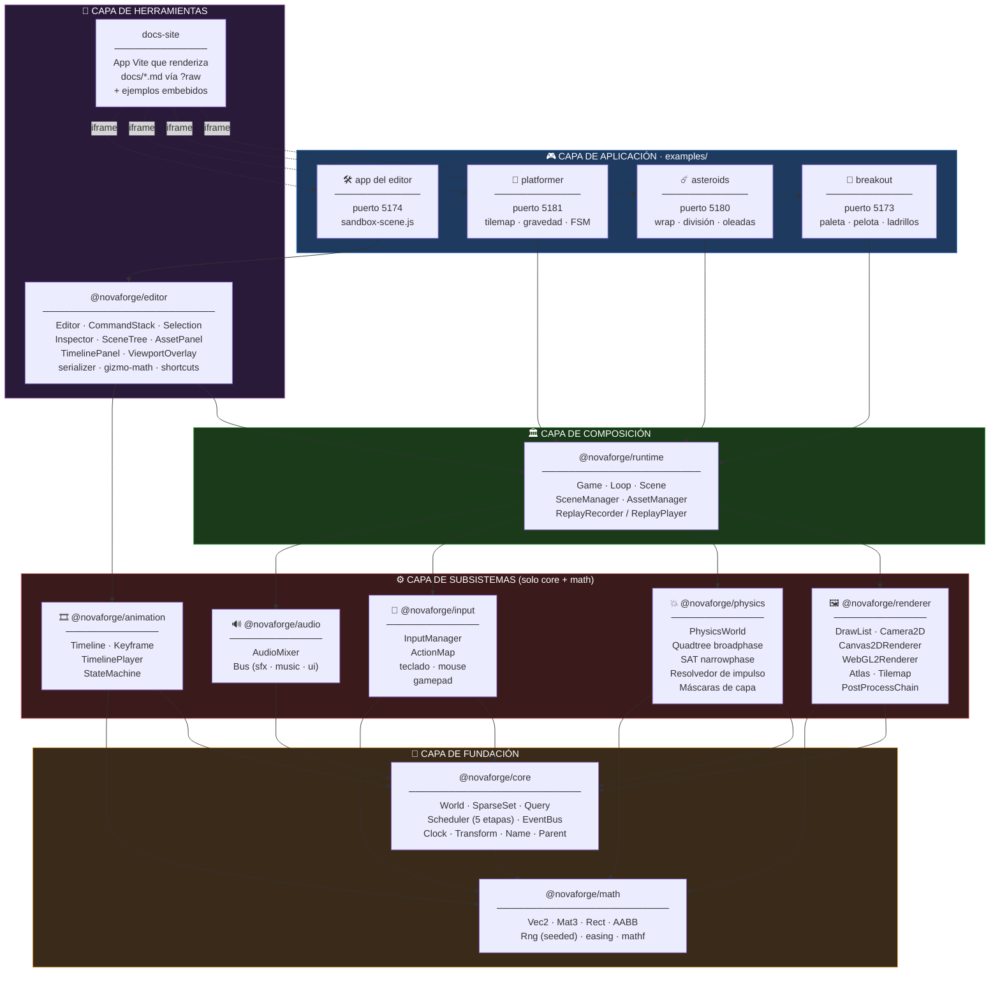
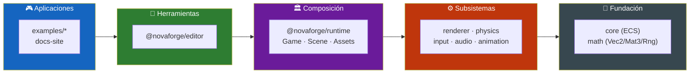
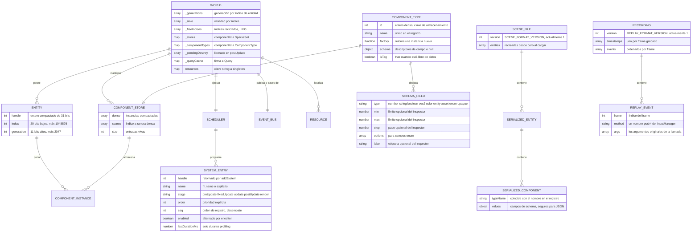
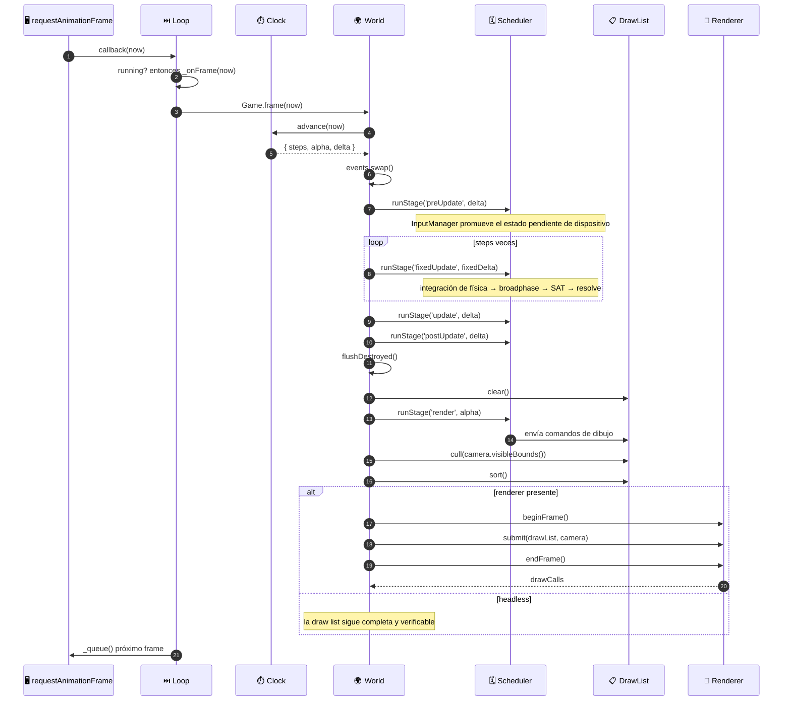
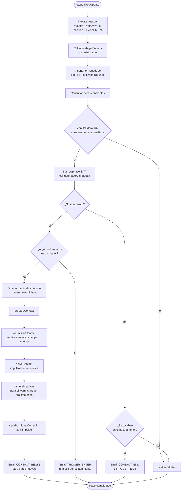
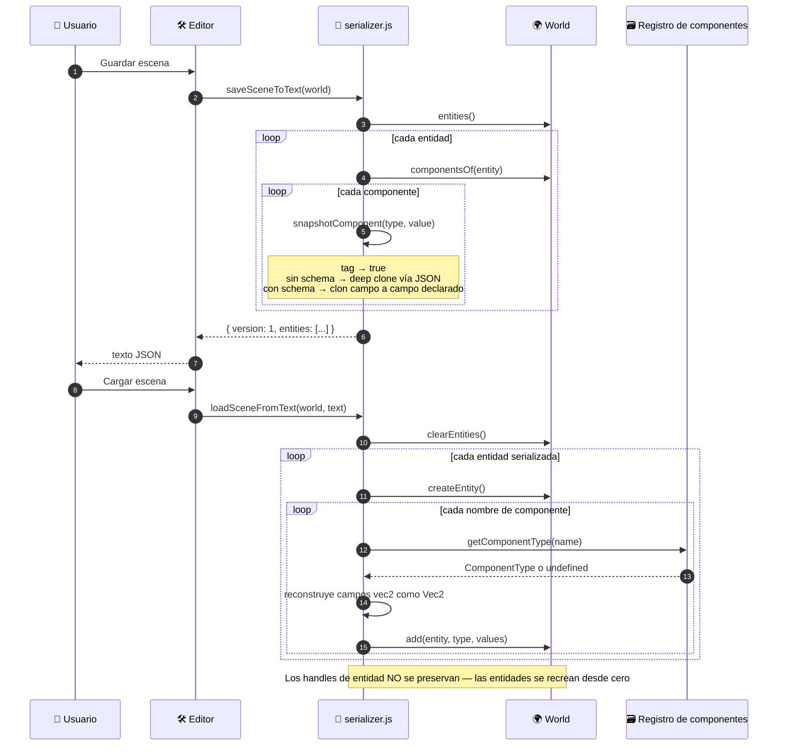
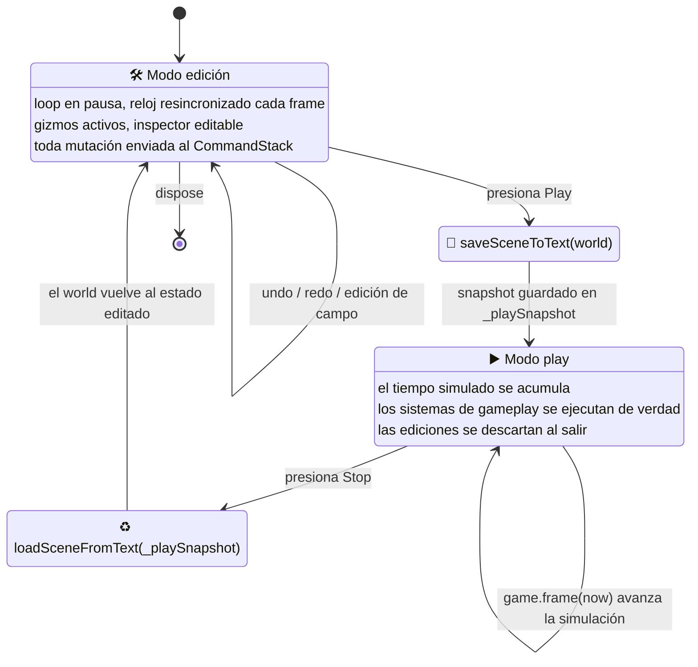
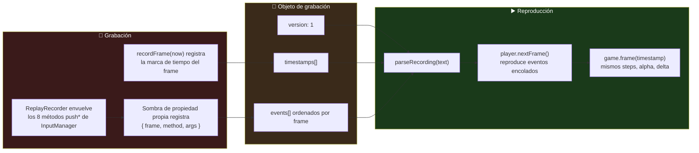
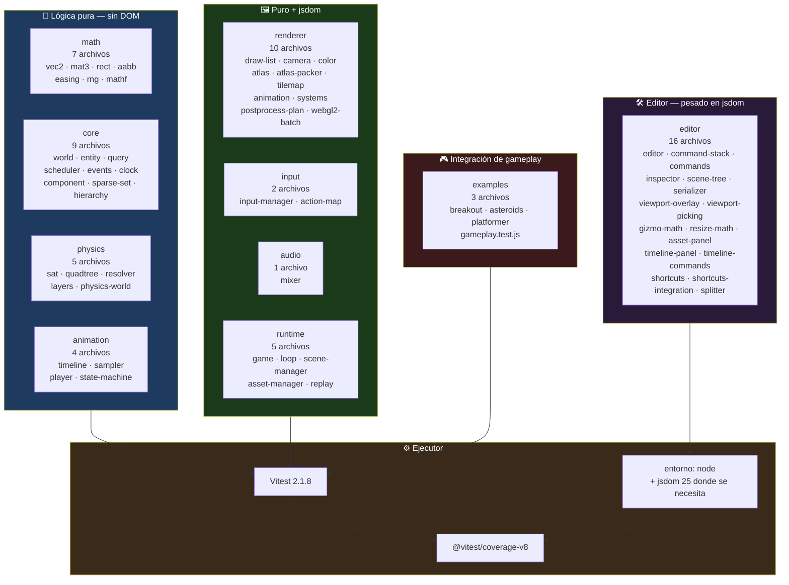

<div align="center">

**🌐 Choose Language / Selecione o Idioma / Elija el Idioma**

[](README.md)&nbsp;&nbsp;&nbsp;[](README_PT.md)&nbsp;&nbsp;&nbsp;[](README_ES.md)

</div>

---

<div align="center">

```
███╗   ██╗ ██████╗ ██╗   ██╗ █████╗ ███████╗ ██████╗ ██████╗  ██████╗ ███████╗
████╗  ██║██╔═══██╗██║   ██║██╔══██╗██╔════╝██╔═══██╗██╔══██╗██╔════╝ ██╔════╝
██╔██╗ ██║██║   ██║██║   ██║███████║█████╗  ██║   ██║██████╔╝██║  ███╗█████╗
██║╚██╗██║██║   ██║╚██╗ ██╔╝██╔══██║██╔══╝  ██║   ██║██╔══██╗██║   ██║██╔══╝
██║ ╚████║╚██████╔╝ ╚████╔╝ ██║  ██║██║     ╚██████╔╝██║  ██║╚██████╔╝███████╗
╚═╝  ╚═══╝ ╚═════╝   ╚═══╝  ╚═╝  ╚═╝╚═╝      ╚═════╝ ╚═╝  ╚═╝ ╚═════╝ ╚══════╝
             Un motor de juegos 2D y editor visual en JavaScript puro
```

---

[](https://developer.mozilla.org/docs/Web/JavaScript)
[](https://nodejs.org/)
[](https://vitest.dev/)
[](https://vite.dev/)
[](https://www.typescriptlang.org/)
[](https://eslint.org/)
[](https://developer.mozilla.org/docs/Web/API/WebGL2RenderingContext)
[](LICENSE)

<br/>

> **Un ECS sin arquetipos, dos backends de renderizado intercambiables, un solver de física SAT y un editor de escenas basado en navegador**
> construido desde cero como nueve workspaces npm de ESM estándar, sin paso de build dentro del propio motor.

<br/>


-1100-FF6B35?style=flat-square)


</div>

---

## 📑 Tabla de Contenidos

<details>
<summary>▶️ <strong>Haga clic para expandir / contraer esta sección</strong></summary>

<table>
<tr>
<td valign="top" width="50%">

**🏗️ Sistema**
- [Visión General](#-visión-general)
- [Arquitectura del Sistema](#️-arquitectura-del-sistema)
- [Stack Tecnológico](#️-stack-tecnológico)
- [Patrones de Diseño](#-patrones-de-diseño-aplicados)
- [Estructura del Proyecto](#-estructura-del-proyecto)

**📦 Módulos**
- [@novaforge/math](#-novaforgemath--primitivas-matemáticas-2d)
- [@novaforge/core](#-novaforgecore--el-runtime-ecs)
- [@novaforge/renderer](#️-novaforgerenderer--draw-list-y-backends)
- [@novaforge/physics](#-novaforgephysics--colisión-y-respuesta)
- [@novaforge/input](#-novaforgeinput--dispositivos-y-mapas-de-acción)
- [@novaforge/audio](#-novaforgeaudio--mezclador-de-web-audio)
- [@novaforge/animation](#-novaforgeanimation--keyframes-y-máquinas-de-estado)
- [@novaforge/runtime](#️-novaforgeruntime--composición-del-juego)
- [@novaforge/editor](#️-novaforgeeditor--el-editor-visual)
- [Aplicaciones de Ejemplo](#-aplicaciones-de-ejemplo)
- [Scripts de Herramientas](#-scripts-de-herramientas)

</td>
<td valign="top" width="50%">

**💼 Negocio**
- [Reglas de Negocio](#-reglas-de-negocio)
- [Requisitos Funcionales](#-requisitos-funcionales)
- [Requisitos No Funcionales](#-requisitos-no-funcionales)

**📐 Diseño**
- [Modelo de Datos](#️-modelo-de-datos)
- [Flujos del Sistema](#-flujos-del-sistema)
- [Pipeline de Frame](#pipeline-de-frame)
- [Paso de Física](#paso-de-física)
- [Máquina de Modos del Editor](#máquina-de-modos-del-editor)

**🔐 Seguridad y Operaciones**
- [Seguridad](#-seguridad)
- [Instalación & Ejecución](#-instalación--ejecución)
- [Pruebas Automatizadas](#-pruebas-automatizadas)
- [Métricas & Monitoreo](#-métricas--monitoreo)
- [Limitaciones Conocidas](#️-limitaciones-conocidas)

</td>
</tr>
</table>

---

</details>

## 🌟 Visión General

<details>
<summary>▶️ <strong>Haga clic para expandir / contraer esta sección</strong></summary>

**NovaForge** es un motor de juegos 2D y un editor visual que lo acompaña, escrito desde cero en JavaScript puro. No hay Phaser, no hay PixiJS, no hay compilador de TypeScript en el pipeline y ningún bundler dentro del motor: todo paquete bajo `packages/` es código fuente ECMAScript module estándar que un navegador o Node puede cargar directamente. La seguridad de tipos se obtiene mediante anotaciones JSDoc verificadas por `tsc -p jsconfig.json --noEmit`, razón por la cual `jsconfig.json` define `"checkJs": true` y `"strict": true` aunque el repositorio no contenga ningún archivo `.ts`.

El repositorio es un monorepo de workspaces npm declarado en `package.json` con tres globs de workspace: `packages/*`, `examples/*` y `docs-site`. Nueve de esos workspaces son el propio motor, organizados en un orden de dependencia estricto, de modo que `@novaforge/math` no depende de nada, `@novaforge/core` depende solo de math, los cuatro subsistemas hermanos (renderer, physics, input, audio) más animation dependen solo de core y math, `@novaforge/runtime` es el único paquete autorizado a conocerlos a todos, y `@novaforge/editor` se sitúa encima, sobre runtime.

La segunda mitad del proyecto es el conjunto de herramientas. `@novaforge/editor` es un editor de escenas basado en navegador con un árbol de escena que soporta re-parentado, un inspector orientado por schema generado a partir de los tipos de campo declarados de cada componente, gizmos de traslación/rotación/escala con snapping, una pila de comandos undo/redo, guardado y carga de escena en JSON, un panel de assets y un panel de línea de tiempo de keyframes. No simula una copia del juego: envuelve una instancia real de `Game` y conduce la propia función `frame()` de esa instancia, de modo que el modo de edición y el modo de juego operan sobre el mismo mundo.

### 🎯 Objetivos del Sistema

| Objetivo | Descripción |
|-----------|-------------|
| 🧩 **ECS sin arquetipos** | Almacenamiento de componentes en sparse-set con handles de entidad compactados en 31 bits, portando un contador de generación, de modo que los handles obsoletos sean detectables |
| 🎨 **Independencia de backend** | Los sistemas nunca llaman a una API de dibujo; añaden a una `DrawList` que tanto `Canvas2DRenderer` como `WebGL2Renderer` consumen de forma idéntica |
| ⏱️ **Simulación determinista** | Un `Clock` de paso fijo con una protección contra espiral de la muerte, más un solver de física independiente del orden, de modo que las mismas entradas reproduzcan el mismo resultado |
| 🧪 **Testabilidad headless** | `@novaforge/core`, `math`, `physics` y `animation` no tienen ninguna dependencia de DOM; un juego entero puede avanzarse y verificarse en Node |
| 🛠️ **Un editor de verdad** | Árbol de escena, inspector, gizmos, undo/redo, guardar/cargar, hot-reload de assets y una línea de tiempo de animación, conduciendo el runtime que se publica |
| 📼 **Replay determinista** | `ReplayRecorder` sombrea los ocho métodos `push*` de `InputManager` para registrar cada evento crudo de dispositivo junto con las marcas de tiempo de frame |
| 📦 **Salida tree-shakeable** | `build:packages` emite un `dist/index.js` minificado por paquete, y `verify:treeshaking` prueba con una ejecución real de bundler que los hermanos no usados son eliminados |
| 🚀 **Cero paso de build del motor** | Cada ejemplo apunta `@novaforge/*` directamente a `packages/*/src/index.js`, de modo que editar el código fuente del motor recarga en caliente un juego en ejecución |
| 🎮 **Juegos de ejemplo completos** | Breakout, Asteroids y un platformer con tilemap, cada uno con su propia suite de pruebas de gameplay, no solo un sprite que se mueve |

---

</details>

## 🏗️ Arquitectura del Sistema

<details>
<summary>▶️ <strong>Haga clic para expandir / contraer esta sección</strong></summary>

### Diagrama de Módulos



### Capas de la Arquitectura



> [!NOTE]
> La dirección de la dependencia se refuerza socialmente y por el bloque `dependencies` de cada paquete, no por una regla de lint. `@novaforge/math` no declara ninguna dependencia; `@novaforge/core` declara solo math; `@novaforge/runtime` declara seis; `@novaforge/editor` declara ocho.

---

</details>

## 🛠️ Stack Tecnológico

<details>
<summary>▶️ <strong>Haga clic para expandir / contraer esta sección</strong></summary>

<table>
<thead>
<tr>
<th>Capa</th>
<th>Tecnología</th>
<th>Versión</th>
<th>Propósito</th>
</tr>
</thead>
<tbody>
<tr>
<td rowspan="2">🧠 <strong>Lenguaje</strong></td>
<td>JavaScript (ESM)</td>
<td>ES2022</td>
<td>Cada archivo fuente es un módulo nativo; <code>"type": "module"</code> en todo manifiesto</td>
</tr>
<tr>
<td>Verificador JSDoc + TypeScript</td>
<td>typescript 5.7.2</td>
<td><code>tsc -p jsconfig.json --noEmit</code> con <code>checkJs</code> y <code>strict</code> habilitados, cero archivos <code>.ts</code></td>
</tr>
<tr>
<td rowspan="2">🏗️ <strong>Runtime</strong></td>
<td>Node.js</td>
<td>&ge; 20 (<code>engines</code>)</td>
<td>Host de pruebas, host de benchmarks, scripts de build; la matriz de CI ejecuta 20 y 22</td>
</tr>
<tr>
<td>Navegador (DOM, Canvas2D, WebGL2, Web Audio, Gamepad)</td>
<td>evergreen</td>
<td>El único entorno que realmente necesitan los paquetes de renderer, input y audio</td>
</tr>
<tr>
<td rowspan="3">🖼️ <strong>Renderizado</strong></td>
<td>Canvas2D</td>
<td>—</td>
<td><code>Canvas2DRenderer</code>: un <code>drawImage</code> o path por comando de dibujo, sin batching por diseño</td>
</tr>
<tr>
<td>WebGL2</td>
<td>—</td>
<td><code>WebGL2Renderer</code> + <code>webgl2-batch.js</code>: quads de sprite por lotes, render targets, post-procesamiento</td>
</tr>
<tr>
<td>Indirección vía draw list</td>
<td>—</td>
<td><code>DrawList</code> con <code>cull()</code> y <code>sort()</code>, el único contrato entre simulación y pantalla</td>
</tr>
<tr>
<td rowspan="2">🧪 <strong>Pruebas</strong></td>
<td>Vitest</td>
<td>^2.1.8</td>
<td>62 archivos de prueba emparejados por <code>packages/*/src/**/__tests__/**/*.test.js</code> y el equivalente en examples</td>
</tr>
<tr>
<td>@vitest/coverage-v8 · jsdom</td>
<td>^2.1.8 · ^25.0.1</td>
<td>Cobertura V8 sobre <code>packages/*/src/**/*.js</code>; jsdom para las suites del editor que tocan el DOM</td>
</tr>
<tr>
<td rowspan="2">📦 <strong>Build y empaquetado</strong></td>
<td>Vite</td>
<td>^6.0.7</td>
<td>Servidor de dev por ejemplo, builds de biblioteca en <code>scripts/build-packages.mjs</code></td>
</tr>
<tr>
<td>npm workspaces</td>
<td>—</td>
<td><code>packages/*</code>, <code>examples/*</code>, <code>docs-site</code>; un único lockfile en la raíz</td>
</tr>
<tr>
<td>🔍 <strong>Calidad</strong></td>
<td>ESLint (flat config)</td>
<td>^9.17.0</td>
<td><code>eqeqeq</code>, <code>no-var</code>, <code>prefer-const</code>, <code>no-undef</code>, <code>no-unused-vars</code> con escapes <code>^_</code></td>
</tr>
<tr>
<td rowspan="2">📊 <strong>Benchmarks</strong></td>
<td>Node <code>--expose-gc</code></td>
<td>—</td>
<td><code>benchmarks/run.js</code>: throughput de query del ECS, churn de entidades y paso de física</td>
</tr>
<tr>
<td>Playwright</td>
<td>^1.62.1</td>
<td><code>benchmarks/run-browser.mjs</code> captura tiempos de frame reales Canvas2D-vs-WebGL2 en Chrome headless</td>
</tr>
<tr>
<td>📚 <strong>Docs</strong></td>
<td>marked</td>
<td>^18.0.9</td>
<td><code>docs-site</code> renderiza markdown importado con el sufijo <code>?raw</code> de Vite</td>
</tr>
<tr>
<td>🤖 <strong>CI</strong></td>
<td>GitHub Actions</td>
<td><code>.github/workflows/ci.yml</code></td>
<td>Tres jobs: <em>check</em> (lint + typecheck + test en Node 20/22), <em>coverage</em>, <em>example builds</em></td>
</tr>
<tr>
<td>📄 <strong>Licencia</strong></td>
<td>MIT</td>
<td>—</td>
<td>Declarada en el manifiesto raíz y en todo manifiesto de paquete</td>
</tr>
</tbody>
</table>

---

</details>

## 🎨 Patrones de Diseño Aplicados

<details>
<summary>▶️ <strong>Haga clic para expandir / contraer esta sección</strong></summary>

| Patrón | Dónde | Justificación |
|---------|-------|-----------|
| 🧩 **Entity-Component-System** | `packages/core/src/world.js` | Los datos viven en stores `SparseSet` indexados por id de componente denso; el comportamiento vive en sistemas registrados por etapa |
| 🗂️ **Sparse Set** | `packages/core/src/sparse-set.js` | Adición, eliminación y búsqueda O(1) con un array denso compactado, elegido en lugar de arquetipos porque los juegos cambian componentes cada frame |
| 🎫 **Handle con contador de generación** | `packages/core/src/entity.js` | 20 bits de índice + 11 bits de generación compactados en un entero de 31 bits, de modo que un índice reciclado no pueda resucitar una referencia obsoleta |
| 🧾 **Command / Memento** | `packages/editor/src/command-stack.js`, `commands.js` | Toda mutación del editor es un par `{ do, undo }`; `snapshotComponent` en `serializer.js` provee el memento |
| 🔌 **Strategy (backend de renderer)** | `packages/renderer/src/renderer.js` | `Renderer` es una base abstracta que lanza error en métodos no implementados; `Canvas2DRenderer` y `WebGL2Renderer` son intercambiables en tiempo de ejecución |
| 📮 **Publish / Subscribe** | `packages/core/src/events.js` | Un `EventBus` de doble buffer intercambiado una vez por frame en `Game.frame`, de modo que un listener nunca vea un evento a medio escribir |
| 🧰 **Service Locator** | mapa `World.resources` | `DRAW_LIST_RESOURCE`, `ASSETS_RESOURCE`, `AUDIO_RESOURCE`, `INPUT_RESOURCE`, `PHYSICS_RESOURCE` evitan que `core` importe capas superiores |
| 🧱 **Composition Root** | `packages/runtime/src/game.js` | El único archivo donde se encuentran todos los paquetes; un juego que quiera otra composición ensambla las piezas por su cuenta |
| 🔁 **Object Pool / Free List** | `World._freeIndices` | Los índices de entidades destruidas se reciclan en orden LIFO para mantener los arrays densos compactos |
| 🎭 **Decorator (sombreado de método)** | `packages/runtime/src/replay.js` | `ReplayRecorder` instala propiedades propias sobre los ocho métodos `push*` de `InputManager` para registrar eventos sin cambiar la clase |
| 🏷️ **UI orientada por schema** | `packages/core/src/component.js` + `packages/editor/src/inspector.js` | Cada componente declara tipos de campo (`number`, `vec2`, `color`, `enum`, `opaque`), y el inspector genera sus widgets a partir de eso |
| 🧵 **Template Method (Scene)** | `packages/runtime/src/scene.js` | Hooks `onEnter` / `onExit` / `onPause` / `onResume` que `SceneManager` llama en puntos fijos del ciclo de vida de la pila |

---

</details>

## 📁 Estructura del Proyecto

<details>
<summary>▶️ <strong>Haga clic para expandir / contraer esta sección</strong></summary>

```
novaforge/
│
├── 📄 package.json                    # Manifiesto raíz del workspace, 14 scripts npm, MIT
├── 📄 package-lock.json               # Lockfile único para todo el monorepo
├── 📄 vitest.config.js                # Globs de prueba, alias @novaforge/* → src, cobertura v8
├── 📄 eslint.config.js                # Flat config: ES2022, globales de navegador, 5 reglas
├── 📄 jsconfig.json                   # Verificación de tipos strict + checkJs sobre .js puro
├── 📄 .editorconfig                   # Convenciones de espaciado compartidas
├── 📄 LICENSE                         # MIT
│
├── 📂 .github/workflows/
│   └── 📄 ci.yml                      # check (Node 20/22) · coverage · builds de ejemplo
│
├── 📂 packages/                       # ★ El motor — 9 workspaces npm
│   ├── 📂 math/src/                   # Vec2, Mat3, Rect, AABB, Rng, easing, mathf
│   ├── 📂 core/src/                   # World, SparseSet, Query, Scheduler, EventBus, Clock
│   │   ├── 📄 world.js                #   517 líneas: entidades, stores, queries, resources
│   │   ├── 📄 entity.js               #   Handle compactado: 20 bits de índice + 11 de generación
│   │   ├── 📄 sparse-set.js           #   La primitiva de almacenamiento detrás de cada componente
│   │   ├── 📄 query.js                #   Iteración sobre el componente requerido más raro
│   │   ├── 📄 scheduler.js            #   5 etapas, `order` explícito, profiling opcional
│   │   ├── 📄 events.js               #   Canales de doble buffer, intercambiados por frame
│   │   ├── 📄 clock.js                #   Paso fijo + clamp de espiral de la muerte
│   │   ├── 📄 component.js            #   defineComponent / defineTag + schema de campos
│   │   ├── 📄 hierarchy.js            #   Componente Parent, re-parentado, descendientes
│   │   ├── 📄 transform.js            #   El componente Transform compartido
│   │   └── 📄 name.js                 #   El componente Name que el árbol del editor muestra
│   ├── 📂 renderer/src/               # 18 módulos: draw list, cámara, ambos backends
│   │   ├── 📄 draw-list.js            #   Comandos DrawKind, cull(), sort()
│   │   ├── 📄 renderer.js             #   Interfaz abstracta de backend
│   │   ├── 📄 canvas2d-renderer.js    #   Backend #1, un comando por llamada de dibujo
│   │   ├── 📄 webgl2-renderer.js      #   Backend #2
│   │   ├── 📄 webgl2-batch.js         #   Batching de quads para el camino WebGL2
│   │   ├── 📄 atlas.js / atlas-packer.js  # TextureAtlas, AtlasRegistry, empaquetado de rects
│   │   ├── 📄 tilemap.js              #   Componente Tilemap + sistema de renderizado
│   │   ├── 📄 postprocess*.js         #   PostProcessChain y su calculador de plan puro
│   │   └── 📄 render-target.js        #   Targets offscreen para la cadena
│   ├── 📂 physics/src/                # Quadtree, SAT, resolvedor de impulso con warm start
│   ├── 📂 input/src/                  # InputManager, ActionMap, mouse, sistemas
│   ├── 📂 audio/src/                  # AudioMixer, Bus
│   ├── 📂 animation/src/              # Timeline, sampler, player, máquina de estado
│   ├── 📂 runtime/src/                # Game, Loop, Scene, SceneManager, AssetManager, replay
│   └── 📂 editor/src/                 # 17 módulos + style.css — el editor visual
│       ├── 📄 editor.js               #   Envuelve un Game real, controla el modo edit/play
│       ├── 📄 command-stack.js        #   Undo/redo
│       ├── 📄 serializer.js           #   JSON de escena, formato versión 1
│       ├── 📄 inspector.js            #   Widgets generados a partir de los schemas de componente
│       ├── 📄 scene-tree.js           #   Vista de jerarquía con re-parentado por arrastre
│       ├── 📄 gizmo-math.js           #   Geometría pura de handle y snapping
│       ├── 📄 viewport-picking.js     #   Prueba de acierto pura
│       └── 📄 timeline-panel.js       #   Superficie de edición de keyframes
│
├── 📂 examples/                       # 4 apps Vite ejecutables
│   ├── 📂 breakout/                   # puerto 5173 — paleta, pelota, ladrillos, HUD
│   ├── 📂 asteroids/                  # puerto 5180 — wrap de pantalla, división, oleadas
│   ├── 📂 platformer/                 # puerto 5181 — tilemap, monedas, obstáculos, cámara
│   └── 📂 editor/                     # puerto 5174 — el editor sobre sandbox-scene.js
│
├── 📂 docs-site/                      # puerto 5176 — renderiza docs/*.md, embebe los ejemplos
│   ├── 📄 index.html
│   └── 📂 src/                        # main.js, docs.js, style.css
│
├── 📂 docs/                           # ⚠️ Presente pero actualmente vacío (ver Limitaciones Conocidas)
│   └── 📂 adr/
│
├── 📂 benchmarks/
│   ├── 📄 run.js                      # Throughput de ECS/física en Node, requiere --expose-gc
│   ├── 📄 run-browser.mjs             # Captura Canvas2D vs WebGL2 conducida por Playwright
│   ├── 📄 browser-results.json        # Capturado el 2026-08-06, HeadlessChrome 151
│   └── 📂 browser/                    # La página que conduce el benchmark de navegador
│
├── 📂 scripts/
│   ├── 📄 build-packages.mjs          # dist/index.js minificado por paquete
│   ├── 📄 verify-treeshaking.mjs      # Ejecución real de bundler que prueba la eliminación de código muerto
│   ├── 📄 build-docs-site.mjs         # Construye los ejemplos, los anida dentro de docs-site/dist
│   └── 📄 verify-docs-site.mjs        # Prueba de humo con Playwright, lee píxeles del canvas
│
├── 📄 README.md                       # 🇺🇸 Inglés (primario)
├── 📄 README_PT.md                    # 🇧🇷 Portugués
└── 📄 README_ES.md                    # 🇪🇸 Español
```

---

</details>

## 📦 Módulos del Sistema

<details>
<summary>▶️ <strong>Haga clic para expandir / contraer esta sección</strong></summary>

### 🔢 @novaforge/math — Primitivas Matemáticas 2D

Datos puros sin dependencias del motor. Esto es lo que permite que cada paquete de simulación siga siendo testeable en Node sin ningún DOM presente. Ocho módulos fuente, siete archivos de prueba.

| Export | Tipo | Notas |
|--------|------|-------|
| `Vec2` | clase | Vector 2D; tiene un `toJSON`, que es lo que hace posible la serialización de escena |
| `Mat3` | clase | Matriz afín 3x3 usada para composición de cámara y transform |
| `Rect` | clase | Rectángulo alineado a los ejes; la región del broadphase de física y los límites de la cámara |
| `AABB` | clase | Caja delimitadora alineada a los ejes usada por la quadtree y el culling |
| `Rng` | clase | Generador pseudoaleatorio con semilla, una precondición del replay determinista |
| `easing` | namespace | `export * as easing` de `easing.js`, consumido por el sampler de animación |
| `clamp` `clamp01` `lerp` `inverseLerp` `remap` | funciones | Auxiliares escalares de `mathf.js` |
| `approximately` `sign` `wrap` `wrapAngle` | funciones | Auxiliares de comparación y ángulo |
| `moveTowards` `smoothDamp` | funciones | Seguimiento de valor sensible a la tasa de frames |
| `nearestPowerOfTwo` `isPowerOfTwo` | funciones | Auxiliares de dimensionado de textura |
| `EPSILON` `DEG_TO_RAD` `RAD_TO_DEG` `TAU` | constantes | Constantes numéricas compartidas |

---

### 🧩 @novaforge/core — El Runtime ECS

El corazón del motor, y deliberadamente libre de cualquier dependencia de DOM: `new World()` funciona en Node, lo que hace posible toda la suite de pruebas headless. Doce módulos fuente, nueve archivos de prueba, 1.846 líneas.

| Preocupación | API | Comportamiento |
|---------|-----|-----------|
| Ciclo de vida de la entidad | `createEntity()` `spawn(...)` `destroy()` `destroyImmediate()` `flushDestroyed()` | `destroy` marca como muerta inmediatamente pero difiere la limpieza de almacenamiento a `postUpdate`, de modo que los sistemas que iteran a mitad de frame nunca se vean sorprendidos |
| Validez de handle | `isAlive()` `generationOf()` `describeEntity()` | La generación se incrementa al reciclar y da la vuelta en `MAX_GENERATION` (2047) |
| Componentes | `add()` `remove()` `get()` `getOrThrow()` `getOrAdd()` `has()` `componentsOf()` | `add` sobrescribe un componente existente a propósito, convirtiendo el re-add en un idioma de reset-a-valores-por-defecto |
| Queries | `query(required, { without })` | Los resultados se cachean por una cadena de firma `id,id\|id`, ya que los sistemas construyen queries cada frame |
| Resources | `setResource()` `getResource()` `requireResource()` | `requireResource` lanza error por diseño: un resource faltante significa que un plugin falló al instalarse |
| Sistemas | `addSystem(stage, fn, { order, name })` `removeSystem()` `runStage()` | Números `order` explícitos, empates resueltos por la secuencia de registro |
| Ciclo de vida | `clearEntities()` `reset()` `stats()` | `clearEntities` mantiene sistemas y resources; `reset` limpia todo |

**Diseño del handle de entidad** (`entity.js`)

| Campo | Bits | Constante de máscara | Significado |
|-------|------|---------------|---------|
| index | 20 | `ENTITY_INDEX_MASK` | Ranura de almacenamiento; hasta `MAX_ENTITIES` = 1.048.576 entidades vivas |
| generation | 11 | `ENTITY_GENERATION_MASK` | Contador de reciclaje; empieza en 1 para que ningún handle vivo sea nunca `0` |
| — | 31 total | `NULL_ENTITY = 0` | Permanecer dentro de 32 bits con signo mantiene `\|` y `>>>` en el camino rápido de enteros |

**Etapas del scheduler**, en el orden en que `Game.frame` las ejecuta:

| # | Etapa | Se ejecuta | Ocupantes típicos |
|---|-------|------|-------------------|
| 1 | `preUpdate` | una vez por frame | `InputManager.update()` promoviendo el estado pendiente de dispositivo |
| 2 | `fixedUpdate` | 0..N veces por frame | Integración de física y gameplay que debe ser determinista |
| 3 | `update` | una vez por frame | Gameplay de tasa variable, seguimiento de cámara, estado de HUD |
| 4 | `postUpdate` | una vez por frame | Limpieza; las destrucciones diferidas se liberan justo después |
| 5 | `render` | una vez por frame | Sistemas que añaden a la `DrawList`, recibiendo `alpha` como `dt` |

---

### 🖼️ @novaforge/renderer — Draw List y Backends

Todo entre la simulación y la pantalla. La simulación nunca llama a una API de dibujo: los sistemas de renderizado añaden comandos a una `DrawList`, y un backend la consume. Esa indirección es la razón por la que el culling y el orden de sort son testeables por unidad en Node sin ningún canvas involucrado. Dieciocho módulos fuente, diez archivos de prueba, 3.460 líneas, el paquete más grande del repositorio.

| Área | Exports | Propósito |
|------|---------|---------|
| Draw list | `DrawList`, `DrawKind` | El único contrato entre sistemas y backends; soporta `cull(bounds)` y `sort()` |
| Backends | `Renderer`, `Canvas2DRenderer`, `WebGL2Renderer` | `Renderer` es abstracto y lanza error en cualquier método no implementado, de modo que un backend parcialmente construido falla en la construcción |
| Batching | `webgl2-batch.js` | Batching de quads que reduce 8.000 sprites a 8 llamadas de dibujo en el benchmark capturado |
| Cámara | `Camera2D` | Tamaño del viewport, `visibleBounds()` usado para culling, proyección mundo/pantalla |
| Componentes | `Transform`, `Sprite`, `ShapeRect`, `ShapeCircle`, `TextLabel` | El conjunto de componentes renderizables |
| Sistemas | `spriteRenderSystem`, `shapeRenderSystem`, `textRenderSystem`, `syncPreviousTransform`, `installRenderSystems` | Registrados bajo la etapa `render`; `DRAW_LIST_RESOURCE` es su handle hacia la lista |
| Texturas | `TextureCache`, `TextureAtlas`, `AtlasRegistry` | Carga y búsqueda de región de atlas |
| Empaquetado | `packRects`, `packingEfficiency`, `packTextures` | Empaquetado de atlas puro, probado de forma independiente |
| Animación de sprite | `defineClip`, `play`, `Animator`, `animationSystem`, `installAnimationSystem` | Animación de sprite basada en frames sobre regiones de atlas |
| Tilemaps | `Tilemap`, `setTile`, `getTile`, `worldToTile`, `resizeTilemap`, `inTilemapBounds`, `tilemapRenderSystem` | Geometría de nivel en cuadrícula, usada por el ejemplo del platformer |
| Post-procesamiento | `RenderTarget`, `PostProcessChain`, `POSTPROCESS_EFFECTS`, `computePostProcessPlan`, `fullscreenQuadVertices` | Targets offscreen más un calculador de plan puro que es testeable sin un contexto GL |
| Color | `rgb`, `rgba`, `fromHexString`, `toCssColor`, `channels`, `lerpColor`, `WHITE`, `BLACK`, `MAGENTA` | Auxiliares de 0xRRGGBB compactado |

---

### 💥 @novaforge/physics — Colisión y Respuesta

Un pipeline de cuatro etapas: integrar, broadphase (quadtree), narrowphase (SAT), resolver (impulsos secuenciales). Nueve módulos fuente, cinco archivos de prueba, 1.880 líneas.

| Etapa | Módulo | Detalle |
|-------|--------|--------|
| Formas | `shapes.js` | `circle`, `box`, `polygon`, más `shapeBounds`, `shapeArea`, `momentOfInertia` |
| Filtrado | `layers.js` | `Layers`, `canCollide`, `layerFromNames`, `describeMask`; el filtrado es simétrico a propósito |
| Broadphase | `quadtree.js` | Subdivisión espacial sobre una región `Rect`, por defecto `(-10000, -10000, 20000, 20000)` desde `Game` |
| Narrowphase | `sat.js` | `collide`, `collideCircles`, `collidePolygons`, `collideCirclePolygon` |
| Resolución | `resolver.js` | `prepareContact`, `warmStartContact`, `solveContact`, `captureImpulses`, `resolveContact`, `applyPositionalCorrection` |
| World | `physics-world.js` | Posee la quadtree y la contabilidad de contacto entre pasos |
| Componentes | `components.js` | `RigidBody`, `Collider`, `BodyType`, `setMass`, `makeStatic` |
| Conexión | `systems.js` | `installPhysicsSystems`, `PHYSICS_RESOURCE` |

**Eventos de contacto** publicados en el `EventBus` del world:

| Constante | Canal | Payload | Se dispara |
|----------|---------|---------|-------|
| `CONTACT_BEGIN` | `physics:contactBegin` | `{ a, b, normal, penetration }` | Primer frame en que dos colisionadores se tocan |
| `CONTACT_END` | `physics:contactEnd` | `{ a, b }` | Primer frame en que dejan de tocarse |
| `TRIGGER_ENTER` | `physics:triggerEnter` | `{ trigger, other }` | Una vez por solapamiento, no una vez por frame |
| `TRIGGER_EXIT` | `physics:triggerExit` | `{ trigger, other }` | Primer frame en que termina el solapamiento |

---

### 🎹 @novaforge/input — Dispositivos y Mapas de Acción

El gameplay lee **acciones**, no teclas: `input.pressed('jump')` sobrevive a un rebind, al soporte de gamepad y a un segundo jugador local, mientras que `input.pressed('Space')` no. Cinco módulos fuente, dos archivos de prueba.

| Export | Rol |
|--------|------|
| `InputManager` | Posee el estado pendiente y actual de dispositivo; `attach(canvas)` instala listeners de DOM, `detach()` los elimina |
| `INPUT_RESOURCE` | La clave de resource del world bajo la cual se registra el manager |
| `ActionMap` | Acciones nombradas vinculadas a entradas de dispositivo |
| `MouseButton` | Enum de constantes de botón |
| `installInputSystems` | Registra el sistema `preUpdate` que promueve el estado pendiente al snapshot legible |

**Superficie de eventos crudos** — los ocho métodos `push*` por los que pasa cada listener de DOM, y exactamente lo que registra `ReplayRecorder`:

| Método | Origen |
|--------|--------|
| `pushKeyDown` / `pushKeyUp` | `keydown` / `keyup` |
| `pushMouseDown` / `pushMouseUp` | `mousedown` / `mouseup` |
| `pushMouseMove` | `mousemove` |
| `pushWheel` | `wheel` |
| `pushMouseLeave` | `mouseleave` |
| `pushGamepadState` | Polling de la Gamepad API |

---

### 🔊 @novaforge/audio — Mezclador de Web Audio

Los sonidos se direccionan por id y se enrutan a través de buses nombrados, cada uno con su propio volumen, alimentando todos a un master. Tres módulos fuente, un archivo de prueba.

| Export | Rol |
|--------|------|
| `AudioMixer` | Posee el `AudioContext`, rastrea `voiceCount`, expone `dispose()` |
| `Bus` | Un grupo de volumen nombrado; el conjunto convencional es `sfx`, `music`, `ui` |
| `AUDIO_RESOURCE` | La clave de resource del world registrada por `Game` |

> [!NOTE]
> La estructura de buses está presente desde el inicio a propósito. Adaptar sliders separados de música y efectos más tarde significa tocar cada llamada `play()` de una base de código.

---

### 🎞️ @novaforge/animation — Keyframes y Máquinas de Estado

Pistas de keyframe sobre campos de componente *arbitrarios*, un player de línea de tiempo y una máquina de estados. Depende solo de core y math, quedando en paralelo a renderer y physics, porque anima cualquier campo declarado por schema de cualquier componente, en lugar de campos específicos de renderizado. Cinco módulos fuente, cuatro archivos de prueba.

| Módulo | Exports | Propósito |
|--------|---------|---------|
| `timeline.js` | `defineTrack`, `defineTimeline` | Pistas de keyframe declarativas; también los typedefs `Keyframe`, `KeyframeTrack`, `Timeline` reexportados desde el barrel |
| `sampler.js` | `sampleTrack`, `interpolateValue` | Evaluación pura de una pista en un instante, con easing aplicado |
| `player.js` | `TimelinePlayer`, `play`, `timelineSystem`, `installTimelineSystem` | Avanza players cada frame y escribe los valores muestreados de vuelta en los componentes |
| `state-machine.js` | `defineState`, `defineStateMachine`, `AnimationController`, `enterStateMachine`, `setParameter`, `stateMachineSystem`, `installStateMachineSystem` | Transiciones orientadas por parámetro; el ejemplo del platformer la usa para idle/run/jump |

---

### 🏛️ @novaforge/runtime — Composición del Juego

El único paquete autorizado a conocer a todos los demás. Todo lo que está debajo de él permanece testeable de forma independiente precisamente porque la conexión vive aquí y en ningún otro lugar. Siete módulos fuente, cinco archivos de prueba.

| Export | Responsabilidad |
|--------|----------------|
| `Game` | Construye `World`, `Clock`, `DrawList`, `Camera2D`, `TextureCache`, `AudioMixer`, `AssetManager`, `SceneManager`, `Loop`, instala sistemas de input, render y (opcionalmente) física |
| `Loop` | Convierte tiempo de reloj en invocaciones `onFrame`; `schedule`/`cancel` son inyectables para que las pruebas lo avancen manualmente |
| `Scene` | Hooks `onEnter` / `onExit` / `onPause` / `onResume` |
| `SceneManager` | Una **pila** de escenas: `change`, más push/pop para overlays como las escenas de pausa de los ejemplos |
| `AssetManager` | Texturas y sonidos con conteo de referencias; `ASSETS_RESOURCE` |
| `ReplayRecorder` / `ReplayPlayer` | Graba y reproduce input crudo más marcas de tiempo de frame; `parseRecording`, `REPLAY_FORMAT_VERSION` |

**Opciones del constructor de `Game`**

| Opción | Por defecto | Efecto |
|--------|---------|--------|
| `canvas` | `undefined` | Omítalo para un juego headless: `renderer` queda `null`, cada etapa sigue ejecutándose y la draw list se sigue llenando |
| `gravity` | reenviado | Reenviado a `installPhysicsSystems` |
| `fixedDelta` | `1/60` | Segundos por paso de simulación |
| `backgroundColor` | por defecto del backend | `0xRRGGBB` compactado |
| `worldBounds` | `Rect(-10000, -10000, 20000, 20000)` | La región de broadphase de la física |
| `assetBaseUrl` | `undefined` | Prefijo para las cargas de assets |
| `physics` | `true` | Ponga `false` para omitir la instalación de la física por completo |

---

### 🛠️ @novaforge/editor — El Editor Visual

Diecisiete módulos fuente más `style.css`, dieciséis archivos de prueba, 2.542 líneas. `Editor` envuelve un `Game` real en lugar de reemplazarlo: el modo play retoma exactamente el loop que el modo edit mantiene pausado, de modo que lo que se ve en el editor y lo que se publica son la misma cosa por construcción.

| Subsistema | Módulos | Notas |
|-----------|---------|-------|
| Shell | `editor.js` | Posee `mode` (`'edit'` \| `'play'`), el snapshot de play, y es el *único* conductor de `game.frame()` |
| Historial | `command-stack.js`, `commands.js`, `timeline-commands.js` | `setFieldCommand`, `addComponentCommand`, `removeComponentCommand`, `createEntityCommand`, `deleteEntityCommand`, `renameEntityCommand`, `setParentCommand`, `setKeyframeCommand`, `removeKeyframeCommand` |
| Selección | `selection.js` | El conjunto de entidades actual sobre el que operan el inspector y los gizmos |
| Paneles | `inspector.js`, `scene-tree.js`, `asset-panel.js`, `timeline-panel.js` | El inspector se genera a partir de los schemas de componente, nunca escrito a mano por componente |
| Viewport | `viewport-overlay.js`, `viewport-picking.js`, `gizmo-math.js`, `resize-math.js` | `pickEntity` y toda la geometría de gizmo son funciones puras, probadas sin DOM |
| Persistencia | `serializer.js` | `serializeScene` / `deserializeScene`, `saveSceneToText` / `loadSceneFromText`, `SCENE_FORMAT_VERSION = 1` |
| Ergonomía | `shortcuts.js`, `splitter.js` | `comboFromEvent`, `DEFAULT_BINDINGS`, `installDefaultShortcuts`, y un splitter de panel arrastrable |

**Constantes de gizmo math**

| Export | Propósito |
|--------|---------|
| `ROTATE_HANDLE_DISTANCE` / `SCALE_HANDLE_DISTANCE` | Desplazamientos del handle desde el centro de la selección |
| `rotateHandlePosition` / `scaleHandlePosition` | Posicionamiento del handle dado un transform |
| `angleFromCenter` / `scaleFromDrag` | Conversión de arrastre a valor |
| `snapValue` / `snapPoint` / `snapAngle` | Snapping de cuadrícula y de ángulo |

---

### 🎮 Aplicaciones de Ejemplo

Cuatro apps Vite, cada una un workspace npm con su propio `package.json`, `vite.config.js` y puerto fijo de servidor de dev. Tres de ellas traen una suite de pruebas de gameplay bajo `src/__tests__/gameplay.test.js`.

| App | Puerto | Nombre del workspace | Demuestra |
|-----|------|----------------|--------------|
| 🧱 **breakout** | 5173 | `@novaforge/example-breakout` | Sistemas `paddle.js`, `ball.js`, `bricks.js`, `hud.js`; una escena de pausa empujada en la pila |
| ☄️ **asteroids** | 5180 | `@novaforge/example-asteroids` | `ship.js`, `asteroids.js`, `wrap.js`, `hud.js`; wrap de pantalla y división de asteroides |
| 🏃 **platformer** | 5181 | `@novaforge/example-platformer` | `player.js`, `camera.js`, `coins.js`, `hazards.js`, `goal.js`, `animation.js` sobre un tilemap `level.js` |
| 🛠️ **editor** | 5174 | `@novaforge/example-editor` | El editor conduciendo `sandbox-scene.js`, con una barra de cambio de backend en vivo |

Cada ejemplo sigue el mismo diseño interno: `components.js`, `config.js`, `factories.js`, `main.js`, `scenes/play-scene.js`, `scenes/pause-scene.js` y una carpeta `systems/`. Solo el platformer añade `level.js` y `player-animation.js`.

---

### 🧰 Scripts de Herramientas

| Script | Comando | Qué hace |
|--------|---------|--------------|
| `scripts/build-packages.mjs` | `npm run build:packages` | Build de biblioteca vía Vite produciendo un `dist/index.js` minificado por paquete; los imports entre paquetes permanecen externos en lugar de inlined |
| `scripts/verify-treeshaking.mjs` | `npm run verify:treeshaking` | Empaqueta una app diminuta que importa un símbolo de `@novaforge/core`, dos veces (desde la fuente y desde `dist/`), y falla si aparecen tokens prohibidos como `WebGL2Renderer` |
| `scripts/build-docs-site.mjs` | `npm run docs:build` | Construye los cuatro ejemplos, luego anida su salida dentro de `docs-site/dist` para que la pestaña Play pueda hacerles iframe relativamente |
| `scripts/verify-docs-site.mjs` | (invocado manualmente) | Prueba de humo con Playwright en el puerto 5177: la navegación renderiza, el markdown convierte, y el canvas del ejemplo embebido tiene píxeles no en blanco |
| `benchmarks/run.js` | `npm run bench` | Benchmark de throughput en Node con `--expose-gc`, forzando una recolección entre secciones |
| `benchmarks/run-browser.mjs` | `npm run bench:browser` | Captura vía Playwright de Canvas2D vs WebGL2 en 500 / 2.000 / 8.000 sprites |

---

</details>

## 💼 Reglas de Negocio

<details>
<summary>▶️ <strong>Haga clic para expandir / contraer esta sección</strong></summary>

### 🧩 Reglas de Entidad y Componente

| # | Regla | Aplicación |
|---|------|-------------|
| RN-01 | Un handle de entidad es un único entero de 31 bits, nunca un objeto | `makeEntity` en `entity.js` compacta índice y generación |
| RN-02 | Las generaciones empiezan en 1, para que ningún handle vivo sea igual a `NULL_ENTITY` | `World.createEntity` fija `_generations[index] = 1` para índices nuevos |
| RN-03 | Destruir una entidad ya muerta es un no-op, no un error | `World.destroy` retorna `false` cuando `isAlive` es falso |
| RN-04 | El almacenamiento de componente no se recupera hasta que se ejecuta `flushDestroyed()` | Cola `_pendingDestroy`, liberada por `Game.frame` tras `postUpdate` |
| RN-05 | Añadir un componente que ya existe lo sobrescribe | `World.add` siempre llama a `type.factory()` y luego a `store.set` |
| RN-06 | Añadir un componente a una entidad muerta lanza error | `World.add` lanza `Error` en lugar de simplemente no hacer nada |
| RN-07 | Los nombres de componente duplicados se rechazan en el momento de la definición | `defineComponent` lanza error cuando el registro ya contiene el nombre |
| RN-08 | Una factory de componente debe retornar un objeto nuevo en cada llamada | Contrato documentado; un literal compartido daría a cada entidad la misma instancia |
| RN-09 | Las instancias de componente son datos puros sin métodos ni closures | Requerido para `JSON.stringify` de guardados de escena y el snapshot de play del editor |

### ⏱️ Reglas de Simulación

| # | Regla | Aplicación |
|---|------|-------------|
| RN-10 | Un delta de frame mayor que `maxFrameTime` se limita, nunca se acumula | `Clock.maxFrameTime`, por defecto 0.25 s, la protección contra espiral de la muerte |
| RN-11 | `fixedUpdate` se ejecuta cero o más veces por frame, `update` exactamente una vez | El bucle `for (let i = 0; i < steps; …)` en `Game.frame` |
| RN-12 | Los eventos se intercambian antes de que cualquier etapa los lea | `world.events.swap()` es la primera instrucción en `Game.frame` |
| RN-13 | La draw list se limpia y reconstruye desde cero cada frame | `this.drawList.clear()` inmediatamente antes de la etapa `render` |
| RN-14 | El culling ocurre antes de la ordenación, ambos antes del envío | `drawList.cull(camera.visibleBounds())` seguido de `drawList.sort()` |
| RN-15 | Registrar un sistema en una etapa desconocida lanza error | `Scheduler.add` valida contra `STAGES` |
| RN-16 | Los empates de orden de sistema se resuelven por la secuencia de registro, nunca arbitrariamente | El campo `seq` en cada `SystemEntry` |

### 💥 Reglas de Física y del Editor

| # | Regla | Aplicación |
|---|------|-------------|
| RN-17 | El filtrado de colisión es simétrico; una máscara unilateral no puede dejar pasar objetos | `canCollide` en `layers.js` |
| RN-18 | La resolución de contacto es determinista; los pares se ordenan antes de resolver | Invariante documentado P2 en `physics/src/index.js` |
| RN-19 | Los eventos de trigger se disparan una vez por solapamiento, no una vez por frame | Contabilidad de `TRIGGER_ENTER` / `TRIGGER_EXIT` en `PhysicsWorld` |
| RN-20 | Entrar en modo play toma un snapshot de la escena; salir de él restaura el snapshot | `Editor._playSnapshot`, escrito y leído a través del serializador |
| RN-21 | El editor es el único conductor del loop de frame que posee | `Editor.frame()` llama a `game.frame(now)` directamente, nunca a `game.loop.start()` |
| RN-22 | La identidad de entidad no se preserva en un round trip de guardar/cargar escena | Documentado en `serializer.js`; las entidades se recrean desde cero, tal como ya hace `Scene.onEnter` |
| RN-23 | Un componente sin schema declarado se serializa de forma opaca, sin cambios | `snapshotComponent` recurre a un deep clone vía JSON |

---

</details>

## ✅ Requisitos Funcionales

<details>
<summary>▶️ <strong>Haga clic para expandir / contraer esta sección</strong></summary>

| ID | Requisito | Prioridad | Estado |
|----|-------------|----------|--------|
| **RF-01** | El motor debe crear, destruir y reciclar entidades con detección de handle obsoleto | 🔴 Alta | ✅ Implementado |
| **RF-02** | El motor debe almacenar componentes en sparse sets indexados por un id entero denso | 🔴 Alta | ✅ Implementado |
| **RF-03** | El motor debe soportar queries con conjuntos de componentes requeridos y excluidos | 🔴 Alta | ✅ Implementado |
| **RF-04** | El motor debe cachear queries por la firma de componentes entre frames | 🟡 Media | ✅ Implementado |
| **RF-05** | El motor debe ejecutar sistemas en cinco etapas ordenadas con prioridades explícitas | 🔴 Alta | ✅ Implementado |
| **RF-06** | El motor debe proveer un bus de eventos de doble buffer intercambiado una vez por frame | 🔴 Alta | ✅ Implementado |
| **RF-07** | El motor debe avanzar la simulación en paso fijo con un alpha de interpolación | 🔴 Alta | ✅ Implementado |
| **RF-08** | El motor debe renderizar mediante una draw list consumible por cualquier backend | 🔴 Alta | ✅ Implementado |
| **RF-09** | El motor debe incluir un backend Canvas2D | 🔴 Alta | ✅ Implementado |
| **RF-10** | El motor debe incluir un backend WebGL2 con batching de sprites | 🔴 Alta | ✅ Implementado |
| **RF-11** | El motor debe soportar render targets y una cadena de post-procesamiento | 🟡 Media | ✅ Implementado |
| **RF-12** | El motor debe empaquetar y direccionar atlas de textura | 🟡 Media | ✅ Implementado |
| **RF-13** | El motor debe renderizar tilemaps como un componente de primera clase | 🟡 Media | ✅ Implementado |
| **RF-14** | El motor debe detectar colisiones usando broadphase por quadtree y narrowphase por SAT | 🔴 Alta | ✅ Implementado |
| **RF-15** | El motor debe resolver contactos con impulsos secuenciales con warm start | 🔴 Alta | ✅ Implementado |
| **RF-16** | El motor debe publicar eventos de inicio/fin de contacto y de trigger | 🔴 Alta | ✅ Implementado |
| **RF-17** | El motor debe mapear input crudo de dispositivo a acciones nombradas | 🔴 Alta | ✅ Implementado |
| **RF-18** | El motor debe muestrear el estado de teclado, mouse y gamepad | 🟡 Media | ✅ Implementado |
| **RF-19** | El motor debe mezclar audio mediante buses nombrados que alimentan un master | 🟡 Media | ✅ Implementado |
| **RF-20** | El motor debe animar campos de componente arbitrarios a partir de pistas de keyframe | 🟡 Media | ✅ Implementado |
| **RF-21** | El motor debe conducir estados de animación desde una máquina de estados orientada por parámetro | 🟡 Media | ✅ Implementado |
| **RF-22** | El runtime debe gestionar una pila de escenas que soporte escenas de overlay | 🔴 Alta | ✅ Implementado |
| **RF-23** | El runtime debe contar referencias de texturas y sonidos cargados | 🟡 Media | ✅ Implementado |
| **RF-24** | El runtime debe grabar y reproducir una sesión de forma determinista | 🟢 Baja | ✅ Implementado |
| **RF-25** | El runtime debe ejecutarse headless sin canvas y aun así llenar la draw list | 🔴 Alta | ✅ Implementado |
| **RF-26** | El editor debe mostrar y re-parentar una jerarquía de escena | 🔴 Alta | ✅ Implementado |
| **RF-27** | El editor debe generar widgets de inspector a partir de los schemas de campo de componente | 🔴 Alta | ✅ Implementado |
| **RF-28** | El editor debe proveer gizmos de traslación, rotación y escala con snapping | 🔴 Alta | ✅ Implementado |
| **RF-29** | El editor debe soportar undo y redo para toda mutación | 🔴 Alta | ✅ Implementado |
| **RF-30** | El editor debe guardar y cargar escenas como JSON versionado | 🔴 Alta | ✅ Implementado |
| **RF-31** | El editor debe alternar entre modo edit y play sin perder la escena editada | 🔴 Alta | ✅ Implementado |
| **RF-32** | El editor debe editar keyframes mediante un panel de línea de tiempo | 🟡 Media | ✅ Implementado |
| **RF-33** | El toolchain debe emitir un build minificado y tree-shakeable por paquete | 🟢 Baja | ✅ Implementado |
| **RF-34** | El toolchain debe verificar el tree-shaking con una ejecución real de bundler | 🟢 Baja | ✅ Implementado |
| **RF-35** | El sitio de docs debe renderizar el markdown del proyecto y embeber los ejemplos en ejecución | 🟢 Baja | ⚠️ Parcial — el código del sitio existe, `docs/*.md` no |

---

</details>

## ⚡ Requisitos No Funcionales

<details>
<summary>▶️ <strong>Haga clic para expandir / contraer esta sección</strong></summary>

| ID | Categoría | Requisito | Objetivo |
|----|----------|-------------|--------|
| **RNF-01** | ⚡ Rendimiento | Llamadas de dibujo WebGL2 para una escena grande de sprites | 8 llamadas para 8.000 sprites (capturado el 2026-08-06) |
| **RNF-02** | ⚡ Rendimiento | Aceleración de WebGL2 sobre Canvas2D en 2.000 sprites | ~8.7x en Chrome headless, renderizado por software |
| **RNF-03** | ⚡ Rendimiento | Costo de iteración de query | Proporcional al tamaño del store del componente requerido más raro |
| **RNF-04** | ⚡ Rendimiento | Costo de broadphase | Subcuadrático vía subdivisión de quadtree en lugar de prueba todos-contra-todos |
| **RNF-05** | 🎯 Determinismo | Las mismas entradas más las mismas marcas de tiempo reproducen la misma sesión | Garantizado por paso fijo, contactos ordenados y `Rng` con semilla |
| **RNF-06** | 🎯 Determinismo | Un frame largo no debe bloquear la página | Delta limitado a `maxFrameTime` = 0.25 s |
| **RNF-07** | 🧪 Testabilidad | Los paquetes de simulación deben ejecutarse sin DOM | `math`, `core`, `physics`, `animation` no importan nada específico de navegador |
| **RNF-08** | 🧪 Testabilidad | Tamaño de la suite de pruebas | 62 archivos, 303 bloques `describe`, aproximadamente 1.100 casos `it()` |
| **RNF-09** | 🧱 Mantenibilidad | Cobertura de tipos sin paso de compilación | `tsc --noEmit` en modo `strict` + `checkJs` sobre cada `.js` |
| **RNF-10** | 🧱 Mantenibilidad | Gate de lint | ESLint flat config con `eqeqeq`, `no-var`, `prefer-const`, `no-undef` como errores |
| **RNF-11** | 📦 Huella | Los consumidores no deben pagar por paquetes no usados | `verify:treeshaking` falla el build si se filtran tokens de un hermano |
| **RNF-12** | 📦 Portabilidad | Rango de soporte de Node | `engines.node >= 20`; la matriz de CI cubre 20 y 22 |
| **RNF-13** | 🔌 Extensibilidad | Añadir un backend de renderer no debe tocar ningún sistema | Reforzado por la interfaz abstracta `Renderer` y el contrato `DrawList` |
| **RNF-14** | 🔌 Extensibilidad | Los plugins se registran y se desmontan de forma limpia | `Game.use(plugin)` recolecta funciones opcionales de teardown |
| **RNF-15** | 🚀 Ciclo de desarrollo | Editar el código fuente del motor debe recargar en caliente un ejemplo en ejecución | Cada ejemplo apunta `@novaforge/*` a `packages/*/src/index.js` |
| **RNF-16** | 🔐 Seguridad | Ningún acceso de red en tiempo de ejecución en el motor | Ningún `fetch` fuera de la carga de assets; sin telemetría, sin analytics |
| **RNF-17** | 📜 Licenciamiento | Licencia permisiva y uniforme | MIT en el manifiesto raíz y en los nueve manifiestos de paquete |
| **RNF-18** | 🤖 Automatización | Cada push y pull request se verifica | Tres jobs de CI: check, coverage, builds de ejemplo |

---

</details>

## 🗄️ Modelo de Datos

<details>
<summary>▶️ <strong>Haga clic para expandir / contraer esta sección</strong></summary>

> [!IMPORTANT]
> NovaForge **no tiene base de datos ni servidor**. Lo que desempeña el papel de capa de persistencia aquí es triple: el world ECS en memoria, el formato de escena JSON versionado escrito por el serializador de `@novaforge/editor`, y la grabación de replay versionada escrita por `@novaforge/runtime`. El diagrama de abajo modela esas estructuras.

### Diagrama de Entidad-Relación



### Formato del Archivo de Escena (`serializer.js`)

| Clave | Tipo | Significado |
|-----|------|---------|
| `version` | entero | `SCENE_FORMAT_VERSION`, actualmente `1`; se incrementa en un cambio disruptivo |
| `entities` | array | Un objeto por entidad, en el orden de índice del world |
| `entities[].components` | objeto | Mapa del nombre del componente registrado a sus valores serializados |
| Componentes de tag | `true` | Un componente libre de datos serializa al literal `true` |
| Componentes sin schema | objeto opaco | Deep-cloned vía `JSON.parse(JSON.stringify(...))` |
| Campos `vec2` | `{ x, y }` | Reconstruidos en un `Vec2` real al cargar, guiados por el schema |

### Claves de Resource del World

| Constante | Declarada en | Valor mantenido |
|----------|-------------|------------|
| `DRAW_LIST_RESOURCE` | `renderer/src/systems.js` | La `DrawList` del frame |
| `ASSETS_RESOURCE` | `runtime/src/asset-manager.js` | El `AssetManager` |
| `AUDIO_RESOURCE` | `audio/src/mixer.js` | El `AudioMixer` |
| `INPUT_RESOURCE` | `input/src/input-manager.js` | El `InputManager` |
| `PHYSICS_RESOURCE` | `physics/src/systems.js` | El `PhysicsWorld` |
| `ATLAS_REGISTRY_RESOURCE` | `renderer/src/animation.js` | El `AtlasRegistry`, creado por `Editor` si está ausente |
| `SPRITE_COMPONENT_RESOURCE` | `renderer/src/animation.js` | El tipo de componente de sprite usado por el sistema de animación |
| `'camera'` | `runtime/src/game.js` | La `Camera2D` activa |
| `'textures'` | `runtime/src/game.js` | El `TextureCache` |

---

</details>

## 🔄 Flujos del Sistema

<details>
<summary>▶️ <strong>Haga clic para expandir / contraer esta sección</strong></summary>

### Pipeline de Frame



### Paso de Física



### Round Trip de Guardar y Cargar Escena



### Máquina de Modos del Editor



### Replay Determinista



---

</details>

## 🔐 Seguridad

<details>
<summary>▶️ <strong>Haga clic para expandir / contraer esta sección</strong></summary>

### Controles Implementados

| Control | Implementación | Efecto |
|---------|---------------|--------|
| 🚫 **Sin telemetría, sin analytics** | El conjunto de dependencias es Vite, Vitest, ESLint, TypeScript, jsdom, marked y Playwright, todas solo de dev | Nada en un juego publicado llama a casa |
| 📦 **Cero dependencias de runtime** | El bloque `dependencies` de cada paquete del motor contiene solo paquetes hermanos `@novaforge/*` | La cadena de suministro publicada es el propio repositorio |
| 🔒 **Resolución de dependencias determinista** | Un único `package-lock.json` en la raíz del workspace | Instalaciones reproducibles entre máquinas y CI |
| 🧱 **Interfaz abstracta que falla en voz alta** | `Renderer` lanza `TypeError` en construcción directa y `Error` en métodos no implementados | Un backend parcialmente implementado no puede dibujar nada silenciosamente |
| 🧨 **Búsqueda de resource que falla en voz alta** | `World.requireResource` lanza error con el nombre de la clave faltante | Un plugin que falló al instalarse se reporta en el punto de uso |
| ✅ **Validación de entrada en el registro** | `Scheduler.add` valida la etapa y garantiza que el sistema es una función | Un error tipográfico no puede registrar un sistema que nunca se ejecuta silenciosamente |
| 🧬 **Rechazo de nombres duplicados** | `defineComponent` lanza error en un nombre ya presente en el registro | La serialización de escena nunca puede volverse ambigua |
| 🔍 **Análisis estático en CI** | `npm run lint` y `npm run typecheck` bloquean cada push y pull request | Los errores de tipo e identificadores indefinidos no pueden fusionarse |
| 🧾 **Formatos de datos versionados** | `SCENE_FORMAT_VERSION` y `REPLAY_FORMAT_VERSION`, ambos actualmente `1` | Un futuro cambio disruptivo es detectable en lugar de mal interpretado silenciosamente |
| 🧊 **Dirección de dependencia congelada** | `math` no declara dependencias; `core` declara solo `math` | Los ciclos que harían inseguro el cargado parcial son estructuralmente imposibles |

### Limitaciones de Seguridad Conocidas

> [!WARNING]
> NovaForge es un motor de juegos del lado del cliente sin componente de servidor y sin superficie de autenticación. Los elementos de abajo son brechas reales que importan en el momento en que un archivo de escena, un replay o un asset provienen de algún lugar no confiable.

| Limitación | Riesgo | Camino de mitigación |
|------------|------|-----------------|
| 📄 **El JSON de escena se analiza sin validación** | `loadSceneFromText` confía en la forma del objeto entrante; un archivo hostil o corrupto puede producir componentes basura o lanzar error en lo profundo del loader | Validar contra un schema derivado del registro de componentes antes de aplicar, y rechazar valores de `version` desconocidos |
| 🎞️ **Las grabaciones de replay son entrada confiable** | `ReplayPlayer` invoca métodos de `InputManager` nombrados por el campo `method` de la grabación | Poner en whitelist los ocho nombres de `RECORDED_METHODS` al cargar, en lugar de despachar cualquier cadena que llegue |
| 🖼️ **Los assets se cargan por URL sin comprobación de integridad** | `AssetManager` obtiene lo que sea que resuelva `assetBaseUrl` | Añadir hashes de Subresource Integrity o servir assets solo same-origin |
| 🧮 **Sin techo de recursos en la creación de entidades** | Un archivo de escena que describe millones de entidades agotará la memoria antes de alcanzar `MAX_ENTITIES` | Imponer un presupuesto configurable de entidades en el deserializador |
| 🕳️ **Los campos de schema `opaque` hacen round trip de JSON arbitrario** | Un campo opaco profundamente anidado puede usarse como portador de payload o amplificador de memoria | Limitar profundidad y tamaño en `snapshotComponent` |
| 🌐 **El editor renderiza nombres de entidad y componente en el DOM** | Un archivo de escena con nombres hostiles es un vector de XSS almacenado si los paneles alguna vez interpolan HTML en lugar de establecer texto | Auditar `scene-tree.js` e `inspector.js` para garantizar escrituras solo vía `textContent`, y añadir una prueba para ello |
| 🔓 **Sin Content Security Policy en las páginas de ejemplo** | Cada `examples/*/index.html` se entrega sin una meta tag CSP | Añadir una política restrictiva `default-src 'self'` a los shells de ejemplo y docs-site |
| 🧰 **Sin escaneo de cadena de suministro en CI** | El workflow ejecuta lint, typecheck, pruebas y builds, pero ningún paso de `npm audit` o SCA | Añadir un job de audit, o Dependabot, al workflow existente de tres jobs |

---

</details>

## 🚀 Instalación & Ejecución

<details>
<summary>▶️ <strong>Haga clic para expandir / contraer esta sección</strong></summary>

### Prerrequisitos

```bash
# Node.js 20 o más nuevo — declarado en "engines" de package.json
node --version      # espere v20.x o v22.x

# npm con soporte de workspace (incluido desde Node 20+)
npm --version

# Opcional: una descarga de Chromium para Playwright, usada solo por el
# benchmark de navegador y el verificador del docs-site.
npx playwright install chromium
```

### Build

```bash
# Instala cada workspace desde el único lockfile raíz
npm install

# Gate de verificación completo: lint, luego typecheck, luego toda la suite de pruebas
npm run check

# Gates individuales
npm run lint            # ESLint flat config en todo el monorepo
npm run lint:fix        # ...con autofix
npm run typecheck       # tsc -p jsconfig.json --noEmit (strict, checkJs)
npm test                # vitest run

# Produce el dist/index.js publicable y minificado para cada paquete del motor
npm run build:packages

# Prueba que el bundler de un consumidor elimina paquetes no usados
npm run verify:treeshaking
```

### Ejecución

```bash
# Breakout — el objetivo de dev por defecto
npm run dev                                            # http://localhost:5173

# Las otras apps de ejemplo
npm run dev --workspace @novaforge/example-editor      # http://localhost:5174
npm run dev --workspace @novaforge/example-asteroids   # http://localhost:5180
npm run dev --workspace @novaforge/example-platformer  # http://localhost:5181

# Números de throughput
npm run bench                                          # Node, ECS + física
npm run bench:browser                                  # Playwright, Canvas2D vs WebGL2
```

Un juego mínimo, de principio a fin:

```js
import { Game, Scene } from '@novaforge/runtime';
import { Transform, Sprite } from '@novaforge/renderer';
import { Vec2 } from '@novaforge/math';

class Playground extends Scene {
  onEnter(world) {
    const player = world.createEntity();
    world.add(player, Transform, { position: new Vec2(400, 300) });
    world.add(player, Sprite, { texture: 'player', width: 32, height: 32 });

    world.addSystem('update', function move(w, dt) {
      for (const [, transform] of w.query([Transform])) {
        transform.position.x += 60 * dt;
      }
    });
  }
}

const game = new Game({ canvas: document.querySelector('canvas') });
game.scenes.register('playground', Playground);
await game.start('playground');
```

### Scripts npm

| Script | Comando | Propósito |
|--------|---------|---------|
| `test` | `vitest run` | Ejecución de un solo paso de los 62 archivos de prueba |
| `test:watch` | `vitest` | Modo watch |
| `test:coverage` | `vitest run --coverage` | Cobertura V8 sobre `packages/*/src/**/*.js` |
| `lint` | `eslint .` | Lint con flat config |
| `lint:fix` | `eslint . --fix` | Lint con autofix |
| `typecheck` | `tsc -p jsconfig.json --noEmit` | Verificación de tipos vía JSDoc |
| `check` | lint && typecheck && test | El gate local completo |
| `dev` | `npm run dev --workspace @novaforge/example-breakout` | Servidor de dev por defecto |
| `bench` | `node --expose-gc benchmarks/run.js` | Throughput de ECS y física |
| `bench:browser` | `node benchmarks/run-browser.mjs` | Comparación real de backend |
| `build:packages` | `node scripts/build-packages.mjs` | `dist/` por paquete |
| `verify:treeshaking` | `node scripts/verify-treeshaking.mjs` | Prueba de eliminación de código muerto |
| `docs:dev` | `npm run dev --workspace docs-site` | Servidor de dev del sitio de docs |
| `docs:build` | `node scripts/build-docs-site.mjs` | Build de ejemplos + sitio de docs |

### Configuración de Build

| Configuración | Valor | Declarado en |
|---------|-------|-------------|
| Workspaces | `packages/*`, `examples/*`, `docs-site` | `package.json` |
| Sistema de módulos | `"type": "module"` en todas partes | todo `package.json` |
| Piso de Node | `>=20` | `package.json` `engines` |
| Objetivo de tipos | `ES2022`, `moduleResolution: Bundler` | `jsconfig.json` |
| Rigurosidad de tipos | `strict: true`, `checkJs: true`, `noEmit: true` | `jsconfig.json` |
| Include de prueba | `packages/*/src/**/__tests__/**/*.test.js`, `examples/*/src/**/__tests__/**/*.test.js` | `vitest.config.js` |
| Entorno de prueba | `node` (jsdom incorporado por suite donde se necesita) | `vitest.config.js` |
| Proveedor de cobertura | `v8`, excluyendo `**/__tests__/**` y `**/index.js` | `vitest.config.js` |
| Ignorados por lint | `**/node_modules/**`, `**/dist/**`, `**/coverage/**` | `eslint.config.js` |
| Puertos del servidor de dev | 5173 breakout · 5174 editor · 5176 docs · 5180 asteroids · 5181 platformer | cada `vite.config.js` |

---

</details>

## 🧪 Pruebas Automatizadas

<details>
<summary>▶️ <strong>Haga clic para expandir / contraer esta sección</strong></summary>

### Arquitectura de Pruebas



### Suites de Prueba

| Paquete | Archivos de prueba | LOC de prueba | Cobertura notable |
|---------|-----------|----------|------------------|
| `math` | 7 | 902 | `vec2`, `mat3`, `rect`, `aabb`, `easing`, `rng`, `mathf` |
| `core` | 9 | 1.736 | `world`, `entity`, `query`, `scheduler`, `events`, `clock`, `component`, `sparse-set`, `hierarchy` |
| `renderer` | 10 | 1.750 | `draw-list`, `camera`, `color`, `atlas`, `atlas-packer`, `tilemap`, `animation`, `systems`, `postprocess-plan`, `webgl2-batch` |
| `physics` | 5 | 1.325 | `sat`, `quadtree`, `resolver`, `layers`, `physics-world` |
| `input` | 2 | 403 | `input-manager`, `action-map` |
| `audio` | 1 | 156 | `mixer` |
| `animation` | 4 | 517 | `timeline`, `sampler`, `player`, `state-machine` |
| `runtime` | 5 | 1.029 | `game`, `loop`, `scene-manager`, `asset-manager`, `replay` |
| `editor` | 16 | 2.768 | El conjunto completo de paneles, ambos módulos de gizmo math, el serializador y una suite de integración de shortcuts |
| `examples` | 3 | — | Suites de gameplay de `breakout`, `asteroids` y `platformer` |
| **Total** | **62** | **~10.600** | 303 bloques `describe`, aproximadamente 1.100 casos `it()` |

### Ejecutando las Pruebas

```bash
# Todo, de una vez
npm test

# Observar un solo paquete mientras se trabaja en él
npx vitest packages/physics

# Un solo archivo
npx vitest packages/core/src/__tests__/world.test.js

# Reporte de cobertura (V8), escrito en coverage/
npm run test:coverage

# Lo que ejecuta la CI, en orden
npm run lint && npm run typecheck && npm run test
```

### Checklist Manual de Aceptación

| # | Escenario | Resultado esperado |
|---|----------|-----------------|
| 1 | `npm install` desde un clon limpio | Todos los workspaces se enlazan, sin avisos de peer que rompan la instalación |
| 2 | `npm run check` | Lint limpio, `tsc` sin errores, las 62 suites pasan |
| 3 | `npm run dev` | Breakout carga en 5173, la paleta responde al input, los ladrillos se rompen |
| 4 | Breakout: perder todas las vidas | La escena de pausa/game-over se empuja en la pila |
| 5 | `npm run dev --workspace @novaforge/example-asteroids` | La nave da wrap en los bordes de la pantalla, los asteroides grandes se dividen en más pequeños |
| 6 | `npm run dev --workspace @novaforge/example-platformer` | La gravedad se aplica, la colisión del tilemap se mantiene, las monedas se recolectan, la cámara sigue |
| 7 | `npm run dev --workspace @novaforge/example-editor` | El árbol de escena lista entidades del sandbox, el inspector muestra campos orientados por schema |
| 8 | Editor: arrastrar un handle de gizmo | El transform se actualiza en vivo tanto en el viewport como en el inspector |
| 9 | Editor: presionar Ctrl+Z tras una edición | La pila de comandos revierte exactamente ese único cambio |
| 10 | Editor: re-parentar un nodo en el árbol | La posición mundial del hijo sigue a su nuevo padre |
| 11 | Editor: Play y luego Stop | La simulación se ejecuta, luego se restaura exactamente la escena previa al play |
| 12 | Editor: guardar y luego cargar una escena | Cada componente hace round trip, los campos `vec2` vuelven como instancias `Vec2` reales |
| 13 | Editor: cambiar el backend de renderer en la barra de herramientas | La misma escena se renderiza vía `WebGL2Renderer` sin regresión visual |
| 14 | `npm run bench` | Imprime cifras de microsegundos por llamada para las secciones de ECS y física |
| 15 | `npm run bench:browser` | Reescribe `benchmarks/browser-results.json` con números recién capturados |
| 16 | `npm run build:packages && npm run verify:treeshaking` | Se producen nueve archivos `dist/index.js`, la verificación no reporta tokens filtrados |

---

</details>

## 📊 Métricas & Monitoreo

<details>
<summary>▶️ <strong>Haga clic para expandir / contraer esta sección</strong></summary>

### Métricas de la Base de Código

| Métrica | Valor |
|--------|-------|
| Paquetes del motor | 9 |
| Aplicaciones de ejemplo | 4 |
| Total de archivos rastreados (excluyendo `node_modules`) | 274 |
| Módulos fuente del motor (excluyendo pruebas) | 84 |
| Líneas de código fuente del motor | 14.026 |
| Archivos de prueba | 62 |
| Líneas de prueba | ~10.586 |
| Bloques `describe` | 303 |
| Casos `it()` | ~1.100 |
| Líneas de código de los ejemplos | 4.946 |
| Paquete más grande por líneas de código | `renderer` (3.460 en 18 módulos) |
| Módulo único más grande | `core/src/world.js` (517 líneas) |
| Dependencias de runtime del motor | 0 externas, solo paquetes hermanos |
| Dependencias de dev en la raíz | 8 |
| Scripts npm en la raíz | 14 |
| Jobs de CI | 3 (`check` en Node 20 y 22, `coverage`, `example`) |

### Señales de Runtime

| Señal | Fuente | Dónde observar |
|--------|--------|------------------|
| Frames por segundo | `Clock.fps`, suavizado exponencialmente | `Game.debugInfo().fps` |
| Índice de frame | `Clock.frame` | `Game.debugInfo().frame` |
| Pasos fijos ejecutados en este frame | `Game.stats.fixedSteps` | `Game.debugInfo().fixedSteps` |
| Alpha de interpolación | `Game.stats.alpha` | `Game.debugInfo().alpha` |
| Conteo de entidades vivas | `World.entityCount` | `Game.debugInfo().entities` y `World.stats()` |
| Entidades esperando reciclaje | `World.pendingDestroyCount` | `World.stats().pendingDestroy` |
| Stores de componente en uso | `World.stats().componentTypes` | `World.stats()` |
| Instancias de componente almacenadas | `World.stats().storedComponents` | `World.stats()` |
| Queries en caché | `World.stats().cachedQueries` | `World.stats()` |
| Comandos de dibujo enviados | `DrawList.length` | `Game.debugInfo().drawCommands` |
| Comandos descartados en este frame | `DrawList.culled` | `Game.debugInfo().culled` |
| Llamadas de dibujo del backend | `Renderer.drawCalls` | `Game.debugInfo().drawCalls` |
| Voces de audio activas | `AudioMixer.voiceCount` | `Game.debugInfo().voices` |
| Pila de escenas | `SceneManager.stackNames()` | `Game.debugInfo().scenes` |
| Sistemas por etapa | `Scheduler.systemsIn(stage).length` | `Game.debugInfo().systems` |
| Duración por sistema | `SystemEntry.lastDurationMs` | Solo cuando `scheduler.profiling === true` |
| Contadores de física | `PhysicsWorld.stats` | `Game.debugInfo().physics`, `null` cuando la física está deshabilitada |

### Comandos de Diagnóstico

```bash
# Qué paquetes tienen más código fuente, y cuánto código de prueba los respalda
find packages -name '*.js' -not -path '*__tests__*' | xargs wc -l | tail -1
find packages -path '*__tests__*' -name '*.test.js' | wc -l

# Ejecuta la suite de un paquete con reporte verboso
npx vitest run packages/core --reporter=verbose

# Cobertura para un solo paquete
npx vitest run packages/physics --coverage

# Solo verificación de tipos, con la configuración exacta de CI
npx tsc -p jsconfig.json --noEmit

# Imprime los números de throughput del motor
node --expose-gc benchmarks/run.js

# Recaptura números reales de backend en benchmarks/browser-results.json
node benchmarks/run-browser.mjs

# Inspecciona el benchmark capturado sin volver a ejecutarlo
cat benchmarks/browser-results.json
```

### Resultados de Benchmark Capturados

Registrados el 2026-08-06 en HeadlessChrome 151 con 20 frames de calentamiento y 120 frames medidos, extraídos de `benchmarks/browser-results.json`.

| Sprites | FPS Canvas2D | Llamadas de dibujo Canvas2D | FPS WebGL2 | Llamadas de dibujo WebGL2 | Aceleración |
|---------|--------------|---------------------|------------|-------------------|----------|
| 500 | 128.9 | 500 | 1081.1 | 8 | 8.39x |
| 2.000 | 74.6 | 2.000 | 651.1 | 8 | 8.72x |
| 8.000 | 33.9 | 8.000 | 164.1 | 8 | 4.84x |

> [!NOTE]
> Estos fueron capturados en un navegador headless sin aceleración de GPU, así que miden la ganancia del batching en lugar del throughput bruto de GPU. La columna de llamadas de dibujo es el número independiente del hardware, y es donde realmente se muestra la diferencia arquitectónica.

### Contrato de Estado y Error

| Situación | Mecanismo | Forma del mensaje |
|-----------|-----------|---------------|
| Espacio de índice de entidad agotado | `RangeError` de `World.createEntity` | `World: entity limit of 1048576 reached` |
| Componente añadido a una entidad muerta | `Error` de `World.add` | `World.add: <entity> is not alive (component "Name")` |
| Componente requerido faltante | `Error` de `World.getOrThrow` | `World.getOrThrow: <entity> has no "Name"` |
| Resource nunca registrado | `Error` de `World.requireResource` | `World.requireResource: no resource registered under "key"` |
| Etapa de scheduler desconocida | `Error` de `Scheduler.add` | `Scheduler.add: unknown stage "x". Valid stages: …` |
| El sistema no es una función | `TypeError` de `Scheduler.add` | `Scheduler.add: system must be a function` |
| Nombre de componente duplicado | `Error` de `defineComponent` | `defineComponent: "Name" is already defined` |
| Factory de componente faltante | `TypeError` de `defineComponent` | `defineComponent: "Name" needs a factory function` |
| Renderer abstracto construido | `TypeError` de `Renderer` | `Renderer is abstract; construct a backend such as Canvas2DRenderer` |
| Método de backend no implementado | `Error` de `Renderer` | `<Backend> must implement submit()` |
| Contexto Canvas2D no disponible | `Error` de `Canvas2DRenderer` | `Canvas2DRenderer: could not acquire a 2d context` |
| Entidad faltante en una query | Omisión silenciosa | Los índices muertos se filtran por `isAliveIndex` durante la iteración |

---

</details>

## ⚠️ Limitaciones Conocidas

<details>
<summary>▶️ <strong>Haga clic para expandir / contraer esta sección</strong></summary>

> [!IMPORTANT]
> NovaForge es un motor a escala de portafolio escrito para explorar arquitectura de motores, no una alternativa de producción a Phaser o Godot. Todo lo listado abajo es una brecha real y observable en el repositorio tal como está, no una hipótesis.

| Categoría | Problema | Estado |
|----------|-------|--------|
| 📚 **Fuente de documentación faltante** | `docs/` y `docs/adr/` existen pero están vacíos. `docs-site/src/docs.js` importa doce archivos markdown de ellos con el sufijo `?raw` de Vite, así que `npm run docs:dev` y `npm run docs:build` actualmente no pueden resolver sus imports | ⚠️ Abierto — restaurar o escribir `SPEC.md`, `ARCHITECTURE.md`, `ROADMAP.md`, `BENCHMARKS.md` y los ADRs 0001 a 0008 |
| 🔗 **Enlaces colgantes en el README** | Comentarios en el código fuente y el README anterior referenciaban `docs/SPEC.md`, `docs/ROADMAP.md`, `docs/BENCHMARKS.md` y ocho ADRs por ruta; esos objetivos están ausentes | ⚠️ Abierto — misma corrección que arriba |
| 🖥️ **Los benchmarks son renderizados por software** | Los números capturados de Canvas2D-vs-WebGL2 provienen de un navegador headless sin GPU, así que el FPS absoluto subestima el hardware real | ➕ Intencional — la advertencia honesta se declara junto a los números; los conteos de llamadas de dibujo permanecen independientes del hardware |
| 🧵 **Solo single-threaded** | Sin offloading de Web Worker para física o decodificación de assets | ➕ Intencional — los límites de worker comprometerían la propiedad "ESM puro, sin paso de build" |
| 🗺️ **Sin alternativa de hashing espacial** | El broadphase es solo quadtree; una cuadrícula uniforme es más rápida para cuerpos del mismo tamaño distribuidos uniformemente | ⚠️ Abierto — la interfaz `Quadtree` es lo suficientemente estrecha como para hacer aditiva una segunda implementación |
| 🎨 **El backend Canvas2D no hace batching** | Un `drawImage` o path por comando de dibujo, por diseño | ➕ Intencional — el batching es trabajo del backend WebGL2, y mantener Canvas2D simple es lo que mantiene honesta la comparación |
| 📐 **Sin 3D y sin animación esquelética** | El motor es estrictamente 2D; la animación se basa en keyframe y en frame de sprite | ➕ Intencional — alcance declarado |
| 🧷 **El formato de escena no tiene camino de migración** | `SCENE_FORMAT_VERSION` se verifica pero no hay rutina de actualización para versiones antiguas | ⚠️ Abierto — añadir una tabla de migración indexada por versión antes de incrementar a 2 |
| 🆔 **La identidad de entidad se pierde entre guardar/cargar** | Las referencias entre entidades almacenadas en campos de tipo `entity` no se remapean en la deserialización | ⚠️ Abierto — asignar ids estables al guardar y remapear al cargar |
| 🌐 **Sin capa de red** | No hay cliente/servidor, sin sincronización de estado y sin compensación de lag | ➕ Intencional — fuera del alcance declarado |
| 📱 **Sin input táctil o de puntero** | `InputManager` cubre teclado, mouse y gamepad; los ocho métodos `push*` no contienen ninguna entrada táctil | ⚠️ Abierto — añadir métodos `pushPointer*` y extender los bindings de `ActionMap` |
| ♿ **El editor no tiene un pase de accesibilidad** | Los paneles están orientados por mouse y atajo de teclado sin roles anunciados ni auditoría de gestión de foco | ⚠️ Abierto — la capa de atajos en `shortcuts.js` es el lugar natural para empezar |

> [!TIP]
> La corrección de mayor valor es **restaurar las fuentes markdown de `docs/`**. Es la única brecha que actualmente rompe un script npm publicado (`docs:dev` / `docs:build`), invalida un workspace entero (`docs-site`), y hace ilegibles ocho decisiones arquitectónicas referenciadas. Cada otro elemento de esta lista es una funcionalidad de alcance definido; este es un objetivo de build roto.

</details>

---

<div align="center">

---

### ⚙️ NovaForge

*Nueve paquetes, un contrato de frame, ningún paso de build*

[](https://developer.mozilla.org/docs/Web/JavaScript)
[](https://www.typescriptlang.org/docs/handbook/jsdoc-supported-types.html)
[](https://vitest.dev/)
[](https://developer.mozilla.org/docs/Web/API/WebGL2RenderingContext)
[]()
[](LICENSE)

<br/>

```
"Un motor no es el sprite que puedes mover.
 Es la costura que puedes reemplazar sin mover el sprite."
```

</div>
