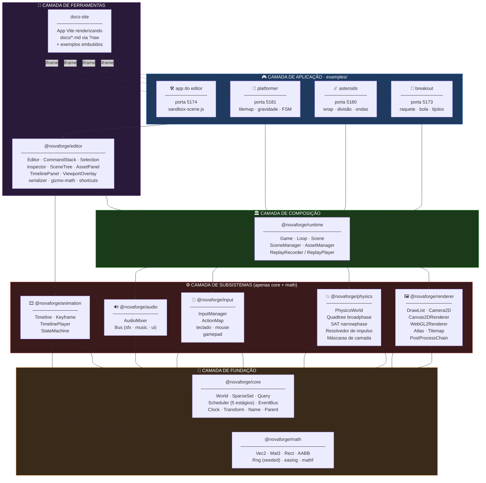
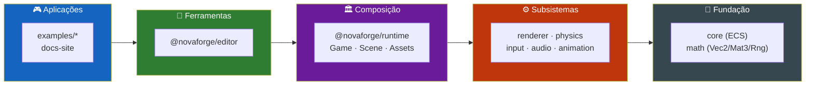
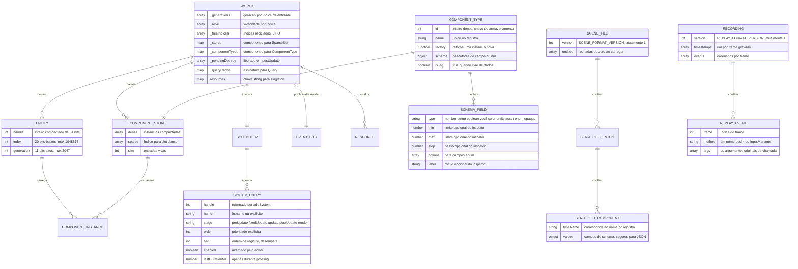
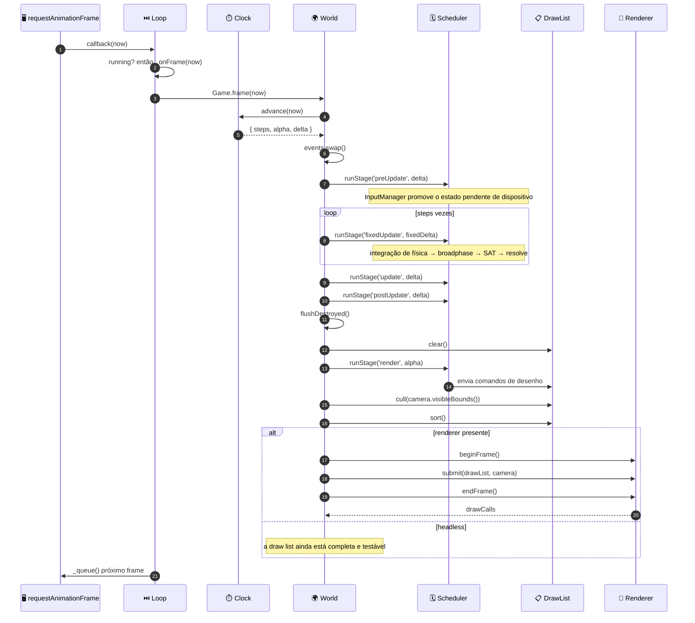
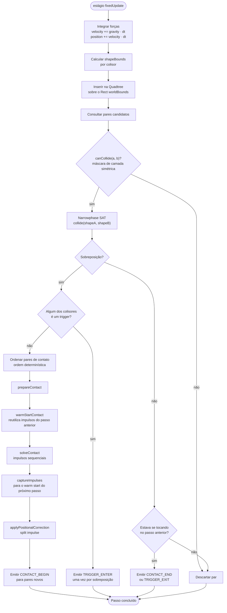
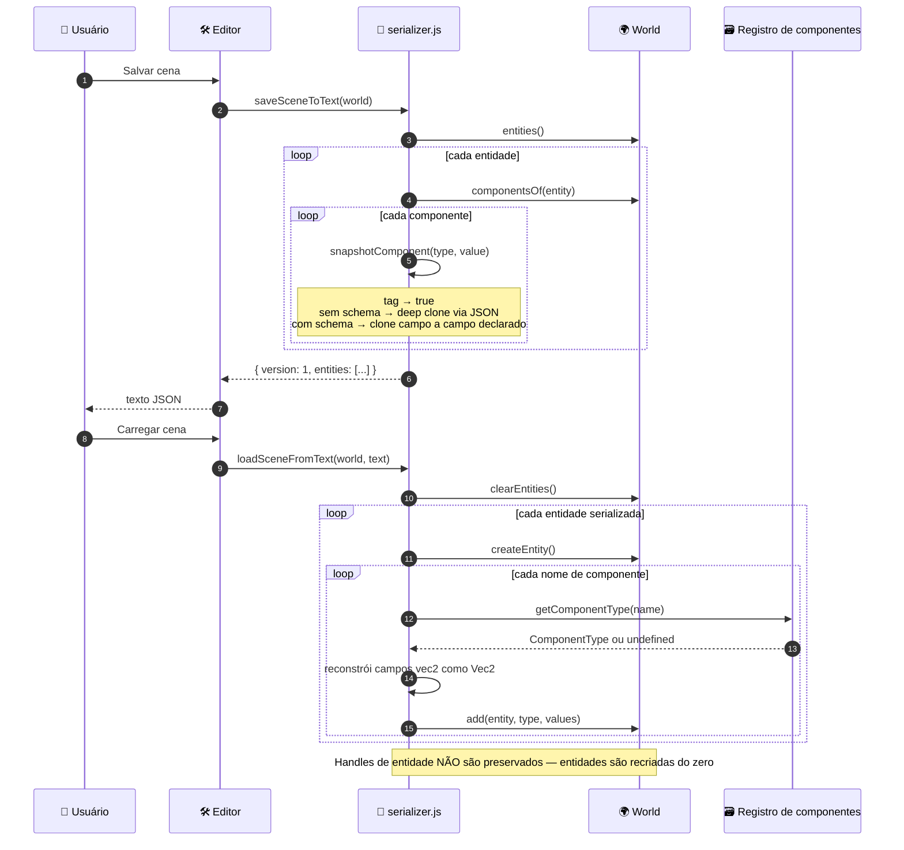
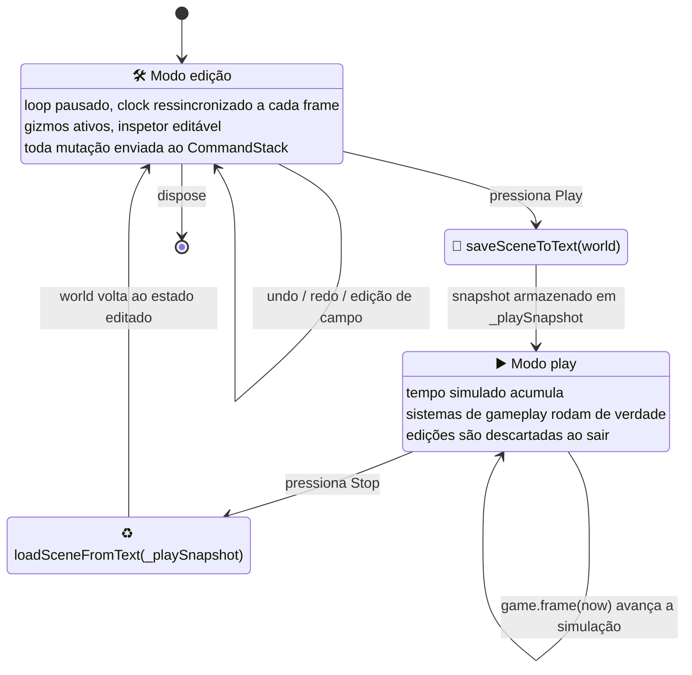
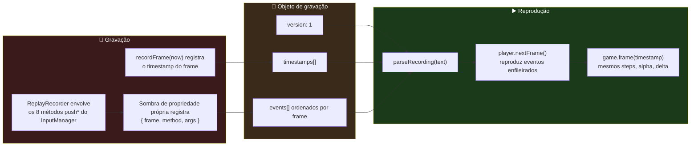
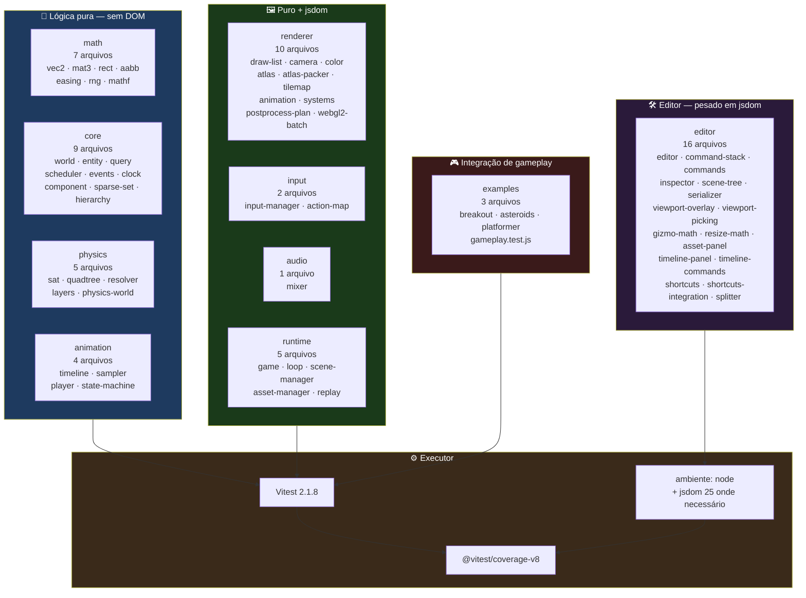

<div align="center">

**🌐 Choose Language / Selecione o Idioma / Elija el Idioma**

[](README.md)&nbsp;&nbsp;&nbsp;[](README_PT.md)&nbsp;&nbsp;&nbsp;[](README_ES.md)

</div>

---

<div align="center">

```
███╗   ██╗ ██████╗ ██╗   ██╗ █████╗ ███████╗ ██████╗ ██████╗  ██████╗ ███████╗
████╗  ██║██╔═══██╗██║   ██║██╔══██╗██╔════╝██╔═══██╗██╔══██╗██╔════╝ ██╔════╝
██╔██╗ ██║██║   ██║██║   ██║███████║█████╗  ██║   ██║██████╔╝██║  ███╗█████╗
██║╚██╗██║██║   ██║╚██╗ ██╔╝██╔══██║██╔══╝  ██║   ██║██╔══██╗██║   ██║██╔══╝
██║ ╚████║╚██████╔╝ ╚████╔╝ ██║  ██║██║     ╚██████╔╝██║  ██║╚██████╔╝███████╗
╚═╝  ╚═══╝ ╚═════╝   ╚═══╝  ╚═╝  ╚═╝╚═╝      ╚═════╝ ╚═╝  ╚═╝ ╚═════╝ ╚══════╝
             Um motor de jogos 2D e editor visual em JavaScript puro
```

---

[](https://developer.mozilla.org/docs/Web/JavaScript)
[](https://nodejs.org/)
[](https://vitest.dev/)
[](https://vite.dev/)
[](https://www.typescriptlang.org/)
[](https://eslint.org/)
[](https://developer.mozilla.org/docs/Web/API/WebGL2RenderingContext)
[](LICENSE)

<br/>

> **Um ECS livre de arquétipos, dois backends de renderização intercambiáveis, um solver de física SAT e um editor de cenas baseado em navegador**
> construído do zero como nove workspaces npm de ESM padrão, sem etapa de build dentro do próprio motor.

<br/>


-1100-FF6B35?style=flat-square)


</div>

---

## 📑 Índice

<details>
<summary>▶️ <strong>Clique para expandir / recolher esta seção</strong></summary>

<table>
<tr>
<td valign="top" width="50%">

**🏗️ Sistema**
- [Visão Geral](#-visão-geral)
- [Arquitetura do Sistema](#️-arquitetura-do-sistema)
- [Stack Tecnológica](#️-stack-tecnológica)
- [Padrões de Projeto](#-padrões-de-projeto-aplicados)
- [Estrutura do Projeto](#-estrutura-do-projeto)

**📦 Módulos**
- [@novaforge/math](#-novaforgemath--primitivas-matemáticas-2d)
- [@novaforge/core](#-novaforgecore--o-runtime-ecs)
- [@novaforge/renderer](#️-novaforgerenderer--draw-list-e-backends)
- [@novaforge/physics](#-novaforgephysics--colisão-e-resposta)
- [@novaforge/input](#-novaforgeinput--dispositivos-e-mapas-de-ação)
- [@novaforge/audio](#-novaforgeaudio--mixer-de-web-audio)
- [@novaforge/animation](#-novaforgeanimation--keyframes-e-máquinas-de-estado)
- [@novaforge/runtime](#️-novaforgeruntime--composição-do-jogo)
- [@novaforge/editor](#️-novaforgeeditor--o-editor-visual)
- [Aplicações de Exemplo](#-aplicações-de-exemplo)
- [Scripts de Ferramentas](#-scripts-de-ferramentas)

</td>
<td valign="top" width="50%">

**💼 Negócio**
- [Regras de Negócio](#-regras-de-negócio)
- [Requisitos Funcionais](#-requisitos-funcionais)
- [Requisitos Não Funcionais](#-requisitos-não-funcionais)

**📐 Design**
- [Modelo de Dados](#️-modelo-de-dados)
- [Fluxos do Sistema](#-fluxos-do-sistema)
- [Pipeline de Frame](#pipeline-de-frame)
- [Passo de Física](#passo-de-física)
- [Máquina de Modos do Editor](#máquina-de-modos-do-editor)

**🔐 Segurança & Operações**
- [Segurança](#-segurança)
- [Instalação & Execução](#-instalação--execução)
- [Testes Automatizados](#-testes-automatizados)
- [Métricas & Monitoramento](#-métricas--monitoramento)
- [Limitações Conhecidas](#️-limitações-conhecidas)

</td>
</tr>
</table>

---

</details>

## 🌟 Visão Geral

<details>
<summary>▶️ <strong>Clique para expandir / recolher esta seção</strong></summary>

**NovaForge** é um motor de jogos 2D e um editor visual que o acompanha, escrito do zero em JavaScript puro. Não há Phaser, não há PixiJS, não há compilador TypeScript no pipeline e nenhum bundler dentro do motor: todo pacote sob `packages/` é código-fonte ECMAScript module padrão que um navegador ou o Node pode carregar diretamente. A segurança de tipos é obtida por meio de anotações JSDoc verificadas por `tsc -p jsconfig.json --noEmit`, motivo pelo qual `jsconfig.json` define `"checkJs": true` e `"strict": true` mesmo o repositório não contendo nenhum arquivo `.ts`.

O repositório é um monorepo de workspaces npm declarado em `package.json` com três globs de workspace: `packages/*`, `examples/*` e `docs-site`. Nove desses workspaces são o próprio motor, organizados em uma ordem de dependência estrita, de modo que `@novaforge/math` não depende de nada, `@novaforge/core` depende apenas de math, os quatro subsistemas irmãos (renderer, physics, input, audio) mais animation dependem apenas de core e math, `@novaforge/runtime` é o único pacote autorizado a conhecer todos eles, e `@novaforge/editor` fica no topo, sobre o runtime.

A segunda metade do projeto é o conjunto de ferramentas. `@novaforge/editor` é um editor de cenas baseado em navegador com uma árvore de cena que suporta reparentamento, um inspetor orientado por schema gerado a partir dos tipos de campo declarados de cada componente, gizmos de translação/rotação/escala com snapping, uma pilha de comandos undo/redo, salvamento e carregamento de cena em JSON, um painel de assets e um painel de linha do tempo de keyframes. Ele não simula uma cópia do jogo: envolve uma instância real de `Game` e conduz a própria função `frame()` dessa instância, de modo que o modo de edição e o modo de jogo operam sobre o mesmo mundo.

### 🎯 Objetivos do Sistema

| Objetivo | Descrição |
|-----------|-------------|
| 🧩 **ECS livre de arquétipos** | Armazenamento de componentes em sparse-set com handles de entidade compactados em 31 bits, carregando um contador de geração, de modo que handles obsoletos sejam detectáveis |
| 🎨 **Independência de backend** | Sistemas nunca chamam uma API de desenho; eles anexam a uma `DrawList` que tanto `Canvas2DRenderer` quanto `WebGL2Renderer` consomem de forma idêntica |
| ⏱️ **Simulação determinística** | Um `Clock` de passo fixo com uma proteção contra espiral da morte, mais um solver de física independente de ordem, de modo que as mesmas entradas reproduzam o mesmo resultado |
| 🧪 **Testabilidade headless** | `@novaforge/core`, `math`, `physics` e `animation` não têm nenhuma dependência de DOM; um jogo inteiro pode ser avançado e testado no Node |
| 🛠️ **Um editor de verdade** | Árvore de cena, inspetor, gizmos, undo/redo, salvar/carregar, hot-reload de assets e uma timeline de animação, conduzindo o runtime que vai para produção |
| 📼 **Replay determinístico** | `ReplayRecorder` sobrepõe os oito métodos `push*` do `InputManager` para registrar cada evento bruto de dispositivo junto com os timestamps de frame |
| 📦 **Saída tree-shakeable** | `build:packages` emite um `dist/index.js` minificado por pacote, e `verify:treeshaking` prova com uma execução real de bundler que os irmãos não usados são eliminados |
| 🚀 **Zero etapa de build do motor** | Todo exemplo aponta `@novaforge/*` diretamente para `packages/*/src/index.js`, de modo que editar o código-fonte do motor recarrega a quente um jogo em execução |
| 🎮 **Jogos de exemplo completos** | Breakout, Asteroids e um platformer com tilemap, cada um com sua própria suíte de testes de gameplay, não apenas um sprite que se move |

---

</details>

## 🏗️ Arquitetura do Sistema

<details>
<summary>▶️ <strong>Clique para expandir / recolher esta seção</strong></summary>

### Diagrama de Módulos



### Camadas da Arquitetura



> [!NOTE]
> A direção da dependência é reforçada socialmente e pelo bloco `dependencies` de cada pacote, não por uma regra de lint. `@novaforge/math` não declara nenhuma dependência; `@novaforge/core` declara apenas math; `@novaforge/runtime` declara seis; `@novaforge/editor` declara oito.

---

</details>

## 🛠️ Stack Tecnológica

<details>
<summary>▶️ <strong>Clique para expandir / recolher esta seção</strong></summary>

<table>
<thead>
<tr>
<th>Camada</th>
<th>Tecnologia</th>
<th>Versão</th>
<th>Finalidade</th>
</tr>
</thead>
<tbody>
<tr>
<td rowspan="2">🧠 <strong>Linguagem</strong></td>
<td>JavaScript (ESM)</td>
<td>ES2022</td>
<td>Todo arquivo-fonte é um módulo nativo; <code>"type": "module"</code> em todo manifesto</td>
</tr>
<tr>
<td>Verificador JSDoc + TypeScript</td>
<td>typescript 5.7.2</td>
<td><code>tsc -p jsconfig.json --noEmit</code> com <code>checkJs</code> e <code>strict</code> habilitados, zero arquivos <code>.ts</code></td>
</tr>
<tr>
<td rowspan="2">🏗️ <strong>Runtime</strong></td>
<td>Node.js</td>
<td>&ge; 20 (<code>engines</code>)</td>
<td>Host de testes, host de benchmarks, scripts de build; a matriz de CI roda 20 e 22</td>
</tr>
<tr>
<td>Navegador (DOM, Canvas2D, WebGL2, Web Audio, Gamepad)</td>
<td>evergreen</td>
<td>O único ambiente de que os pacotes de renderer, input e audio realmente precisam</td>
</tr>
<tr>
<td rowspan="3">🖼️ <strong>Renderização</strong></td>
<td>Canvas2D</td>
<td>—</td>
<td><code>Canvas2DRenderer</code>: um <code>drawImage</code> ou path por comando de desenho, sem batching por design</td>
</tr>
<tr>
<td>WebGL2</td>
<td>—</td>
<td><code>WebGL2Renderer</code> + <code>webgl2-batch.js</code>: quads de sprite em lote, render targets, pós-processamento</td>
</tr>
<tr>
<td>Indireção via draw list</td>
<td>—</td>
<td><code>DrawList</code> com <code>cull()</code> e <code>sort()</code>, o único contrato entre simulação e tela</td>
</tr>
<tr>
<td rowspan="2">🧪 <strong>Testes</strong></td>
<td>Vitest</td>
<td>^2.1.8</td>
<td>62 arquivos de teste casados por <code>packages/*/src/**/__tests__/**/*.test.js</code> e o equivalente em examples</td>
</tr>
<tr>
<td>@vitest/coverage-v8 · jsdom</td>
<td>^2.1.8 · ^25.0.1</td>
<td>Cobertura V8 sobre <code>packages/*/src/**/*.js</code>; jsdom para as suítes do editor que tocam o DOM</td>
</tr>
<tr>
<td rowspan="2">📦 <strong>Build &amp; empacotamento</strong></td>
<td>Vite</td>
<td>^6.0.7</td>
<td>Servidor de dev por exemplo, builds de biblioteca em <code>scripts/build-packages.mjs</code></td>
</tr>
<tr>
<td>npm workspaces</td>
<td>—</td>
<td><code>packages/*</code>, <code>examples/*</code>, <code>docs-site</code>; um único lockfile na raiz</td>
</tr>
<tr>
<td>🔍 <strong>Qualidade</strong></td>
<td>ESLint (flat config)</td>
<td>^9.17.0</td>
<td><code>eqeqeq</code>, <code>no-var</code>, <code>prefer-const</code>, <code>no-undef</code>, <code>no-unused-vars</code> com escapes <code>^_</code></td>
</tr>
<tr>
<td rowspan="2">📊 <strong>Benchmarks</strong></td>
<td>Node <code>--expose-gc</code></td>
<td>—</td>
<td><code>benchmarks/run.js</code>: throughput de query do ECS, churn de entidades e passo de física</td>
</tr>
<tr>
<td>Playwright</td>
<td>^1.62.1</td>
<td><code>benchmarks/run-browser.mjs</code> captura tempos de frame reais Canvas2D-vs-WebGL2 em Chrome headless</td>
</tr>
<tr>
<td>📚 <strong>Docs</strong></td>
<td>marked</td>
<td>^18.0.9</td>
<td><code>docs-site</code> renderiza markdown importado com o sufixo <code>?raw</code> do Vite</td>
</tr>
<tr>
<td>🤖 <strong>CI</strong></td>
<td>GitHub Actions</td>
<td><code>.github/workflows/ci.yml</code></td>
<td>Três jobs: <em>check</em> (lint + typecheck + test em Node 20/22), <em>coverage</em>, <em>example builds</em></td>
</tr>
<tr>
<td>📄 <strong>Licença</strong></td>
<td>MIT</td>
<td>—</td>
<td>Declarada no manifesto raiz e em todo manifesto de pacote</td>
</tr>
</tbody>
</table>

---

</details>

## 🎨 Padrões de Projeto Aplicados

<details>
<summary>▶️ <strong>Clique para expandir / recolher esta seção</strong></summary>

| Padrão | Onde | Justificativa |
|---------|-------|-----------|
| 🧩 **Entity-Component-System** | `packages/core/src/world.js` | Os dados vivem em stores `SparseSet` indexados por id de componente denso; o comportamento vive em sistemas registrados por estágio |
| 🗂️ **Sparse Set** | `packages/core/src/sparse-set.js` | Adição, remoção e busca O(1) com um array denso compactado, escolhido em vez de arquétipos porque jogos trocam componentes a cada frame |
| 🎫 **Handle com contador de geração** | `packages/core/src/entity.js` | 20 bits de índice + 11 bits de geração compactados em um inteiro de 31 bits, de modo que um índice reciclado não possa ressuscitar uma referência obsoleta |
| 🧾 **Command / Memento** | `packages/editor/src/command-stack.js`, `commands.js` | Toda mutação do editor é um par `{ do, undo }`; `snapshotComponent` em `serializer.js` fornece o memento |
| 🔌 **Strategy (backend de renderer)** | `packages/renderer/src/renderer.js` | `Renderer` é uma base abstrata que lança erro em métodos não implementados; `Canvas2DRenderer` e `WebGL2Renderer` são intercambiáveis em tempo de execução |
| 📮 **Publish / Subscribe** | `packages/core/src/events.js` | Um `EventBus` de buffer duplo trocado uma vez por frame em `Game.frame`, de modo que um listener nunca veja um evento sendo escrito no meio |
| 🧰 **Service Locator** | mapa `World.resources` | `DRAW_LIST_RESOURCE`, `ASSETS_RESOURCE`, `AUDIO_RESOURCE`, `INPUT_RESOURCE`, `PHYSICS_RESOURCE` evitam que `core` importe camadas acima dele |
| 🧱 **Composition Root** | `packages/runtime/src/game.js` | O único arquivo em que todo pacote se encontra; um jogo que queira outra composição monta as peças por conta própria |
| 🔁 **Object Pool / Free List** | `World._freeIndices` | Índices de entidades destruídas são reciclados em ordem LIFO para manter os arrays densos compactos |
| 🎭 **Decorator (sombreamento de método)** | `packages/runtime/src/replay.js` | `ReplayRecorder` instala propriedades próprias sobre os oito métodos `push*` do `InputManager` para registrar eventos sem alterar a classe |
| 🏷️ **UI orientada por schema** | `packages/core/src/component.js` + `packages/editor/src/inspector.js` | Cada componente declara tipos de campo (`number`, `vec2`, `color`, `enum`, `opaque`), e o inspetor gera seus widgets a partir disso |
| 🧵 **Template Method (Scene)** | `packages/runtime/src/scene.js` | Hooks `onEnter` / `onExit` / `onPause` / `onResume` que o `SceneManager` chama em pontos fixos do ciclo de vida da pilha |

---

</details>

## 📁 Estrutura do Projeto

<details>
<summary>▶️ <strong>Clique para expandir / recolher esta seção</strong></summary>

```
novaforge/
│
├── 📄 package.json                    # Manifesto raiz do workspace, 14 scripts npm, MIT
├── 📄 package-lock.json               # Lockfile único para todo o monorepo
├── 📄 vitest.config.js                # Globs de teste, aliases @novaforge/* → src, cobertura v8
├── 📄 eslint.config.js                # Flat config: ES2022, globais de navegador, 5 regras
├── 📄 jsconfig.json                   # Verificação de tipos strict + checkJs sobre .js puro
├── 📄 .editorconfig                   # Convenções de espaçamento compartilhadas
├── 📄 LICENSE                         # MIT
│
├── 📂 .github/workflows/
│   └── 📄 ci.yml                      # check (Node 20/22) · coverage · builds de exemplo
│
├── 📂 packages/                       # ★ O motor — 9 workspaces npm
│   ├── 📂 math/src/                   # Vec2, Mat3, Rect, AABB, Rng, easing, mathf
│   ├── 📂 core/src/                   # World, SparseSet, Query, Scheduler, EventBus, Clock
│   │   ├── 📄 world.js                #   517 linhas: entidades, stores, queries, resources
│   │   ├── 📄 entity.js               #   Handle compactado: 20 bits de índice + 11 de geração
│   │   ├── 📄 sparse-set.js           #   A primitiva de armazenamento por trás de todo componente
│   │   ├── 📄 query.js                #   Iteração sobre o componente exigido mais raro
│   │   ├── 📄 scheduler.js            #   5 estágios, `order` explícito, profiling opcional
│   │   ├── 📄 events.js               #   Canais de buffer duplo, trocados por frame
│   │   ├── 📄 clock.js                #   Passo fixo + clamp de espiral da morte
│   │   ├── 📄 component.js            #   defineComponent / defineTag + schema de campos
│   │   ├── 📄 hierarchy.js            #   Componente Parent, reparentamento, descendentes
│   │   ├── 📄 transform.js            #   O componente Transform compartilhado
│   │   └── 📄 name.js                 #   O componente Name que a árvore do editor exibe
│   ├── 📂 renderer/src/               # 18 módulos: draw list, câmera, ambos os backends
│   │   ├── 📄 draw-list.js            #   Comandos DrawKind, cull(), sort()
│   │   ├── 📄 renderer.js             #   Interface abstrata de backend
│   │   ├── 📄 canvas2d-renderer.js    #   Backend #1, um comando por chamada de desenho
│   │   ├── 📄 webgl2-renderer.js      #   Backend #2
│   │   ├── 📄 webgl2-batch.js         #   Batching de quads para o caminho WebGL2
│   │   ├── 📄 atlas.js / atlas-packer.js  # TextureAtlas, AtlasRegistry, empacotamento de rects
│   │   ├── 📄 tilemap.js              #   Componente Tilemap + sistema de renderização
│   │   ├── 📄 postprocess*.js         #   PostProcessChain e seu calculador de plano puro
│   │   └── 📄 render-target.js        #   Targets offscreen para a cadeia
│   ├── 📂 physics/src/                # Quadtree, SAT, resolvedor de impulso com warm start
│   ├── 📂 input/src/                  # InputManager, ActionMap, mouse, sistemas
│   ├── 📂 audio/src/                  # AudioMixer, Bus
│   ├── 📂 animation/src/              # Timeline, sampler, player, máquina de estado
│   ├── 📂 runtime/src/                # Game, Loop, Scene, SceneManager, AssetManager, replay
│   └── 📂 editor/src/                 # 17 módulos + style.css — o editor visual
│       ├── 📄 editor.js               #   Envolve um Game real, controla o modo edit/play
│       ├── 📄 command-stack.js        #   Undo/redo
│       ├── 📄 serializer.js           #   JSON de cena, formato versão 1
│       ├── 📄 inspector.js            #   Widgets gerados a partir dos schemas de componente
│       ├── 📄 scene-tree.js           #   Visão de hierarquia com reparentamento por arraste
│       ├── 📄 gizmo-math.js           #   Geometria pura de handle e snapping
│       ├── 📄 viewport-picking.js     #   Teste de acerto puro
│       └── 📄 timeline-panel.js       #   Superfície de edição de keyframes
│
├── 📂 examples/                       # 4 apps Vite executáveis
│   ├── 📂 breakout/                   # porta 5173 — raquete, bola, tijolos, HUD
│   ├── 📂 asteroids/                  # porta 5180 — wrap de tela, divisão, ondas
│   ├── 📂 platformer/                 # porta 5181 — tilemap, moedas, obstáculos, câmera
│   └── 📂 editor/                     # porta 5174 — o editor sobre sandbox-scene.js
│
├── 📂 docs-site/                      # porta 5176 — renderiza docs/*.md, embute os exemplos
│   ├── 📄 index.html
│   └── 📂 src/                        # main.js, docs.js, style.css
│
├── 📂 docs/                           # ⚠️ Presente mas atualmente vazio (ver Limitações Conhecidas)
│   └── 📂 adr/
│
├── 📂 benchmarks/
│   ├── 📄 run.js                      # Throughput de ECS/física no Node, precisa de --expose-gc
│   ├── 📄 run-browser.mjs             # Captura Canvas2D vs WebGL2 conduzida por Playwright
│   ├── 📄 browser-results.json        # Capturado em 2026-08-06, HeadlessChrome 151
│   └── 📂 browser/                    # A página que o benchmark de navegador conduz
│
├── 📂 scripts/
│   ├── 📄 build-packages.mjs          # dist/index.js minificado por pacote
│   ├── 📄 verify-treeshaking.mjs      # Execução real de bundler provando eliminação de código morto
│   ├── 📄 build-docs-site.mjs         # Constrói os exemplos, aninha-os dentro de docs-site/dist
│   └── 📄 verify-docs-site.mjs        # Teste de fumaça Playwright, lê pixels do canvas
│
├── 📄 README.md                       # 🇺🇸 Inglês (primário)
├── 📄 README_PT.md                    # 🇧🇷 Português
└── 📄 README_ES.md                    # 🇪🇸 Espanhol
```

---

</details>

## 📦 Módulos do Sistema

<details>
<summary>▶️ <strong>Clique para expandir / recolher esta seção</strong></summary>

### 🔢 @novaforge/math — Primitivas Matemáticas 2D

Dados puros sem dependências do motor. É isso que permite que todo pacote de simulação continue testável no Node sem nenhum DOM presente. Oito módulos-fonte, sete arquivos de teste.

| Export | Tipo | Notas |
|--------|------|-------|
| `Vec2` | classe | Vetor 2D; possui um `toJSON`, que é o que torna possível a serialização de cena |
| `Mat3` | classe | Matriz afim 3x3 usada para composição de câmera e transform |
| `Rect` | classe | Retângulo alinhado aos eixos; a região do broadphase de física e os limites da câmera |
| `AABB` | classe | Caixa delimitadora alinhada aos eixos usada pela quadtree e pelo culling |
| `Rng` | classe | Gerador pseudoaleatório com seed, uma precondição do replay determinístico |
| `easing` | namespace | `export * as easing` de `easing.js`, consumido pelo sampler de animação |
| `clamp` `clamp01` `lerp` `inverseLerp` `remap` | funções | Auxiliares escalares de `mathf.js` |
| `approximately` `sign` `wrap` `wrapAngle` | funções | Auxiliares de comparação e ângulo |
| `moveTowards` `smoothDamp` | funções | Rastreamento de valor sensível à taxa de frames |
| `nearestPowerOfTwo` `isPowerOfTwo` | funções | Auxiliares de dimensionamento de textura |
| `EPSILON` `DEG_TO_RAD` `RAD_TO_DEG` `TAU` | constantes | Constantes numéricas compartilhadas |

---

### 🧩 @novaforge/core — O Runtime ECS

O coração do motor, e deliberadamente livre de qualquer dependência de DOM: `new World()` funciona no Node, o que é o que torna possível toda a suíte de testes headless. Doze módulos-fonte, nove arquivos de teste, 1.846 linhas.

| Preocupação | API | Comportamento |
|---------|-----|-----------|
| Ciclo de vida da entidade | `createEntity()` `spawn(...)` `destroy()` `destroyImmediate()` `flushDestroyed()` | `destroy` marca como morta imediatamente mas adia a limpeza de armazenamento para `postUpdate`, de modo que sistemas iterando no meio do frame nunca sejam surpreendidos |
| Validade de handle | `isAlive()` `generationOf()` `describeEntity()` | A geração incrementa na reciclagem e dá a volta em `MAX_GENERATION` (2047) |
| Componentes | `add()` `remove()` `get()` `getOrThrow()` `getOrAdd()` `has()` `componentsOf()` | `add` sobrescreve um componente existente de propósito, tornando o re-add um idioma de reset-para-padrões |
| Queries | `query(required, { without })` | Os resultados são armazenados em cache por uma string de assinatura `id,id\|id`, já que sistemas constroem queries a cada frame |
| Resources | `setResource()` `getResource()` `requireResource()` | `requireResource` lança erro por design: um resource ausente significa que um plugin falhou ao se instalar |
| Sistemas | `addSystem(stage, fn, { order, name })` `removeSystem()` `runStage()` | Números `order` explícitos, empates resolvidos pela sequência de registro |
| Ciclo de vida | `clearEntities()` `reset()` `stats()` | `clearEntities` mantém sistemas e resources; `reset` limpa tudo |

**Layout do handle de entidade** (`entity.js`)

| Campo | Bits | Constante de máscara | Significado |
|-------|------|---------------|---------|
| index | 20 | `ENTITY_INDEX_MASK` | Slot de armazenamento; até `MAX_ENTITIES` = 1.048.576 entidades vivas |
| generation | 11 | `ENTITY_GENERATION_MASK` | Contador de reciclagem; começa em 1 para que nenhum handle vivo seja jamais `0` |
| — | 31 total | `NULL_ENTITY = 0` | Ficar dentro de 32 bits com sinal mantém `\|` e `>>>` no caminho rápido de inteiros |

**Estágios do scheduler**, na ordem em que `Game.frame` os executa:

| # | Estágio | Executa | Ocupantes típicos |
|---|-------|------|-------------------|
| 1 | `preUpdate` | uma vez por frame | `InputManager.update()` promovendo o estado pendente de dispositivo |
| 2 | `fixedUpdate` | 0..N vezes por frame | Integração de física e gameplay que precisa ser determinística |
| 3 | `update` | uma vez por frame | Gameplay de taxa variável, seguimento de câmera, estado de HUD |
| 4 | `postUpdate` | uma vez por frame | Limpeza; destruições adiadas são liberadas logo em seguida |
| 5 | `render` | uma vez por frame | Sistemas que anexam à `DrawList`, recebendo `alpha` como `dt` |

---

### 🖼️ @novaforge/renderer — Draw List e Backends

Tudo entre a simulação e a tela. A simulação nunca chama uma API de desenho: sistemas de renderização anexam comandos a uma `DrawList`, e um backend a consome. Essa indireção é o motivo pelo qual o culling e a ordem de sort são testáveis por unidade no Node sem nenhum canvas envolvido. Dezoito módulos-fonte, dez arquivos de teste, 3.460 linhas, o maior pacote do repositório.

| Área | Exports | Finalidade |
|------|---------|---------|
| Draw list | `DrawList`, `DrawKind` | O único contrato entre sistemas e backends; suporta `cull(bounds)` e `sort()` |
| Backends | `Renderer`, `Canvas2DRenderer`, `WebGL2Renderer` | `Renderer` é abstrato e lança erro em qualquer método não implementado, de modo que um backend parcialmente construído falha na construção |
| Batching | `webgl2-batch.js` | Batching de quads que reduz 8.000 sprites a 8 chamadas de desenho no benchmark capturado |
| Câmera | `Camera2D` | Tamanho do viewport, `visibleBounds()` usado para culling, projeção mundo/tela |
| Componentes | `Transform`, `Sprite`, `ShapeRect`, `ShapeCircle`, `TextLabel` | O conjunto de componentes renderizáveis |
| Sistemas | `spriteRenderSystem`, `shapeRenderSystem`, `textRenderSystem`, `syncPreviousTransform`, `installRenderSystems` | Registrados sob o estágio `render`; `DRAW_LIST_RESOURCE` é o handle deles para a lista |
| Texturas | `TextureCache`, `TextureAtlas`, `AtlasRegistry` | Carregamento e busca de região de atlas |
| Empacotamento | `packRects`, `packingEfficiency`, `packTextures` | Empacotamento de atlas puro, testado independentemente |
| Animação de sprite | `defineClip`, `play`, `Animator`, `animationSystem`, `installAnimationSystem` | Animação de sprite baseada em frames sobre regiões de atlas |
| Tilemaps | `Tilemap`, `setTile`, `getTile`, `worldToTile`, `resizeTilemap`, `inTilemapBounds`, `tilemapRenderSystem` | Geometria de nível em grade, usada pelo exemplo do platformer |
| Pós-processamento | `RenderTarget`, `PostProcessChain`, `POSTPROCESS_EFFECTS`, `computePostProcessPlan`, `fullscreenQuadVertices` | Targets offscreen mais um calculador de plano puro que é testável sem um contexto GL |
| Cor | `rgb`, `rgba`, `fromHexString`, `toCssColor`, `channels`, `lerpColor`, `WHITE`, `BLACK`, `MAGENTA` | Auxiliares de 0xRRGGBB compactado |

---

### 💥 @novaforge/physics — Colisão e Resposta

Um pipeline de quatro estágios: integrar, broadphase (quadtree), narrowphase (SAT), resolver (impulsos sequenciais). Nove módulos-fonte, cinco arquivos de teste, 1.880 linhas.

| Estágio | Módulo | Detalhe |
|-------|--------|--------|
| Formas | `shapes.js` | `circle`, `box`, `polygon`, mais `shapeBounds`, `shapeArea`, `momentOfInertia` |
| Filtragem | `layers.js` | `Layers`, `canCollide`, `layerFromNames`, `describeMask`; a filtragem é simétrica de propósito |
| Broadphase | `quadtree.js` | Subdivisão espacial sobre uma região `Rect`, padrão `(-10000, -10000, 20000, 20000)` vindo de `Game` |
| Narrowphase | `sat.js` | `collide`, `collideCircles`, `collidePolygons`, `collideCirclePolygon` |
| Resolução | `resolver.js` | `prepareContact`, `warmStartContact`, `solveContact`, `captureImpulses`, `resolveContact`, `applyPositionalCorrection` |
| World | `physics-world.js` | Possui a quadtree e a contabilidade de contato entre passos |
| Componentes | `components.js` | `RigidBody`, `Collider`, `BodyType`, `setMass`, `makeStatic` |
| Ligação | `systems.js` | `installPhysicsSystems`, `PHYSICS_RESOURCE` |

**Eventos de contato** publicados no `EventBus` do world:

| Constante | Canal | Payload | Dispara |
|----------|---------|---------|-------|
| `CONTACT_BEGIN` | `physics:contactBegin` | `{ a, b, normal, penetration }` | Primeiro frame em que dois colisores se tocam |
| `CONTACT_END` | `physics:contactEnd` | `{ a, b }` | Primeiro frame em que param de se tocar |
| `TRIGGER_ENTER` | `physics:triggerEnter` | `{ trigger, other }` | Uma vez por sobreposição, não uma vez por frame |
| `TRIGGER_EXIT` | `physics:triggerExit` | `{ trigger, other }` | Primeiro frame em que a sobreposição termina |

---

### 🎹 @novaforge/input — Dispositivos e Mapas de Ação

O gameplay lê **ações**, não teclas: `input.pressed('jump')` sobrevive a rebind, suporte a gamepad e um segundo jogador local, enquanto `input.pressed('Space')` não. Cinco módulos-fonte, dois arquivos de teste.

| Export | Papel |
|--------|------|
| `InputManager` | Possui o estado de dispositivo pendente e atual; `attach(canvas)` instala listeners de DOM, `detach()` os remove |
| `INPUT_RESOURCE` | A chave de resource do world sob a qual o manager é registrado |
| `ActionMap` | Ações nomeadas vinculadas a entradas de dispositivo |
| `MouseButton` | Enum de constantes de botão |
| `installInputSystems` | Registra o sistema `preUpdate` que promove o estado pendente para o snapshot legível |

**Superfície de eventos brutos** — os oito métodos `push*` pelos quais todo listener de DOM passa, e exatamente o que `ReplayRecorder` registra:

| Método | Origem |
|--------|--------|
| `pushKeyDown` / `pushKeyUp` | `keydown` / `keyup` |
| `pushMouseDown` / `pushMouseUp` | `mousedown` / `mouseup` |
| `pushMouseMove` | `mousemove` |
| `pushWheel` | `wheel` |
| `pushMouseLeave` | `mouseleave` |
| `pushGamepadState` | Polling da Gamepad API |

---

### 🔊 @novaforge/audio — Mixer de Web Audio

Sons são endereçados por id e roteados por buses nomeados, cada um com seu próprio volume, todos alimentando um master. Três módulos-fonte, um arquivo de teste.

| Export | Papel |
|--------|------|
| `AudioMixer` | Possui o `AudioContext`, rastreia `voiceCount`, expõe `dispose()` |
| `Bus` | Um grupo de volume nomeado; o conjunto convencional é `sfx`, `music`, `ui` |
| `AUDIO_RESOURCE` | A chave de resource do world registrada por `Game` |

> [!NOTE]
> A estrutura de buses está presente desde o início de propósito. Adaptar sliders separados de música e efeitos depois significa mexer em toda chamada `play()` de uma base de código.

---

### 🎞️ @novaforge/animation — Keyframes e Máquinas de Estado

Trilhas de keyframe sobre campos de componente *arbitrários*, um player de timeline e uma máquina de estados. Depende apenas de core e math, ficando paralelo a renderer e physics, porque anima qualquer campo declarado por schema de qualquer componente, em vez de campos específicos de renderização. Cinco módulos-fonte, quatro arquivos de teste.

| Módulo | Exports | Finalidade |
|--------|---------|---------|
| `timeline.js` | `defineTrack`, `defineTimeline` | Trilhas de keyframe declarativas; também os typedefs `Keyframe`, `KeyframeTrack`, `Timeline` reexportados do barrel |
| `sampler.js` | `sampleTrack`, `interpolateValue` | Avaliação pura de uma trilha em um instante, com easing aplicado |
| `player.js` | `TimelinePlayer`, `play`, `timelineSystem`, `installTimelineSystem` | Avança players a cada frame e escreve os valores amostrados de volta nos componentes |
| `state-machine.js` | `defineState`, `defineStateMachine`, `AnimationController`, `enterStateMachine`, `setParameter`, `stateMachineSystem`, `installStateMachineSystem` | Transições orientadas por parâmetro; o exemplo do platformer a usa para idle/run/jump |

---

### 🏛️ @novaforge/runtime — Composição do Jogo

O único pacote autorizado a conhecer todos os outros. Tudo abaixo dele permanece testável de forma independente exatamente porque a ligação vive aqui e em nenhum outro lugar. Sete módulos-fonte, cinco arquivos de teste.

| Export | Responsabilidade |
|--------|----------------|
| `Game` | Constrói `World`, `Clock`, `DrawList`, `Camera2D`, `TextureCache`, `AudioMixer`, `AssetManager`, `SceneManager`, `Loop`, instala sistemas de input, render e (opcionalmente) física |
| `Loop` | Transforma tempo de relógio em invocações `onFrame`; `schedule`/`cancel` são injetáveis para que testes o avancem manualmente |
| `Scene` | Hooks `onEnter` / `onExit` / `onPause` / `onResume` |
| `SceneManager` | Uma **pilha** de cenas: `change`, mais push/pop para overlays como as cenas de pausa dos exemplos |
| `AssetManager` | Texturas e sons com contagem de referência; `ASSETS_RESOURCE` |
| `ReplayRecorder` / `ReplayPlayer` | Grava e reproduz input bruto mais timestamps de frame; `parseRecording`, `REPLAY_FORMAT_VERSION` |

**Opções do construtor de `Game`**

| Opção | Padrão | Efeito |
|--------|---------|--------|
| `canvas` | `undefined` | Omita para um jogo headless: `renderer` fica `null`, todo estágio ainda roda e a draw list ainda é preenchida |
| `gravity` | repassado | Encaminhado para `installPhysicsSystems` |
| `fixedDelta` | `1/60` | Segundos por passo de simulação |
| `backgroundColor` | padrão do backend | `0xRRGGBB` compactado |
| `worldBounds` | `Rect(-10000, -10000, 20000, 20000)` | A região de broadphase da física |
| `assetBaseUrl` | `undefined` | Prefixo para carregamentos de asset |
| `physics` | `true` | Defina `false` para pular a instalação da física por completo |

---

### 🛠️ @novaforge/editor — O Editor Visual

Dezessete módulos-fonte mais `style.css`, dezesseis arquivos de teste, 2.542 linhas. `Editor` envolve um `Game` real em vez de substituí-lo: o modo play retoma exatamente o loop que o modo edit mantém pausado, de modo que o que se vê no editor e o que vai para produção são a mesma coisa por construção.

| Subsistema | Módulos | Notas |
|-----------|---------|-------|
| Shell | `editor.js` | Possui `mode` (`'edit'` \| `'play'`), o snapshot de play, e é o *único* condutor de `game.frame()` |
| Histórico | `command-stack.js`, `commands.js`, `timeline-commands.js` | `setFieldCommand`, `addComponentCommand`, `removeComponentCommand`, `createEntityCommand`, `deleteEntityCommand`, `renameEntityCommand`, `setParentCommand`, `setKeyframeCommand`, `removeKeyframeCommand` |
| Seleção | `selection.js` | O conjunto de entidades atual sobre o qual o inspetor e os gizmos operam |
| Painéis | `inspector.js`, `scene-tree.js`, `asset-panel.js`, `timeline-panel.js` | O inspetor é gerado a partir dos schemas de componente, nunca escrito à mão por componente |
| Viewport | `viewport-overlay.js`, `viewport-picking.js`, `gizmo-math.js`, `resize-math.js` | `pickEntity` e toda a geometria de gizmo são funções puras, testadas sem DOM |
| Persistência | `serializer.js` | `serializeScene` / `deserializeScene`, `saveSceneToText` / `loadSceneFromText`, `SCENE_FORMAT_VERSION = 1` |
| Ergonomia | `shortcuts.js`, `splitter.js` | `comboFromEvent`, `DEFAULT_BINDINGS`, `installDefaultShortcuts`, e um splitter de painel arrastável |

**Constantes de gizmo math**

| Export | Finalidade |
|--------|---------|
| `ROTATE_HANDLE_DISTANCE` / `SCALE_HANDLE_DISTANCE` | Deslocamentos do handle a partir do centro da seleção |
| `rotateHandlePosition` / `scaleHandlePosition` | Posicionamento do handle dado um transform |
| `angleFromCenter` / `scaleFromDrag` | Conversão de arraste para valor |
| `snapValue` / `snapPoint` / `snapAngle` | Snapping de grade e de ângulo |

---

### 🎮 Aplicações de Exemplo

Quatro apps Vite, cada um um workspace npm com seu próprio `package.json`, `vite.config.js` e porta fixa de servidor de dev. Três deles trazem uma suíte de testes de gameplay sob `src/__tests__/gameplay.test.js`.

| App | Porta | Nome do workspace | Demonstra |
|-----|------|----------------|--------------|
| 🧱 **breakout** | 5173 | `@novaforge/example-breakout` | Sistemas `paddle.js`, `ball.js`, `bricks.js`, `hud.js`; uma cena de pausa empurrada na pilha |
| ☄️ **asteroids** | 5180 | `@novaforge/example-asteroids` | `ship.js`, `asteroids.js`, `wrap.js`, `hud.js`; wrap de tela e divisão de asteroides |
| 🏃 **platformer** | 5181 | `@novaforge/example-platformer` | `player.js`, `camera.js`, `coins.js`, `hazards.js`, `goal.js`, `animation.js` sobre um tilemap `level.js` |
| 🛠️ **editor** | 5174 | `@novaforge/example-editor` | O editor conduzindo `sandbox-scene.js`, com uma barra de troca de backend ao vivo |

Cada exemplo segue o mesmo layout interno: `components.js`, `config.js`, `factories.js`, `main.js`, `scenes/play-scene.js`, `scenes/pause-scene.js` e uma pasta `systems/`. Apenas o platformer adiciona `level.js` e `player-animation.js`.

---

### 🧰 Scripts de Ferramentas

| Script | Comando | O que faz |
|--------|---------|--------------|
| `scripts/build-packages.mjs` | `npm run build:packages` | Build de biblioteca via Vite produzindo um `dist/index.js` minificado por pacote; imports entre pacotes permanecem externos em vez de inlined |
| `scripts/verify-treeshaking.mjs` | `npm run verify:treeshaking` | Empacota uma app minúscula que importa um símbolo de `@novaforge/core`, duas vezes (da fonte e de `dist/`), e falha se tokens proibidos como `WebGL2Renderer` aparecerem |
| `scripts/build-docs-site.mjs` | `npm run docs:build` | Constrói os quatro exemplos, depois aninha a saída deles dentro de `docs-site/dist` para que a aba Play possa fazer iframe deles relativamente |
| `scripts/verify-docs-site.mjs` | (invocado manualmente) | Teste de fumaça Playwright na porta 5177: a navegação renderiza, o markdown converte, e o canvas do exemplo embutido tem pixels não em branco |
| `benchmarks/run.js` | `npm run bench` | Benchmark de throughput no Node com `--expose-gc`, forçando uma coleta entre seções |
| `benchmarks/run-browser.mjs` | `npm run bench:browser` | Captura via Playwright de Canvas2D vs WebGL2 em 500 / 2.000 / 8.000 sprites |

---

</details>

## 💼 Regras de Negócio

<details>
<summary>▶️ <strong>Clique para expandir / recolher esta seção</strong></summary>

### 🧩 Regras de Entidade e Componente

| # | Regra | Aplicação |
|---|------|-------------|
| RN-01 | Um handle de entidade é um único inteiro de 31 bits, nunca um objeto | `makeEntity` em `entity.js` compacta índice e geração |
| RN-02 | As gerações começam em 1, para que nenhum handle vivo seja igual a `NULL_ENTITY` | `World.createEntity` define `_generations[index] = 1` para índices novos |
| RN-03 | Destruir uma entidade já morta é um no-op, não um erro | `World.destroy` retorna `false` quando `isAlive` é falso |
| RN-04 | O armazenamento de componente não é recuperado até `flushDestroyed()` rodar | Fila `_pendingDestroy`, liberada por `Game.frame` após `postUpdate` |
| RN-05 | Adicionar um componente que já existe o sobrescreve | `World.add` sempre chama `type.factory()` e depois `store.set` |
| RN-06 | Adicionar um componente a uma entidade morta lança erro | `World.add` lança `Error` em vez de simplesmente não fazer nada |
| RN-07 | Nomes de componente duplicados são rejeitados no momento da definição | `defineComponent` lança erro quando o registro já contém o nome |
| RN-08 | Uma factory de componente deve retornar um objeto novo a cada chamada | Contrato documentado; um literal compartilhado daria a mesma instância para toda entidade |
| RN-09 | Instâncias de componente são dados puros sem métodos ou closures | Necessário para `JSON.stringify` de saves de cena e o snapshot de play do editor |

### ⏱️ Regras de Simulação

| # | Regra | Aplicação |
|---|------|-------------|
| RN-10 | Um delta de frame maior que `maxFrameTime` é limitado, nunca acumulado | `Clock.maxFrameTime`, padrão 0.25 s, a proteção contra espiral da morte |
| RN-11 | `fixedUpdate` roda zero ou mais vezes por frame, `update` exatamente uma vez | O loop `for (let i = 0; i < steps; …)` em `Game.frame` |
| RN-12 | Eventos são trocados antes de qualquer estágio os ler | `world.events.swap()` é a primeira instrução em `Game.frame` |
| RN-13 | A draw list é limpa e reconstruída do zero a cada frame | `this.drawList.clear()` imediatamente antes do estágio `render` |
| RN-14 | O culling acontece antes da ordenação, ambos antes do envio | `drawList.cull(camera.visibleBounds())` seguido de `drawList.sort()` |
| RN-15 | Registrar um sistema em um estágio desconhecido lança erro | `Scheduler.add` valida contra `STAGES` |
| RN-16 | Empates de ordem de sistema são resolvidos pela sequência de registro, nunca arbitrariamente | O campo `seq` em cada `SystemEntry` |

### 💥 Regras de Física e do Editor

| # | Regra | Aplicação |
|---|------|-------------|
| RN-17 | A filtragem de colisão é simétrica; uma máscara unilateral não pode deixar objetos passarem | `canCollide` em `layers.js` |
| RN-18 | A resolução de contato é determinística; os pares são ordenados antes de resolver | Invariante documentado P2 em `physics/src/index.js` |
| RN-19 | Eventos de trigger disparam uma vez por sobreposição, não uma vez por frame | Contabilidade de `TRIGGER_ENTER` / `TRIGGER_EXIT` em `PhysicsWorld` |
| RN-20 | Entrar no modo play tira um snapshot da cena; sair dele restaura o snapshot | `Editor._playSnapshot`, escrito e lido através do serializador |
| RN-21 | O editor é o único condutor do loop de frame que possui | `Editor.frame()` chama `game.frame(now)` diretamente, nunca `game.loop.start()` |
| RN-22 | A identidade de entidade não é preservada num round trip de salvar/carregar cena | Documentado em `serializer.js`; entidades são recriadas do zero, assim como `Scene.onEnter` já faz |
| RN-23 | Um componente sem schema declarado é serializado de forma opaca, inalterado | `snapshotComponent` recorre a um deep clone via JSON |

---

</details>

## ✅ Requisitos Funcionais

<details>
<summary>▶️ <strong>Clique para expandir / recolher esta seção</strong></summary>

| ID | Requisito | Prioridade | Status |
|----|-------------|----------|--------|
| **RF-01** | O motor deve criar, destruir e reciclar entidades com detecção de handle obsoleto | 🔴 Alta | ✅ Implementado |
| **RF-02** | O motor deve armazenar componentes em sparse sets indexados por um id inteiro denso | 🔴 Alta | ✅ Implementado |
| **RF-03** | O motor deve suportar queries com conjuntos de componentes exigidos e excluídos | 🔴 Alta | ✅ Implementado |
| **RF-04** | O motor deve fazer cache de queries pela assinatura de componentes entre frames | 🟡 Média | ✅ Implementado |
| **RF-05** | O motor deve rodar sistemas em cinco estágios ordenados com prioridades explícitas | 🔴 Alta | ✅ Implementado |
| **RF-06** | O motor deve fornecer um barramento de eventos de buffer duplo trocado uma vez por frame | 🔴 Alta | ✅ Implementado |
| **RF-07** | O motor deve avançar a simulação em passo fixo com um alpha de interpolação | 🔴 Alta | ✅ Implementado |
| **RF-08** | O motor deve renderizar por meio de uma draw list consumível por qualquer backend | 🔴 Alta | ✅ Implementado |
| **RF-09** | O motor deve embarcar um backend Canvas2D | 🔴 Alta | ✅ Implementado |
| **RF-10** | O motor deve embarcar um backend WebGL2 com batching de sprites | 🔴 Alta | ✅ Implementado |
| **RF-11** | O motor deve suportar render targets e uma cadeia de pós-processamento | 🟡 Média | ✅ Implementado |
| **RF-12** | O motor deve empacotar e endereçar atlas de textura | 🟡 Média | ✅ Implementado |
| **RF-13** | O motor deve renderizar tilemaps como um componente de primeira classe | 🟡 Média | ✅ Implementado |
| **RF-14** | O motor deve detectar colisões usando broadphase por quadtree e narrowphase por SAT | 🔴 Alta | ✅ Implementado |
| **RF-15** | O motor deve resolver contatos com impulsos sequenciais com warm start | 🔴 Alta | ✅ Implementado |
| **RF-16** | O motor deve publicar eventos de início/fim de contato e de trigger | 🔴 Alta | ✅ Implementado |
| **RF-17** | O motor deve mapear input bruto de dispositivo para ações nomeadas | 🔴 Alta | ✅ Implementado |
| **RF-18** | O motor deve amostrar o estado de teclado, mouse e gamepad | 🟡 Média | ✅ Implementado |
| **RF-19** | O motor deve mixar áudio por meio de buses nomeados alimentando um master | 🟡 Média | ✅ Implementado |
| **RF-20** | O motor deve animar campos de componente arbitrários a partir de trilhas de keyframe | 🟡 Média | ✅ Implementado |
| **RF-21** | O motor deve conduzir estados de animação a partir de uma máquina de estados orientada por parâmetro | 🟡 Média | ✅ Implementado |
| **RF-22** | O runtime deve gerenciar uma pilha de cenas suportando cenas de overlay | 🔴 Alta | ✅ Implementado |
| **RF-23** | O runtime deve contar referências de texturas e sons carregados | 🟡 Média | ✅ Implementado |
| **RF-24** | O runtime deve gravar e reproduzir uma sessão de forma determinística | 🟢 Baixa | ✅ Implementado |
| **RF-25** | O runtime deve rodar headless sem canvas e ainda preencher a draw list | 🔴 Alta | ✅ Implementado |
| **RF-26** | O editor deve exibir e reparentar uma hierarquia de cena | 🔴 Alta | ✅ Implementado |
| **RF-27** | O editor deve gerar widgets de inspetor a partir dos schemas de campo de componente | 🔴 Alta | ✅ Implementado |
| **RF-28** | O editor deve fornecer gizmos de translação, rotação e escala com snapping | 🔴 Alta | ✅ Implementado |
| **RF-29** | O editor deve suportar undo e redo para toda mutação | 🔴 Alta | ✅ Implementado |
| **RF-30** | O editor deve salvar e carregar cenas como JSON versionado | 🔴 Alta | ✅ Implementado |
| **RF-31** | O editor deve alternar entre modo edit e play sem perder a cena editada | 🔴 Alta | ✅ Implementado |
| **RF-32** | O editor deve editar keyframes por meio de um painel de timeline | 🟡 Média | ✅ Implementado |
| **RF-33** | O toolchain deve emitir um build minificado e tree-shakeable por pacote | 🟢 Baixa | ✅ Implementado |
| **RF-34** | O toolchain deve verificar o tree-shaking com uma execução real de bundler | 🟢 Baixa | ✅ Implementado |
| **RF-35** | O site de docs deve renderizar o markdown do projeto e embutir os exemplos em execução | 🟢 Baixa | ⚠️ Parcial — o código do site existe, `docs/*.md` não |

---

</details>

## ⚡ Requisitos Não Funcionais

<details>
<summary>▶️ <strong>Clique para expandir / recolher esta seção</strong></summary>

| ID | Categoria | Requisito | Alvo |
|----|----------|-------------|--------|
| **RNF-01** | ⚡ Performance | Chamadas de desenho WebGL2 para uma cena de sprites grande | 8 chamadas para 8.000 sprites (capturado em 2026-08-06) |
| **RNF-02** | ⚡ Performance | Ganho de velocidade do WebGL2 sobre Canvas2D em 2.000 sprites | ~8.7x em Chrome headless, renderização por software |
| **RNF-03** | ⚡ Performance | Custo de iteração de query | Proporcional ao tamanho do store do componente exigido mais raro |
| **RNF-04** | ⚡ Performance | Custo de broadphase | Sub-quadrático via subdivisão de quadtree em vez de teste todos-contra-todos |
| **RNF-05** | 🎯 Determinismo | As mesmas entradas mais os mesmos timestamps reproduzem a mesma sessão | Garantido por passo fixo, contatos ordenados e `Rng` com seed |
| **RNF-06** | 🎯 Determinismo | Um frame longo não pode travar a página | Delta limitado a `maxFrameTime` = 0.25 s |
| **RNF-07** | 🧪 Testabilidade | Pacotes de simulação devem rodar sem DOM | `math`, `core`, `physics`, `animation` não importam nada específico de navegador |
| **RNF-08** | 🧪 Testabilidade | Tamanho da suíte de testes | 62 arquivos, 303 blocos `describe`, cerca de 1.100 casos `it()` |
| **RNF-09** | 🧱 Manutenibilidade | Cobertura de tipos sem etapa de compilação | `tsc --noEmit` em modo `strict` + `checkJs` sobre todo `.js` |
| **RNF-10** | 🧱 Manutenibilidade | Gate de lint | ESLint flat config com `eqeqeq`, `no-var`, `prefer-const`, `no-undef` como erros |
| **RNF-11** | 📦 Footprint | Consumidores não devem pagar por pacotes não usados | `verify:treeshaking` falha o build se tokens de um irmão vazarem |
| **RNF-12** | 📦 Portabilidade | Faixa de suporte do Node | `engines.node >= 20`; a matriz de CI cobre 20 e 22 |
| **RNF-13** | 🔌 Extensibilidade | Adicionar um backend de renderer não deve tocar em nenhum sistema | Reforçado pela interface abstrata `Renderer` e pelo contrato `DrawList` |
| **RNF-14** | 🔌 Extensibilidade | Plugins se registram e se desmontam de forma limpa | `Game.use(plugin)` coleta funções opcionais de teardown |
| **RNF-15** | 🚀 Loop de desenvolvimento | Editar o código-fonte do motor deve recarregar a quente um exemplo em execução | Todo exemplo aponta `@novaforge/*` para `packages/*/src/index.js` |
| **RNF-16** | 🔐 Segurança | Nenhum acesso de rede em tempo de execução no motor | Nenhum `fetch` fora do carregamento de assets; sem telemetria, sem analytics |
| **RNF-17** | 📜 Licenciamento | Licença permissiva e uniforme | MIT no manifesto raiz e nos nove manifestos de pacote |
| **RNF-18** | 🤖 Automação | Todo push e pull request é verificado | Três jobs de CI: check, coverage, builds de exemplo |

---

</details>

## 🗄️ Modelo de Dados

<details>
<summary>▶️ <strong>Clique para expandir / recolher esta seção</strong></summary>

> [!IMPORTANT]
> O NovaForge **não tem banco de dados nem servidor**. O que desempenha o papel de camada de persistência aqui é triplo: o world ECS em memória, o formato de cena JSON versionado escrito pelo serializador do `@novaforge/editor`, e a gravação de replay versionada escrita pelo `@novaforge/runtime`. O diagrama abaixo modela essas estruturas.

### Diagrama de Entidade-Relacionamento



### Formato do Arquivo de Cena (`serializer.js`)

| Chave | Tipo | Significado |
|-----|------|---------|
| `version` | inteiro | `SCENE_FORMAT_VERSION`, atualmente `1`; incrementado em uma mudança de ruptura |
| `entities` | array | Um objeto por entidade, na ordem de índice do world |
| `entities[].components` | objeto | Mapa do nome do componente registrado para seus valores serializados |
| Componentes de tag | `true` | Um componente livre de dados serializa para o literal `true` |
| Componentes sem schema | objeto opaco | Deep-cloned via `JSON.parse(JSON.stringify(...))` |
| Campos `vec2` | `{ x, y }` | Reconstruídos em um `Vec2` real ao carregar, guiados pelo schema |

### Chaves de Resource do World

| Constante | Declarada em | Valor mantido |
|----------|-------------|------------|
| `DRAW_LIST_RESOURCE` | `renderer/src/systems.js` | A `DrawList` do frame |
| `ASSETS_RESOURCE` | `runtime/src/asset-manager.js` | O `AssetManager` |
| `AUDIO_RESOURCE` | `audio/src/mixer.js` | O `AudioMixer` |
| `INPUT_RESOURCE` | `input/src/input-manager.js` | O `InputManager` |
| `PHYSICS_RESOURCE` | `physics/src/systems.js` | O `PhysicsWorld` |
| `ATLAS_REGISTRY_RESOURCE` | `renderer/src/animation.js` | O `AtlasRegistry`, criado por `Editor` se ausente |
| `SPRITE_COMPONENT_RESOURCE` | `renderer/src/animation.js` | O tipo de componente de sprite usado pelo sistema de animação |
| `'camera'` | `runtime/src/game.js` | A `Camera2D` ativa |
| `'textures'` | `runtime/src/game.js` | O `TextureCache` |

---

</details>

## 🔄 Fluxos do Sistema

<details>
<summary>▶️ <strong>Clique para expandir / recolher esta seção</strong></summary>

### Pipeline de Frame



### Passo de Física



### Round Trip de Salvar e Carregar Cena



### Máquina de Modos do Editor



### Replay Determinístico



---

</details>

## 🔐 Segurança

<details>
<summary>▶️ <strong>Clique para expandir / recolher esta seção</strong></summary>

### Controles Implementados

| Controle | Implementação | Efeito |
|---------|---------------|--------|
| 🚫 **Sem telemetria, sem analytics** | O conjunto de dependências é Vite, Vitest, ESLint, TypeScript, jsdom, marked e Playwright, todas apenas de dev | Nada em um jogo entregue liga para casa |
| 📦 **Zero dependências de runtime** | O bloco `dependencies` de cada pacote do motor contém apenas pacotes irmãos `@novaforge/*` | A cadeia de suprimentos publicada é o próprio repositório |
| 🔒 **Resolução de dependências determinística** | Um único `package-lock.json` na raiz do workspace | Instalações reproduzíveis entre máquinas e CI |
| 🧱 **Interface abstrata que falha alto** | `Renderer` lança `TypeError` em construção direta e `Error` em métodos não implementados | Um backend parcialmente implementado não pode desenhar nada silenciosamente |
| 🧨 **Busca de resource que falha alto** | `World.requireResource` lança erro com o nome da chave ausente | Um plugin que falhou ao se instalar é reportado no ponto de uso |
| ✅ **Validação de entrada no registro** | `Scheduler.add` valida o estágio e garante que o sistema é uma função | Um erro de digitação não pode registrar um sistema que nunca roda silenciosamente |
| 🧬 **Rejeição de nomes duplicados** | `defineComponent` lança erro em um nome já presente no registro | A serialização de cena nunca pode se tornar ambígua |
| 🔍 **Análise estática na CI** | `npm run lint` e `npm run typecheck` bloqueiam todo push e pull request | Erros de tipo e identificadores indefinidos não podem ser mesclados |
| 🧾 **Formatos de dados versionados** | `SCENE_FORMAT_VERSION` e `REPLAY_FORMAT_VERSION`, ambos atualmente `1` | Uma futura mudança de ruptura é detectável em vez de silenciosamente mal interpretada |
| 🧊 **Direção de dependência congelada** | `math` não declara dependências; `core` declara apenas `math` | Ciclos que tornariam o carregamento parcial inseguro são estruturalmente impossíveis |

### Limitações de Segurança Conhecidas

> [!WARNING]
> O NovaForge é um motor de jogos client-side sem componente de servidor e sem superfície de autenticação. Os itens abaixo são lacunas reais que importam no momento em que um arquivo de cena, um replay ou um asset vêm de algum lugar não confiável.

| Limitação | Risco | Caminho de mitigação |
|------------|------|-----------------|
| 📄 **O JSON de cena é analisado sem validação** | `loadSceneFromText` confia na forma do objeto recebido; um arquivo hostil ou corrompido pode produzir componentes inválidos ou lançar erro no fundo do loader | Validar contra um schema derivado do registro de componentes antes de aplicar, e rejeitar valores de `version` desconhecidos |
| 🎞️ **Gravações de replay são entrada confiável** | `ReplayPlayer` invoca métodos do `InputManager` nomeados pelo campo `method` da gravação | Colocar em whitelist os oito nomes de `RECORDED_METHODS` ao carregar, em vez de despachar qualquer string que chegue |
| 🖼️ **Assets são carregados por URL sem checagem de integridade** | `AssetManager` busca o que quer que `assetBaseUrl` resolva | Adicionar hashes de Subresource Integrity ou servir assets apenas same-origin |
| 🧮 **Sem teto de recursos na criação de entidades** | Um arquivo de cena descrevendo milhões de entidades esgotará a memória antes de atingir `MAX_ENTITIES` | Impor um orçamento configurável de entidades no deserializador |
| 🕳️ **Campos de schema `opaque` fazem round trip de JSON arbitrário** | Um campo opaco profundamente aninhado pode ser usado como carregador de payload ou amplificador de memória | Limitar profundidade e tamanho em `snapshotComponent` |
| 🌐 **O editor renderiza nomes de entidade e componente no DOM** | Um arquivo de cena com nomes hostis é um vetor de XSS armazenado se os painéis algum dia interpolarem HTML em vez de definir texto | Auditar `scene-tree.js` e `inspector.js` para garantir escritas apenas via `textContent`, e adicionar um teste para isso |
| 🔓 **Sem Content Security Policy nas páginas de exemplo** | Cada `examples/*/index.html` é entregue sem uma meta tag CSP | Adicionar uma política restritiva `default-src 'self'` aos shells de exemplo e docs-site |
| 🧰 **Sem varredura de supply chain na CI** | O workflow roda lint, typecheck, testes e builds, mas nenhuma etapa de `npm audit` ou SCA | Adicionar um job de audit, ou Dependabot, ao workflow existente de três jobs |

---

</details>

## 🚀 Instalação & Execução

<details>
<summary>▶️ <strong>Clique para expandir / recolher esta seção</strong></summary>

### Pré-requisitos

```bash
# Node.js 20 ou mais novo — declarado em "engines" do package.json
node --version      # espere v20.x ou v22.x

# npm com suporte a workspace (incluído a partir do Node 20+)
npm --version

# Opcional: um download do Chromium para o Playwright, usado apenas pelo
# benchmark de navegador e pelo verificador do docs-site.
npx playwright install chromium
```

### Build

```bash
# Instala todo workspace a partir do único lockfile raiz
npm install

# Gate de verificação completo: lint, depois typecheck, depois toda a suíte de testes
npm run check

# Gates individuais
npm run lint            # ESLint flat config em todo o monorepo
npm run lint:fix        # ...com autofix
npm run typecheck       # tsc -p jsconfig.json --noEmit (strict, checkJs)
npm test                # vitest run

# Produz o dist/index.js publicável e minificado para cada pacote do motor
npm run build:packages

# Prova que o bundler de um consumidor elimina pacotes não usados
npm run verify:treeshaking
```

### Execução

```bash
# Breakout — o alvo de dev padrão
npm run dev                                            # http://localhost:5173

# Os outros apps de exemplo
npm run dev --workspace @novaforge/example-editor      # http://localhost:5174
npm run dev --workspace @novaforge/example-asteroids   # http://localhost:5180
npm run dev --workspace @novaforge/example-platformer  # http://localhost:5181

# Números de throughput
npm run bench                                          # Node, ECS + física
npm run bench:browser                                  # Playwright, Canvas2D vs WebGL2
```

Um jogo mínimo, do início ao fim:

```js
import { Game, Scene } from '@novaforge/runtime';
import { Transform, Sprite } from '@novaforge/renderer';
import { Vec2 } from '@novaforge/math';

class Playground extends Scene {
  onEnter(world) {
    const player = world.createEntity();
    world.add(player, Transform, { position: new Vec2(400, 300) });
    world.add(player, Sprite, { texture: 'player', width: 32, height: 32 });

    world.addSystem('update', function move(w, dt) {
      for (const [, transform] of w.query([Transform])) {
        transform.position.x += 60 * dt;
      }
    });
  }
}

const game = new Game({ canvas: document.querySelector('canvas') });
game.scenes.register('playground', Playground);
await game.start('playground');
```

### Scripts npm

| Script | Comando | Finalidade |
|--------|---------|---------|
| `test` | `vitest run` | Execução única de todos os 62 arquivos de teste |
| `test:watch` | `vitest` | Modo watch |
| `test:coverage` | `vitest run --coverage` | Cobertura V8 sobre `packages/*/src/**/*.js` |
| `lint` | `eslint .` | Lint com flat config |
| `lint:fix` | `eslint . --fix` | Lint com autofix |
| `typecheck` | `tsc -p jsconfig.json --noEmit` | Verificação de tipos via JSDoc |
| `check` | lint && typecheck && test | O gate local completo |
| `dev` | `npm run dev --workspace @novaforge/example-breakout` | Servidor de dev padrão |
| `bench` | `node --expose-gc benchmarks/run.js` | Throughput de ECS e física |
| `bench:browser` | `node benchmarks/run-browser.mjs` | Comparação real de backend |
| `build:packages` | `node scripts/build-packages.mjs` | `dist/` por pacote |
| `verify:treeshaking` | `node scripts/verify-treeshaking.mjs` | Prova de eliminação de código morto |
| `docs:dev` | `npm run dev --workspace docs-site` | Servidor de dev do site de docs |
| `docs:build` | `node scripts/build-docs-site.mjs` | Build de exemplos + site de docs |

### Configuração de Build

| Configuração | Valor | Declarado em |
|---------|-------|-------------|
| Workspaces | `packages/*`, `examples/*`, `docs-site` | `package.json` |
| Sistema de módulos | `"type": "module"` em toda parte | todo `package.json` |
| Piso de Node | `>=20` | `package.json` `engines` |
| Alvo de tipos | `ES2022`, `moduleResolution: Bundler` | `jsconfig.json` |
| Rigor de tipos | `strict: true`, `checkJs: true`, `noEmit: true` | `jsconfig.json` |
| Include de teste | `packages/*/src/**/__tests__/**/*.test.js`, `examples/*/src/**/__tests__/**/*.test.js` | `vitest.config.js` |
| Ambiente de teste | `node` (jsdom trazido por suíte onde necessário) | `vitest.config.js` |
| Provedor de cobertura | `v8`, excluindo `**/__tests__/**` e `**/index.js` | `vitest.config.js` |
| Ignorados pelo lint | `**/node_modules/**`, `**/dist/**`, `**/coverage/**` | `eslint.config.js` |
| Portas do servidor de dev | 5173 breakout · 5174 editor · 5176 docs · 5180 asteroids · 5181 platformer | cada `vite.config.js` |

---

</details>

## 🧪 Testes Automatizados

<details>
<summary>▶️ <strong>Clique para expandir / recolher esta seção</strong></summary>

### Arquitetura de Testes



### Suítes de Teste

| Pacote | Arquivos de teste | LOC de teste | Cobertura notável |
|---------|-----------|----------|------------------|
| `math` | 7 | 902 | `vec2`, `mat3`, `rect`, `aabb`, `easing`, `rng`, `mathf` |
| `core` | 9 | 1.736 | `world`, `entity`, `query`, `scheduler`, `events`, `clock`, `component`, `sparse-set`, `hierarchy` |
| `renderer` | 10 | 1.750 | `draw-list`, `camera`, `color`, `atlas`, `atlas-packer`, `tilemap`, `animation`, `systems`, `postprocess-plan`, `webgl2-batch` |
| `physics` | 5 | 1.325 | `sat`, `quadtree`, `resolver`, `layers`, `physics-world` |
| `input` | 2 | 403 | `input-manager`, `action-map` |
| `audio` | 1 | 156 | `mixer` |
| `animation` | 4 | 517 | `timeline`, `sampler`, `player`, `state-machine` |
| `runtime` | 5 | 1.029 | `game`, `loop`, `scene-manager`, `asset-manager`, `replay` |
| `editor` | 16 | 2.768 | O conjunto completo de painéis, ambos os módulos de gizmo math, o serializador e uma suíte de integração de shortcuts |
| `examples` | 3 | — | Suítes de gameplay de `breakout`, `asteroids` e `platformer` |
| **Total** | **62** | **~10.600** | 303 blocos `describe`, cerca de 1.100 casos `it()` |

### Executando os Testes

```bash
# Tudo, de uma vez
npm test

# Observar um único pacote enquanto se trabalha nele
npx vitest packages/physics

# Um único arquivo
npx vitest packages/core/src/__tests__/world.test.js

# Relatório de cobertura (V8), escrito em coverage/
npm run test:coverage

# O que a CI executa, em ordem
npm run lint && npm run typecheck && npm run test
```

### Checklist Manual de Aceitação

| # | Cenário | Resultado esperado |
|---|----------|-----------------|
| 1 | `npm install` a partir de um clone limpo | Todos os workspaces se conectam, sem avisos de peer que quebrem a instalação |
| 2 | `npm run check` | Lint limpo, `tsc` sem erros, todas as 62 suítes passam |
| 3 | `npm run dev` | Breakout carrega em 5173, a raquete responde ao input, os tijolos quebram |
| 4 | Breakout: perder todas as vidas | A cena de pausa/game-over é empurrada na pilha |
| 5 | `npm run dev --workspace @novaforge/example-asteroids` | A nave dá wrap nas bordas da tela, asteroides grandes se dividem em menores |
| 6 | `npm run dev --workspace @novaforge/example-platformer` | Gravidade se aplica, colisão de tilemap se mantém, moedas são coletadas, câmera segue |
| 7 | `npm run dev --workspace @novaforge/example-editor` | Árvore de cena lista entidades do sandbox, inspetor mostra campos orientados por schema |
| 8 | Editor: arrastar um handle de gizmo | O transform atualiza ao vivo tanto no viewport quanto no inspetor |
| 9 | Editor: pressionar Ctrl+Z após uma edição | A pilha de comandos reverte exatamente essa única mudança |
| 10 | Editor: reparentar um nó na árvore | A posição mundial do filho segue o novo pai |
| 11 | Editor: Play depois Stop | A simulação roda, depois a cena pré-play é restaurada exatamente |
| 12 | Editor: salvar depois carregar uma cena | Todo componente faz round trip, campos `vec2` voltam como instâncias `Vec2` reais |
| 13 | Editor: trocar o backend de renderer na barra de ferramentas | A mesma cena renderiza via `WebGL2Renderer` sem regressão visual |
| 14 | `npm run bench` | Imprime números de microssegundos por chamada para as seções de ECS e física |
| 15 | `npm run bench:browser` | Reescreve `benchmarks/browser-results.json` com números recém-capturados |
| 16 | `npm run build:packages && npm run verify:treeshaking` | Nove arquivos `dist/index.js` produzidos, verificação não reporta tokens vazados |

---

</details>

## 📊 Métricas & Monitoramento

<details>
<summary>▶️ <strong>Clique para expandir / recolher esta seção</strong></summary>

### Métricas da Base de Código

| Métrica | Valor |
|--------|-------|
| Pacotes do motor | 9 |
| Aplicações de exemplo | 4 |
| Total de arquivos rastreados (excluindo `node_modules`) | 274 |
| Módulos-fonte do motor (excluindo testes) | 84 |
| Linhas de código-fonte do motor | 14.026 |
| Arquivos de teste | 62 |
| Linhas de teste | ~10.586 |
| Blocos `describe` | 303 |
| Casos `it()` | ~1.100 |
| Linhas de código dos exemplos | 4.946 |
| Maior pacote por linhas de código | `renderer` (3.460 em 18 módulos) |
| Maior módulo único | `core/src/world.js` (517 linhas) |
| Dependências de runtime do motor | 0 externas, apenas pacotes irmãos |
| Dependências de dev na raiz | 8 |
| Scripts npm na raiz | 14 |
| Jobs de CI | 3 (`check` em Node 20 e 22, `coverage`, `example`) |

### Sinais de Runtime

| Sinal | Fonte | Onde observar |
|--------|--------|------------------|
| Frames por segundo | `Clock.fps`, suavizado exponencialmente | `Game.debugInfo().fps` |
| Índice de frame | `Clock.frame` | `Game.debugInfo().frame` |
| Passos fixos rodados neste frame | `Game.stats.fixedSteps` | `Game.debugInfo().fixedSteps` |
| Alpha de interpolação | `Game.stats.alpha` | `Game.debugInfo().alpha` |
| Contagem de entidades vivas | `World.entityCount` | `Game.debugInfo().entities` e `World.stats()` |
| Entidades aguardando reciclagem | `World.pendingDestroyCount` | `World.stats().pendingDestroy` |
| Stores de componente em uso | `World.stats().componentTypes` | `World.stats()` |
| Instâncias de componente armazenadas | `World.stats().storedComponents` | `World.stats()` |
| Queries em cache | `World.stats().cachedQueries` | `World.stats()` |
| Comandos de desenho enviados | `DrawList.length` | `Game.debugInfo().drawCommands` |
| Comandos descartados neste frame | `DrawList.culled` | `Game.debugInfo().culled` |
| Chamadas de desenho do backend | `Renderer.drawCalls` | `Game.debugInfo().drawCalls` |
| Vozes de áudio ativas | `AudioMixer.voiceCount` | `Game.debugInfo().voices` |
| Pilha de cenas | `SceneManager.stackNames()` | `Game.debugInfo().scenes` |
| Sistemas por estágio | `Scheduler.systemsIn(stage).length` | `Game.debugInfo().systems` |
| Duração por sistema | `SystemEntry.lastDurationMs` | Apenas quando `scheduler.profiling === true` |
| Contadores de física | `PhysicsWorld.stats` | `Game.debugInfo().physics`, `null` quando a física está desabilitada |

### Comandos de Diagnóstico

```bash
# Quais pacotes têm mais código-fonte, e quanto código de teste os sustenta
find packages -name '*.js' -not -path '*__tests__*' | xargs wc -l | tail -1
find packages -path '*__tests__*' -name '*.test.js' | wc -l

# Roda a suíte de um pacote com relatório verboso
npx vitest run packages/core --reporter=verbose

# Cobertura para um único pacote
npx vitest run packages/physics --coverage

# Apenas verificação de tipos, com as configurações exatas da CI
npx tsc -p jsconfig.json --noEmit

# Imprime os números de throughput do motor
node --expose-gc benchmarks/run.js

# Recaptura números reais de backend em benchmarks/browser-results.json
node benchmarks/run-browser.mjs

# Inspeciona o benchmark capturado sem executá-lo novamente
cat benchmarks/browser-results.json
```

### Resultados de Benchmark Capturados

Registrados em 2026-08-06 no HeadlessChrome 151 com 20 frames de aquecimento e 120 frames medidos, extraídos de `benchmarks/browser-results.json`.

| Sprites | FPS Canvas2D | Chamadas de desenho Canvas2D | FPS WebGL2 | Chamadas de desenho WebGL2 | Ganho |
|---------|--------------|---------------------|------------|-------------------|----------|
| 500 | 128.9 | 500 | 1081.1 | 8 | 8.39x |
| 2.000 | 74.6 | 2.000 | 651.1 | 8 | 8.72x |
| 8.000 | 33.9 | 8.000 | 164.1 | 8 | 4.84x |

> [!NOTE]
> Estes foram capturados em um navegador headless sem aceleração de GPU, então medem o ganho do batching em vez do throughput bruto de GPU. A coluna de chamadas de desenho é o número que independe de hardware, e é onde a diferença arquitetural realmente aparece.

### Contrato de Status e Erro

| Situação | Mecanismo | Formato da mensagem |
|-----------|-----------|---------------|
| Espaço de índice de entidade esgotado | `RangeError` de `World.createEntity` | `World: entity limit of 1048576 reached` |
| Componente adicionado a uma entidade morta | `Error` de `World.add` | `World.add: <entity> is not alive (component "Name")` |
| Componente exigido ausente | `Error` de `World.getOrThrow` | `World.getOrThrow: <entity> has no "Name"` |
| Resource nunca registrado | `Error` de `World.requireResource` | `World.requireResource: no resource registered under "key"` |
| Estágio de scheduler desconhecido | `Error` de `Scheduler.add` | `Scheduler.add: unknown stage "x". Valid stages: …` |
| Sistema não é uma função | `TypeError` de `Scheduler.add` | `Scheduler.add: system must be a function` |
| Nome de componente duplicado | `Error` de `defineComponent` | `defineComponent: "Name" is already defined` |
| Factory de componente ausente | `TypeError` de `defineComponent` | `defineComponent: "Name" needs a factory function` |
| Renderer abstrato construído | `TypeError` de `Renderer` | `Renderer is abstract; construct a backend such as Canvas2DRenderer` |
| Método de backend não implementado | `Error` de `Renderer` | `<Backend> must implement submit()` |
| Contexto Canvas2D indisponível | `Error` de `Canvas2DRenderer` | `Canvas2DRenderer: could not acquire a 2d context` |
| Entidade ausente em uma query | Ignorada silenciosamente | Índices mortos são filtrados por `isAliveIndex` durante a iteração |

---

</details>

## ⚠️ Limitações Conhecidas

<details>
<summary>▶️ <strong>Clique para expandir / recolher esta seção</strong></summary>

> [!IMPORTANT]
> O NovaForge é um motor em escala de portfólio escrito para explorar arquitetura de motores, não uma alternativa de produção ao Phaser ou ao Godot. Tudo listado abaixo é uma lacuna real e observável no repositório tal como ele está, não uma hipótese.

| Categoria | Problema | Status |
|----------|-------|--------|
| 📚 **Fonte de documentação ausente** | `docs/` e `docs/adr/` existem mas estão vazios. `docs-site/src/docs.js` importa doze arquivos markdown deles com o sufixo `?raw` do Vite, então `npm run docs:dev` e `npm run docs:build` atualmente não conseguem resolver seus imports | ⚠️ Aberto — restaurar ou escrever `SPEC.md`, `ARCHITECTURE.md`, `ROADMAP.md`, `BENCHMARKS.md` e os ADRs 0001 a 0008 |
| 🔗 **Links pendentes no README** | Comentários no código-fonte e o README anterior referenciavam `docs/SPEC.md`, `docs/ROADMAP.md`, `docs/BENCHMARKS.md` e oito ADRs por caminho; esses alvos estão ausentes | ⚠️ Aberto — mesma correção acima |
| 🖥️ **Benchmarks são renderizados por software** | Os números capturados de Canvas2D-vs-WebGL2 vêm de um navegador headless sem GPU, então o FPS absoluto subestima o hardware real | ➕ Intencional — a ressalva honesta é declarada junto aos números; as contagens de chamadas de desenho permanecem independentes de hardware |
| 🧵 **Apenas single-threaded** | Nenhum offloading via Web Worker para física ou decodificação de assets | ➕ Intencional — fronteiras de worker comprometeriam a propriedade "ESM puro, sem etapa de build" |
| 🗺️ **Sem alternativa de hashing espacial** | O broadphase é apenas quadtree; uma grade uniforme é mais rápida para corpos de mesmo tamanho distribuídos uniformemente | ⚠️ Aberto — a interface `Quadtree` é estreita o suficiente para tornar uma segunda implementação aditiva |
| 🎨 **O backend Canvas2D não faz batching** | Um `drawImage` ou path por comando de desenho, por design | ➕ Intencional — batching é trabalho do backend WebGL2, e manter Canvas2D simples é o que mantém a comparação honesta |
| 📐 **Sem 3D e sem animação esquelética** | O motor é estritamente 2D; a animação é baseada em keyframe e em frame de sprite | ➕ Intencional — escopo declarado |
| 🧷 **O formato de cena não tem caminho de migração** | `SCENE_FORMAT_VERSION` é verificado mas não há rotina de upgrade para versões antigas | ⚠️ Aberto — adicionar uma tabela de migração indexada por versão antes de incrementar para 2 |
| 🆔 **A identidade de entidade se perde entre salvar/carregar** | Referências entre entidades armazenadas em campos do tipo `entity` não são remapeadas na desserialização | ⚠️ Aberto — atribuir ids estáveis ao salvar e remapear ao carregar |
| 🌐 **Sem camada de rede** | Não há cliente/servidor, sem sincronização de estado e sem compensação de lag | ➕ Intencional — fora do escopo declarado |
| 📱 **Sem input de toque ou pointer** | `InputManager` cobre teclado, mouse e gamepad; os oito métodos `push*` não contêm nenhuma entrada de toque | ⚠️ Aberto — adicionar métodos `pushPointer*` e estender os bindings do `ActionMap` |
| ♿ **O editor não tem passe de acessibilidade** | Painéis são orientados por mouse e atalho de teclado sem roles anunciados ou auditoria de gerenciamento de foco | ⚠️ Aberto — a camada de atalhos em `shortcuts.js` é o lugar natural para começar |

> [!TIP]
> A correção de maior valor é **restaurar as fontes markdown de `docs/`**. É a única lacuna que atualmente quebra um script npm entregue (`docs:dev` / `docs:build`), invalida um workspace inteiro (`docs-site`), e torna ilegíveis oito decisões arquiteturais referenciadas. Todo outro item desta lista é uma funcionalidade de escopo definido; este é um alvo de build quebrado.

</details>

---

<div align="center">

---

### ⚙️ NovaForge

*Nove pacotes, um contrato de frame, nenhuma etapa de build*

[](https://developer.mozilla.org/docs/Web/JavaScript)
[](https://www.typescriptlang.org/docs/handbook/jsdoc-supported-types.html)
[](https://vitest.dev/)
[](https://developer.mozilla.org/docs/Web/API/WebGL2RenderingContext)
[]()
[](LICENSE)

<br/>

```
"Um motor não é o sprite que você pode mover.
 É a costura que você pode substituir sem mover o sprite."
```

</div>
